# ZeroG Tweaks

## Alloy Forge input-routing repair and upgrade-card queue — 7 October 2026

Still **1.0.12-dev**. [Bug report and card requirements](docs/alloy-forge-upgrade-card-issues-2026-10-07.md) · [77-test delivery receipt](docs/alloy-menu-delivery-2026-10-07.json) · [Matching JAR](docs/jars/zerog-tweaks-1.21.1-1.0.12-dev-alloy-menu-20261007.jar).

Shift-click now puts recipe ingredients into operating slots instead of silently
installing them as legacy upgrades. Full inputs leave items with the player.
Stardust insertion passed; the reported client-specific catalyst rejection remains
under investigation. Six-tier acceleration, Energy Coil, compact-input and selective
Void cards are requested follow-ups, **not implemented features**. See the report
for pending capacity/balance decisions. Existing guides and archived builds remain.

## Fuel routing, remaining machine faces and upgrade contracts — 7 October 2026

Still **1.0.12-dev**. [Controls, supported resources and upgrade limits](docs/fuel-machine-faces-and-upgrades-2026-10-07.md) · [Live TODO ledger](docs/storage-and-machinery-todo.json) · [82-test delivery receipt](docs/fuel-machine-faces-delivery-2026-10-07.json) · [Matching JAR](docs/jars/zerog-tweaks-1.21.1-1.0.12-dev-fuel-machine-faces-20261007.jar).

Fusion and Combustion have independent fuel/power face controls. Genetics and older
processing machines have filtered item controls; real power receivers and genetics
tanks expose only their supported power/fluid modes. Saved settings, server validation
and vanilla hopper fallback guards protect the same permissions across automation.
The cooling-slot fix grants speed only for a valid Cryo Core, preserving invalid old
items for recovery. New legacy upgrade effects and client visual approval remain pending.
This update does not reset the hub or planetary saves.

## Cardinal inspection hub and GUI repair — 7 October 2026

Still **1.0.12-dev**. [New hub layout and machine usage](docs/cardinal-hub-2026-10-07.md) · [Current TODO ledger](docs/storage-and-machinery-todo.json).

The fresh Seed 0 hub places all gates north, apiary/alveary shells south, supplied
machines and isolated transport lanes west, and Concord room schematics east.
The four approved older hub worlds are recoverably archived outside the saves
folder after verification. Silk Weaver and Starmetal Smelter's silent fallback to
misaligned legacy screens is repaired; client visual approval remains separate.

## Supplied inspection hub — 7 October 2026

Still **1.0.12-dev**. [Workshop locations, supplies and limits](docs/supplied-hub-workshop-2026-10-07.md) · [Live TODO ledger](docs/storage-and-machinery-todo.json) · [Archived workshop JAR](docs/jars/zerog-tweaks-1.21.1-1.0.12-dev-supplied-workshop-20261006.jar).

A new copy of the local Seed 0 hub adds **13 machine stations and an alveary service
supply area**, with recipe-derived materials, real bee cages, catalysts, fuel and
configured power cells. **Five targeted isolated checks passed**; client inspection
remains pending. Original saves and planetary terrain are preserved. Survival costs
will be reviewed afterward, hardest to easiest, against the Concord storyline.

## Latest repair batch — processing item faces, 6 October 2026

Still **1.0.12-dev**. [Item/power panel guide and remaining work](docs/processing-item-faces-2026-10-06.md) · [Live TODO ledger](docs/storage-and-machinery-todo.json) · [Delivery receipt](docs/item-faces-delivery-2026-10-06.json) · [Archived JAR](docs/jars/zerog-tweaks-1.21.1-1.0.12-dev-item-faces-20261006.jar).

Four processing machines gain independent Auto/Input/Catalyst/Output/Off item
faces beside their power controls. **79 isolated server tests passed**, including
actual hopper feeding, saved roles and revoked cached handlers. Existing layouts
default to Auto. Client approval and remaining machine controls are still pending.
Survival recipes remain last, awaiting exact user costs; saves are untouched.

## Latest repair batch — honey and processing power faces, 6 October 2026

Still **1.0.12-dev**. [Changes, usage and remaining work](docs/honey-and-processing-power-faces-2026-10-06.md) · [Live TODO ledger](docs/storage-and-machinery-todo.json) · [Delivery receipt](docs/honey-power-delivery-2026-10-06.json) · [Archived JAR](docs/jars/zerog-tweaks-1.21.1-1.0.12-dev-honey-power-20261006.jar).

T3+ alvearies produce honey alongside combs, with blocked-tank protection. Four
processing machines gain persistent colour-coded power-face controls. **77 isolated
server checks passed**; client approval and broader item/fluid side modes remain
pending. Survival recipes wait for exact user costs. No hub or saves are reset.

## Latest repair batch — controller interaction and hive discovery, 6 October 2026

Still **1.0.12-dev**. [Detailed changes and limits](docs/alveary-interaction-and-hive-repairs-2026-10-06.md) · [Live TODO ledger](docs/storage-and-machinery-todo.json) · [Delivery receipt](docs/controller-hive-delivery-2026-10-06.json) · [Archived JAR](docs/jars/zerog-tweaks-1.21.1-1.0.12-dev-controller-hivefix-20261006.jar).

Ordinary held items use the modern controller, detailed formation reasons reach
its status tooltip, and all twelve planetary hive families are discoverable by
vanilla bee AI. **76 isolated server checks passed**, including spawned and
breeding-offspring hive discovery. Client visual approval, survival recipes and
normal honey production are still pending. No artwork or hub/save terrain changed.

## Latest repair batch — mining, refinery, routing and jelly, 6 October 2026

Still **1.0.12-dev**. [Detailed repair guide and next priorities](docs/blocker-repairs-2026-10-06.md) · [Live TODO ledger](docs/storage-and-machinery-todo.json) · [Build receipt](docs/blocker-repair-delivery-2026-10-06.json) · [Archived JAR](docs/jars/zerog-tweaks-1.21.1-1.0.12-dev-blockerfix-20261006.jar).

Correct-tool ore drops, powered data-driven refining with 79 recipes, connected
routing and actual nearest-path selection, large-network traversal, mixed-tier
hazardous-fluid protection, and collectable Royal/Cosmic Jelly buckets are repaired.
**73 isolated server checks passed with the optional bee addons.** These are tested
repairs, not completion of the remaining biology, gas, recipe-guide or ecology queue.
Existing hub/save terrain is preserved; the version number is not increased.

## Latest delivery — machinery and service-port hub, 6 October 2026

Same version **1.0.12-dev**. [Detailed changes and remaining work](docs/machinery-and-hub-update-2026-10-06.md) · [Live TODO ledger](docs/storage-and-machinery-todo.json) · [Build receipt](docs/machinery-hub-delivery-2026-10-06.json) · [Archived JAR](docs/jars/zerog-tweaks-1.21.1-1.0.12-dev-servicehub-20261006.jar).

Alloy Forge, Crystal Growth Chamber and Salvage Station processing, configurable solar/fusion power, dedicated machine interaction routing and five-port alveary service shells are implemented. The fresh Seed 0 inspection hub includes twelve service-shell exhibits, six supplied machine stations and ten Vault room exhibits. Transport/tank side panels and original item-tube/energy-cell artwork are included. Graphical client approval, larger authored alveary layouts and advanced biology remain pending; server tests do not certify those features.

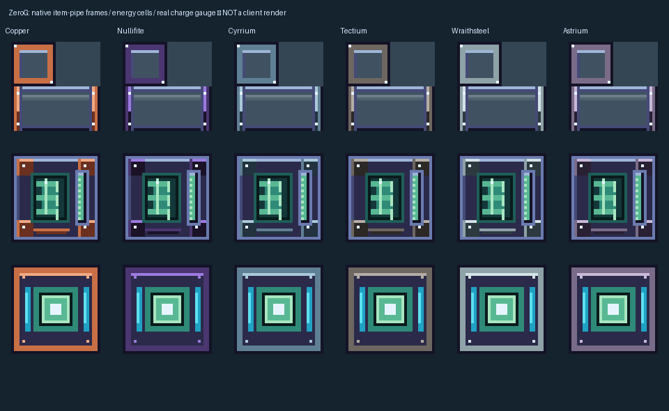

The sections below preserve earlier delivery history; the dated guide and live ledger above supersede their older pending-status statements.

## Current same-version extension: faceted armour and machine visual corrections

[Full workflow and field guide](docs/storage-and-machinery-workflow.md) ·
[Remaining tasks](docs/storage-and-machinery-todo.json) ·
[Latest build and verification receipt](docs/storage-machinery-art-fix-2026-10-05.json) ·
[Original native gallery](docs/images/storage-joinery-v1/README.md)

Four wood families gain panel doors, lattice trapdoors and independently expandable
chests/barrels. Six fluid-tank tiers hold 5,000–5,000,000 mB with buckets, sided ports
and conserved upgrades. Crops survive sunless farmland and grow slowly; new village
doors match the planet's wood. Machine corrections and vanilla-proportioned worn
armour take priority over adding more machine types. The 1.0.12-dev version is retained.
The newest worn-art pass paints all 40 vanilla-fit layers at native 128×64:
faceted plates, beveled highlights and cyan/violet energy accents from the approved
equipment reference. Face openings and visible hands stay intact. Tanks render
their real stored fluid and wooden chest lids animate; client visual approval is
still pending. Transport screens separate actual item buffers from take-only old
item recovery; unused legacy machine inputs are rejected without losing contents.
**56 isolated checks passed** for this extension: 50 workflow, four genetics and
two optional-addon-absent checks. The receipt records source/JAR validation
separately from pending in-game visual approval.

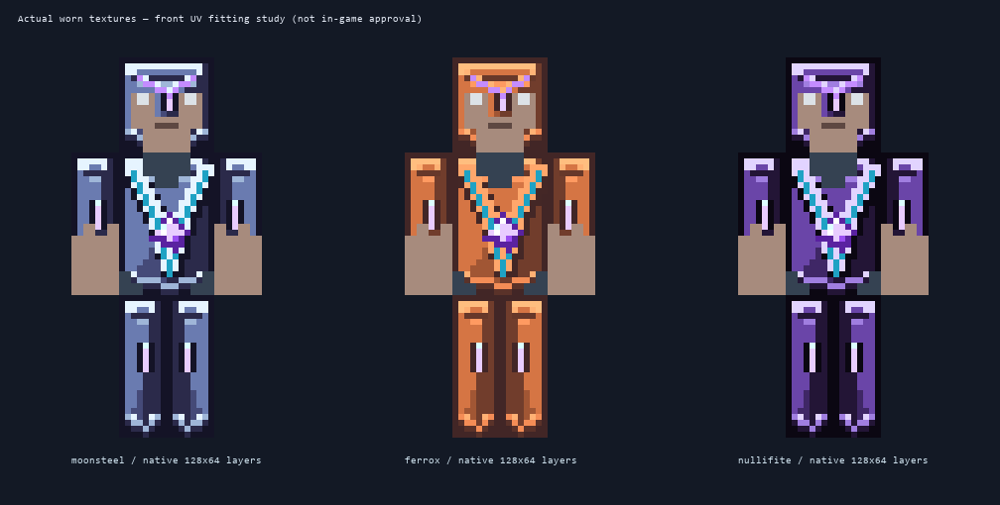

[Download latest same-version art/visual fix](docs/jars/zerog-tweaks-1.21.1-1.0.12-dev-artfix-20261005.jar) ·
[Previous storage delivery evidence](docs/storage-machinery-delivery-2026-10-05.json)

No Mekanism code or artwork is redistributed, and no additional machine dependency
is introduced. Historical images/guides below are preserved, not deleted.

The same-version update includes twelve repaired honeycomb sprites, all 80 main
armour items on vanilla Netherite-style coverage, Alveary service-block acceptance
and output/recovery paging, refinery controls, and a working combustion terminal.
**50 isolated server checks passed** (44 workflow, 4 genetics, 2 without optional
bee addons), followed by a clean production build and zero-error asset audits.
In-game visual approval and the remaining legacy machine bugs are explicitly
tracked, not claimed complete. No saves or existing hub terrain were changed.

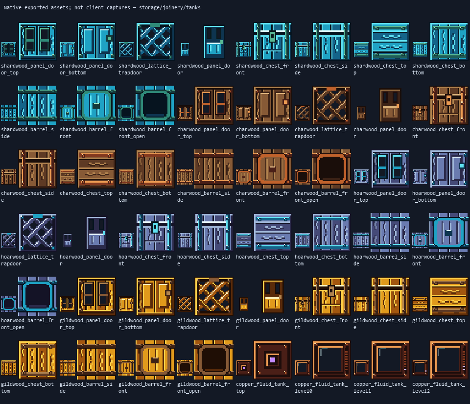

A NeoForge 1.21.1 content/companion mod for the ZeroG modpack — shattered-void
Nullifite progression, galaxy teleporters, planet ores, space woods, machine
blocks, and the food/economy layer that ties the ZeroG planet network's
economy together. This local work-in-progress also requires GeckoLib for the Tidewraith integration.

Current development build **1.0.12-dev** · NeoForge **21.1.252** · Minecraft **Java 1.21.1** · Java **21**

## Current addition: Sol progression, working bee machines and native A/C artwork

[Workflow and verification ledger](docs/sol-build-workflow-2026-10-05.md): player-built
tiered gates, gravity, return platforms, Recall/Group Anchors, coal-fired power,
Mars wrecks and shrines, new Sol mobs and planet-matched ecology are implemented.
Genetics has server-validated analysis/sampling/splicing, real trait data, research
prerequisites, power, catalysts and saved recovery slots. Alvearies now unlock
3/4/6/8/12/18/27 frame housings, FE/honey/starlight tanks and verified production.
Six-tier transport adds conduits, pipes, tubes, cells, ports, filters, wrench
upgrades and shared Null Link storage. Unsupported biological attributes are
explicitly disclosed rather than simulated. Version remains **1.0.12-dev**.

[Machine and transport controls](docs/sol-machines-and-transport-runtime.md)
explain specimen research, catalysts, frame progression, filter cards, face rules
and loaded-only Null Links. The verification ledger also records what still
needs client review or authoritative gameplay rules.

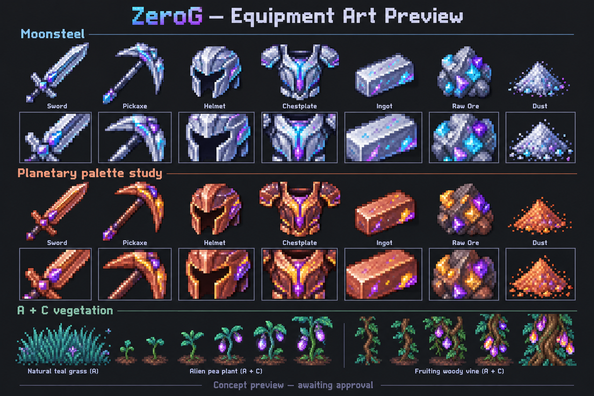

Both equipment palettes and A/C vegetation are approved. The image above remains
reference art; the [native texture gallery](docs/images/full-art-rollout-v4/README.md)
shows the actual new sprites and atlases. Equipment uses readable, hue-shifted
magitech facets; living plants retain natural shading with selective glowing buds
and fruit. Dry/wet farmland is distinct and soil contains no gems. The native
rollout includes varied crop anatomy, woods/leaves, six kelp families and editable
Blockbench sprite sources. Inventory, placed and worn resource layers match.
Existing guides and galleries are retained. Automated server/asset checks do not
replace your in-game visual approval; the ledger separates those results.

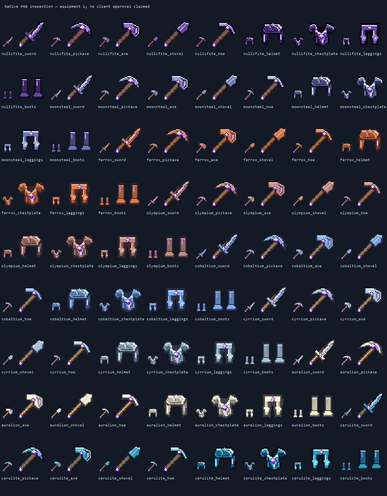

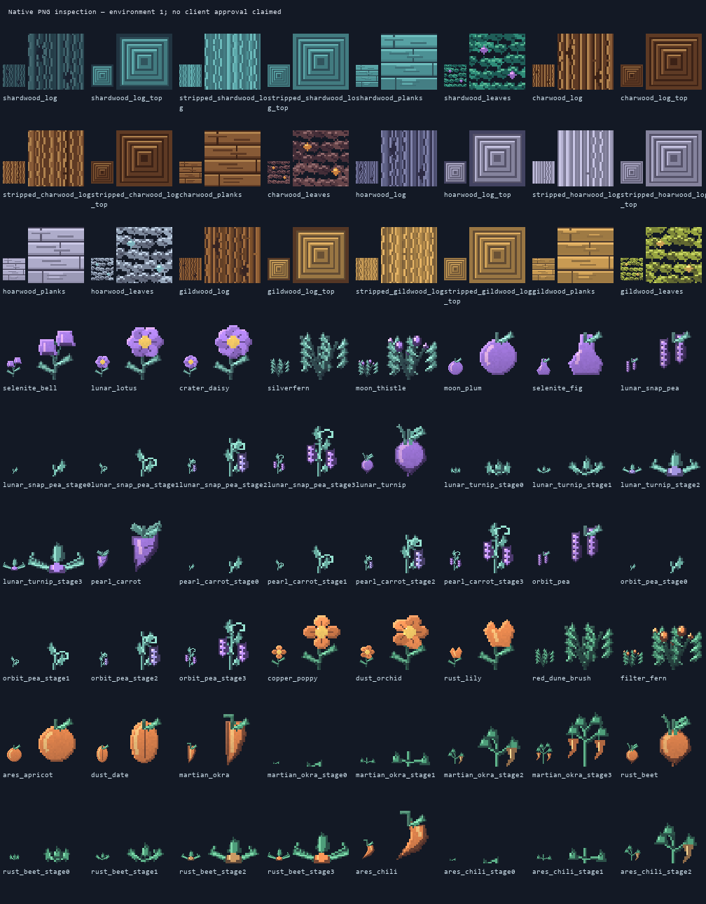

## Single-block machines and use-specific interfaces

[Single-block machine guide](docs/single-block-machines-1.0.12.md): Genetic Splicer
and Geno Station are now single cubes with detailed 32-pixel faces and animated
terminals. Eleven existing machine menus have clearer input/output layouts.
Six unfinished core machines and twenty hatches/ports expose labelled read-only
interface plans, not fake working inventories. The genetics implementation above
replaces the two terminals' older placeholder processing.
The resource-only Orbital Bees repair removes obsolete model assets while keeping
classes, data and IDs unchanged. Both previous jars are backed up before installation.

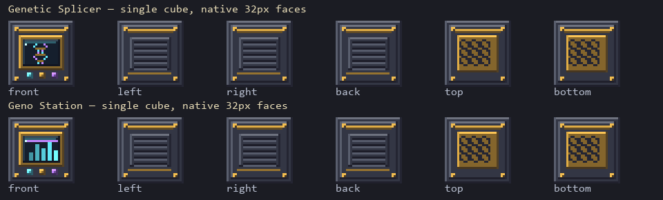

## 1.0.12-dev hotfix: artwork, Orbital Bees controllers and vanilla sky

[Detailed visual and controller guide](docs/art-and-controller-hotfix-1.0.12.md):
recovered coloured bee icons, native A/C material/food/plant art, wood/leaves and
dust shading, wet farmland, detailed melons/dripstone/vents/torchflowers and
recognizable controller terminals. Moonsteel keeps the final X-axis correction.
Nine apiary/hive/alveary interfaces get the compact reference layout with server status and
guarded output sorting; unsupported lifespan/tank/tolerance systems stay sealed.
The planetary panorama is no longer rendered: vanilla skies return with 480
larger smoothly colour-changing scattered stars. Version remains **1.0.12-dev**.
Offline previews and asset checks are not in-game visual approval; player review
is still needed. Existing galleries, IDs and played saves remain intact.

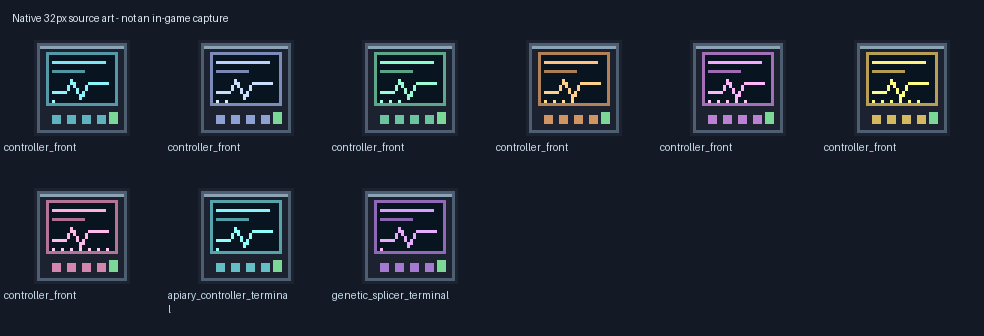

[Earlier same-version hotfix (preserved)](docs/jars/zerog-tweaks-1.21.1-1.0.12-dev.jar) ·
[Checksums](docs/jars/SHA256SUMS.txt) ·
[GUI design sources](https://github.com/ZeroG-Network-PTY-LTD/ZeroG-Tweaks/tree/Design/docs/alveary-controller-gui-v1).

## The Signal: Courier Pod and hub inspection district

[1.0.12 Prologue and showcase guide](docs/prologue-and-hub-1.0.12.md): the first
Raw Nullifite pickup schedules the Moon relay's Courier reply. Its fractured
shell, meteorite crater, chest and Broken Console deliver Echo's Dormant Wisp
and a readable Concord Codex. The Wisp is now required in the Gate Controller
recipe; a seven-day replacement and 5% ancient-city chest chance provide recovery.
Existing IDs, ore generation, played saves and all galleries below are retained.

The explicit test hub gains eight authored apiary layouts, four real formation
references and ten labelled Concord Vault inspection rooms north of the gates.
Occupied plots are never cleared. Unsupported detected claim mods pause Courier
delivery; full survival gate-tier progression remains unfinished.

[Download 1.0.12-dev](docs/jars/zerog-tweaks-1.21.1-1.0.12-dev.jar) ·
[Checksums](docs/jars/SHA256SUMS.txt) ·
[Design source](https://github.com/ZeroG-Network-PTY-LTD/ZeroG-Tweaks/tree/Design/docs/zero-g-tweaks-bundle/structures/concord_courier).

## Budding crops, tree fruits and fifty new planetary varieties

[1.0.11 botany field guide](docs/planet-botany-1.0.11.md) adds **18 flowers,
12 shrubs, 12 tree fruits, six vegetables and two alien melons**. Peas and
vegetables display sprouts, buds, developing produce and ripe produce; matching
planetary trees can carry three-stage regrowing fruit pods. All 34 planetary
grass sets gain directional shading, leaf veins and continuous tall silhouettes.
Existing registry IDs, the earlier galleries and previous downloads are retained.

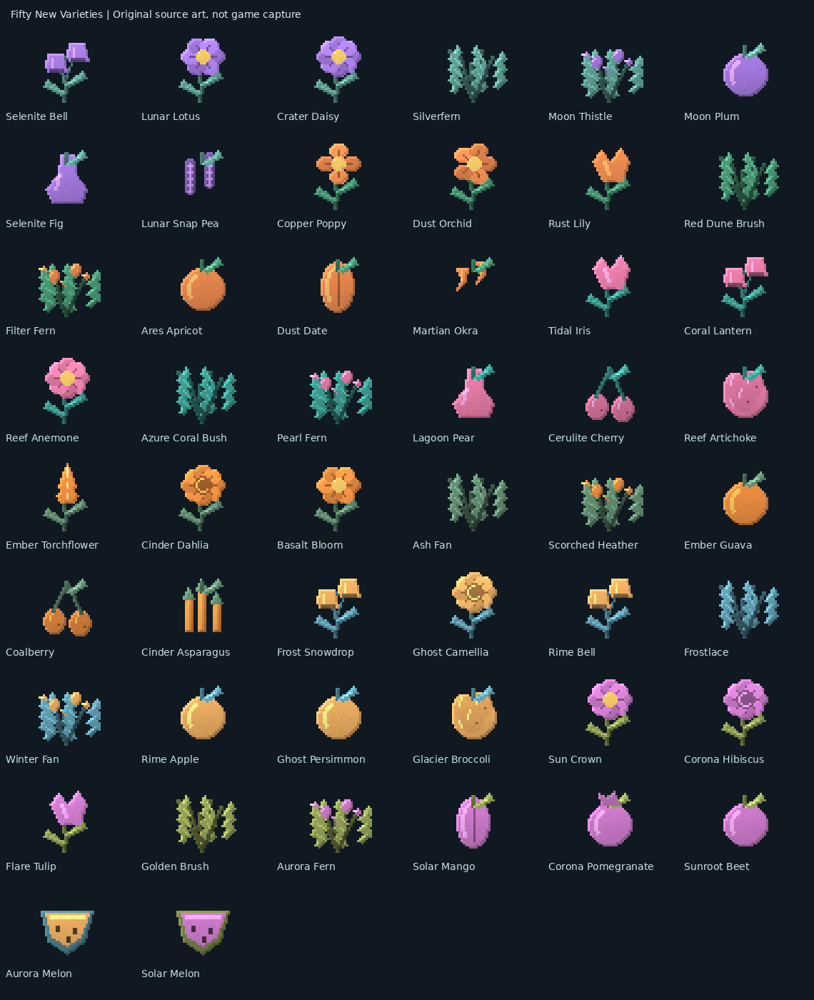

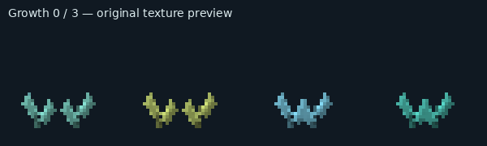

[Download 1.0.11-dev](docs/jars/zerog-tweaks-1.21.1-1.0.11-dev.jar) ·
[Checksums](docs/jars/SHA256SUMS.txt) ·
[50 editable Blockbench projects](https://github.com/ZeroG-Network-PTY-LTD/ZeroG-Tweaks/tree/Design/docs/planet-botany-v2/blockbench).
Seven isolated server checks and eight packaged-asset audits passed. GPU visuals
remain for player review. This publication does **not** replace an installed JAR
or regenerate any existing world.

## Real planetary rain and harsh lightning storms

[1.0.10 storm guide](docs/native-planet-storms-1.0.10.md): acid rain is now
animated green rain sheets and green splashes; electrical storms bring ordinary
rain, darkened skies, clouds and real server-side vanilla lightning strikes.
Creative **Z-Admintools** weather controls are planet-wide. Acid remains
harmless; lightning has vanilla damage/fire interactions and avoids protected
arrival gates. The existing 1.0.9 Seed 0 showcase works without regeneration.
All previous artwork, models, item catalogues and galleries below are retained.

[Download 1.0.10-dev](docs/jars/zerog-tweaks-1.21.1-1.0.10-dev.jar) ·
[SHA256 checksums](docs/jars/SHA256SUMS.txt). Visual and shader appearance remains
for player review; isolated server checks do not certify GPU rendering.

## Preserved 1.0.9 atmosphere and creative weather testing

[1.0.9 atmosphere guide](docs/planet-atmosphere-1.0.9.md): Creative **Z-Admintools**
has a local weather-testing screen for fog, blizzards, steam, geyser spray, ash,
dust devils, visual-only acid rain and cosmetic lightning/thunder. Larger
twinkling stars have colour-cycling halos; a detailed replacement panorama keeps
the actual 1774×887 resolution. Six planetary themes gain 24 native climbing
vine designs, six edible fruits and safe ambient vent clusters/dormant cones.
Planet settlements now use only the six designed species; existing planetary
villagers migrate with their saved trade/inventory data. Overworld villagers
remain untouched. Acid-rain gameplay and the broader flora redesign are later work.

[Download 1.0.9-dev](docs/jars/zerog-tweaks-1.21.1-1.0.9-dev.jar) ·
[SHA256 checksums](docs/jars/SHA256SUMS.txt). The identical clean-build JAR was
installed before publication, with the older JAR backed up. Six isolated server
checks passed; a new **ZeroG Planet Showcase 1.0.9 — Seed 0** has 68 gates and
60 nearby inspection villages, populated only by 480 designed planetary residents.
Existing played saves and all older galleries remain untouched. Client weather,
shader appearance and performance are still for player review.

## Preserved 1.0.8 species admission and village inspections

[1.0.8 resident and village guide](docs/planetary-villagers-1.0.8.md) admits
the six authored Lunari, Rustborn, Glintfolk, Ashwright, Hollow Kin and Sunwarden
models alongside ordinary villagers, with native trading, six spawn eggs,
clothing styles and authored animation loops. A fresh seed-0 showcase places
one or two terrain-grounded inspection settlements near each planetary gate;
ordinary natural villages remain rare and existing hub saves are not retrofitted.

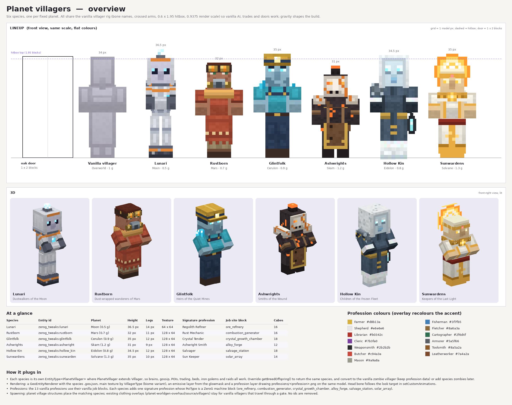

## Alien agriculture, cave families and liquid categories

[1.0.7 guide: crops, caves, rare terrain-blended villages and all liquid IDs](docs/crops-caves-liquids-1.0.7.md)
adds twenty seeded alien crop families and thirty-four cave berry/vine/mineral
families. The liquid inventory is separated into **Planetary Liquids** (six
buckets) and **Bee Honeys** (twelve), retaining all eighteen distinct source,
flowing and bucket identities with vanilla-shaped container artwork.
Isolated tests passed collection/placement of every liquid, crop/cave behaviour
and all thirty-four gateway return routes. The fresh **ZeroG Planet Showcase
1.0.7 — Seed 0** is exported with 68 active gates and no demonstration colonies;
seed **0**, spawn **62 / 65 / 0**. The clean production build and packaged asset
checks passed. [Download 1.0.7-dev](docs/jars/zerog-tweaks-1.21.1-1.0.7-dev.jar)
· [Checksums](docs/jars/SHA256SUMS.txt).
The prior showcase described below is preserved, not silently replaced.

Villages now choose one candidate per 50×50-chunk region and reject wet/steep
sites; this is not one village per fifty individual chunks. New sites follow
native surfaces and planetary soil/farmland/wood rather than floating on tall
pillars or stamping identical green lawns. The next fresh hub excludes authored
demonstration colonies. Existing played saves and all earlier galleries remain.

## Preserved 1.0.6 field guide

[Download 1.0.6-dev](docs/jars/zerog-tweaks-1.21.1-1.0.6-dev.jar)
· [SHA-256 checksums](docs/jars/SHA256SUMS.txt)
· [Fresh planets, colonies, caves, glass and gate building](docs/planet-generation-1.0.6.md)
· [All 4,096 item-model artwork references](docs/runtime-item-catalog-1.0.6.md).

The new local **ZeroG Planet Showcase 1.0.6 — Seed 0** contains 34 independently
seeded planetary terrains, 68 active destination/return gates, and one inhabited
demonstration colony per destination at X/Z=136/136. Seed **0**, hub spawn
**62 / 65 / 0**. The previous save is preserved: use the new showcase rather than
expecting already explored chunks to regenerate. Natural four-layout colonies,
space-clothed vanilla villagers and supported mining galleries now generate.
The current server check found four natural Martian colonies in its test area.

Planet skies now rotate smoothly with twinkling stars; Blue and Teal Star Glass
join Purple as inventory items, with same-colour connected galaxy projection.
Gate arrival pads resist damage and impacts. Comets retain weaker shells and rare
cores and can land at seabeds. **Client visuals remain for in-game review**;
small automated ecology samples contained no tree logs. The generation/debugging
checks certify their stated server assertions, not the whole modpack.

### Themed atlas and illustrated systems

| Explore | What the illustrated guide covers |
| --- | --- |
| [Planets and ecology](docs/dimension-ecology-1.21.1.md) | 34 soil/farmland/grass/sand identities, native plants and liquids, flora and impacts; read the 1.0.6 field guide for current generation changes |
| [Seeds, crops and minerals](docs/planet-art-and-minerals-1.21.1.md) | Six grain crops, Torch Blossoms, native soil art and twelve additional mineral families |
| [Bees, hives, combs and Blazes](docs/planet-bees-and-blazes-1.21.1.md) | Twelve half-size vanilla-rig bee families and coordinated products, six rare Blaze families with palette/rod variants |
| [Armour, wieldables and materials](docs/current-collection-guide-1.21.1.md) | Twenty material equipment families, fitted art, tool studies and honest runtime/renderer boundaries |
| [Apiaries and frames](docs/multiblock-reference-guide.md) | Eight tiered assembly references, frame housings, ports and external gene/cryo modules; G opens the rotating layered guide |
| [Mobs, eggs and drops](docs/current-collection-guide-1.21.1.md#approved-tidewraith-pair-other-mobs-and-drops) | Approved Tidewraith pair, preserved roster, palette/drop/egg studies; not every study is registered |
| [Crystals and Star Glass](docs/crystal-material-update-1.21.1.md) | Budding crystal growth, metals, raw materials and animated glass; current variant/connection rules in the 1.0.6 guide |
| [Gate assembly and travel](docs/planet-generation-1.0.6.md#t6-test-gate--exact-assembly) | Exact part positions, labelled diagram, test power, operator binding and FE limits |
| [Food, crafting and liquids](docs/planet-test-hub-1.21.1.md) | Eating/cooking, hide/leather, flower/dye conversions and dedicated liquid tab |
| [Weather and optional realism](docs/alien-weather-1.21.1.md) | Dust, ash, storms and cosmetic lightning; separate from terrain-damaging comets |
| [Complete artwork index](docs/runtime-item-catalog-1.0.6.md) | 41 texture-reference sheets plus searchable local HTML and exact model IDs; not a registered-item count or 3D render |

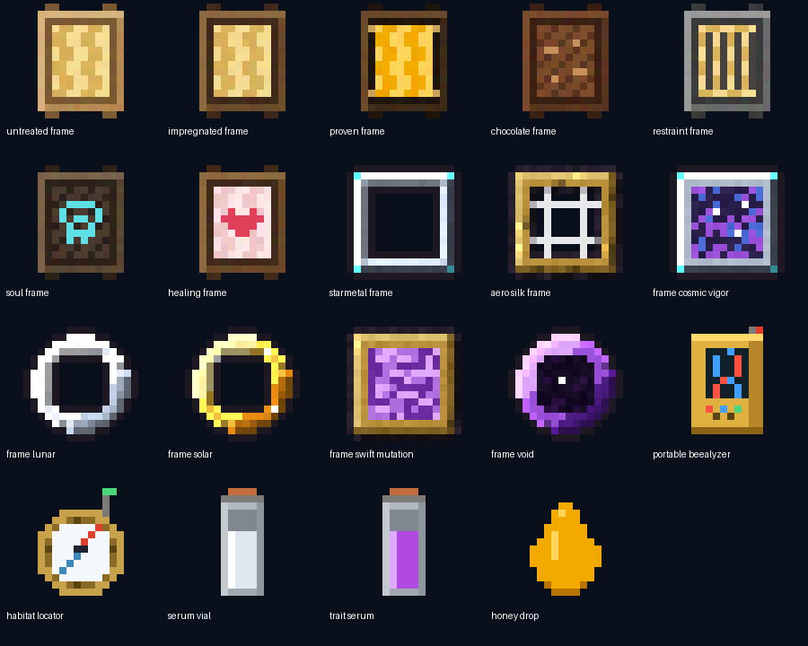

### What is deliberately unfinished

The apiary guide is not a working production GUI or formation system. Genetics,
frame effects, processing/export automation and full Productive Bees integration
remain pending. Fitted/animated HD armour studies are not the current vanilla-layer
worn renderer. Catalogue-only mobs, final boss phases/arenas, bespoke alien trades,
all-seed ecology coverage and client/GPU/modpack validation remain future work.
See [the full current field guide](docs/planet-generation-1.0.6.md) for exact scope.

### Preserved update history

Everything below is retained historical documentation. Older candidate counts,
test evidence and unfinished-status statements describe their own snapshots;
the 1.0.6 field guide above supersedes them where implementation changed.

## Current development update — weather, planets and the test hub

[Download 1.0.5-dev](docs/jars/zerog-tweaks-1.21.1-1.0.5-dev.jar)
· [Checksums](docs/jars/SHA256SUMS.txt)
· [Test hub and gameplay changes](docs/planet-test-hub-1.21.1.md)
· [Alien weather controls](docs/alien-weather-1.21.1.md)
· [Optional realism status](docs/optional-realism-1.21.1.md).

The current candidate includes food-property/cooking/hide/dye repairs, a separate
Liquids tab, layered 10-block comet remnants, planetary panorama sky, cave
ecology additions and a selectable test-hub world preset. The isolated seed-0
hub verified all 34 destination/return routes (68 gates); **this does not certify
complete planet ecology**. Small samples contained no tree logs. New village
layouts, additional concept structures and full survival gate progression remain
unfinished. A normal world with seed 0 is not automatically the hub: select
the ZeroG Planet Test Hub preset or use the separately exported test save.

Experimental **client-only cosmetic weather** adds dust/ash/spore/snow/electrical
effects, particle funnels and native-rendered lightning. Use **ZeroG Weather** on
the title screen; defaults Off, with Low/High controls. No tornado damage or
terrain destruction is introduced by these effects. Airless moons stay clear.

[Original ZeroG Atmosphere 0.1 shader ZIP](https://github.com/ZeroG-Network-PTY-LTD/ZeroG-Tweaks/raw/refs/heads/Design/docs/asset-collection-1.21.1/zero-g-realism-v1/ZeroG-Atmosphere-0.1.zip)
adds ray-marched clouds, haze and subtle bloom, with quality presets and airless
exceptions. Iris 1.8.12 + its required Sodium 0.6.13 NeoForge pair were installed
locally with shaders disabled. **Shader syntax/link checks and normal JAR builds
passed; client/GPU visuals, performance and full modpack compatibility remain
unverified.** This is not complete photorealism, PBR lighting, DLSS or hardware
ray tracing. The third-party Optimum Realism pack stays local and is not included.

### Earlier planetary artwork update

[Planet artwork, seeds and minerals](docs/planet-art-and-minerals-1.21.1.md):
six growable grain crops, plantable Solflower/Rust Tuber seeds, refreshed soils
and grass, six tall Torch Blossoms, animated plant highlights, twelve mineral
families, rare cosmic Blazes, and inventory icon repairs. **Build and static
asset checks only; no client/server tests for that snapshot.** This is historical
evidence, not runtime approval of the current candidate.

[Download the local 1.0.3-dev candidate](docs/jars/zerog-tweaks-1.21.1-1.0.3-dev.jar)
· [Checksums](docs/jars/SHA256SUMS.txt).

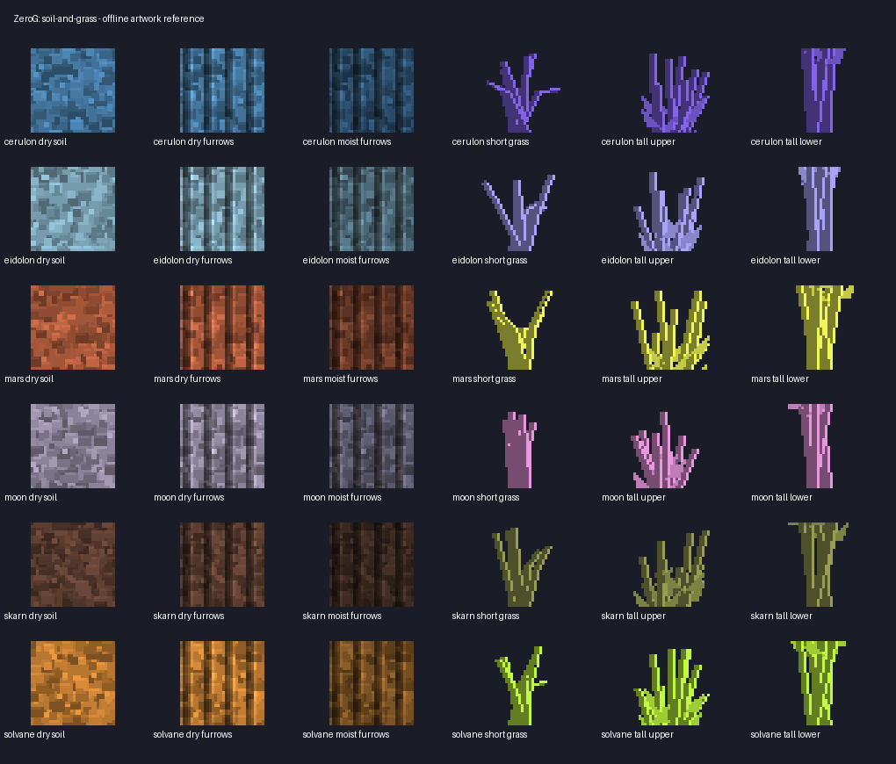

[Cerulon threading hotfix](docs/cerulon-threading-hotfix-1.21.1.md): occupied
planet hives now store bee data rather than constructing live bees on worldgen
workers. **53 isolated server tests passed**, including the new regression.
The older 1.0.1-dev candidate has this known crash; client/modpack retest remains pending.

New [half-size bees, hives, honeys and cosmic Blazes](docs/planet-bees-and-blazes-1.21.1.md):
twelve vanilla-rig bee families, matching hive/comb/bottle/bucket products,
animated wing patterns and planet nests; six Blaze types with eighteen palette
variants, matching rod drops and emissive accents. **52 isolated server tests
passed**; client graphics and the actual CurseForge modpack remain unverified.

The [dimension ecology guide](docs/dimension-ecology-1.21.1.md) adds soil,
farmland, grass and sands for all 34 dimensions, natural pools for the five
additional fluids, glowing flora/bugs, coloured gas vents and daily bounded
terrain-damaging impact remnants. **Back up saves: daily impacts are enabled
by default and configurable.** Further alien vegetables and tree fruits remain future work.

## Latest update — crystals, Star Glass and Cerulon

The [illustrated 1.0.1-dev update and installation guide](docs/crystal-material-update-1.21.1.md)
combines the latest Cerulon/Mossback/Prism Sentinel work with four budding
crystal families, refreshed crystal/ore textures, all sixteen ingot/raw-metal
pairs, six planet Star Sands and light-12 animated Star Glass. It includes
Liquid Starlight, Cerulean Soil and the expanded Cerulon biomes from upstream.
This is a development candidate, not a complete gameplay release.

[All updated ingots/raw materials](docs/images/crystal-material-update-1.21.1/ingots_raw_reference.png)
· [Full texture roster](docs/images/crystal-material-update-1.21.1/crystals_v2_preview.png)
· [Download the 1.21.1 NeoForge jar](docs/jars/zerog-tweaks-1.21.1-1.0.2-dev.jar)
· [SHA-256 checksums](docs/jars/SHA256SUMS.txt).

The historical images and collection remain available below. The new asset
revision has 96 texture PNGs and 80 editable Blockbench projects on Design.
Installation is performed only under the user's explicit request; earlier
Tweaks jars are backed up outside the mods folder, not permanently deleted.

## Illustrated collection and current implementation

New update: [in-game multiblock reference guide](https://github.com/ZeroG-Network-PTY-LTD/ZeroG-Tweaks/blob/Docs/docs/multiblock-reference-guide.md)
— press G for eight apiary layouts, layers from Y=0, 360° rotation, clickable
part coordinates and quantities. Genetics/cryo are separate external modules;
formation, world ghost placement and processing remain unfinished. This
guide is included in the current `1.21.x` development jar.

Start with the [illustrated armour, Bees, materials and mobs guide](https://github.com/ZeroG-Network-PTY-LTD/ZeroG-Tweaks/blob/Docs/docs/current-collection-guide-1.21.1.md).
It groups the designs by use, lists every armour family and apiary tier, and
distinguishes working Java features from asset-only studies and future updates.
The older hashed collection README is preserved as a historical design snapshot;
the illustrated guide and [runtime review](https://github.com/ZeroG-Network-PTY-LTD/ZeroG-Tweaks/blob/Docs/docs/local-runtime-review-1.21.1.md)
describe the newer implementation.

Images are design sheets/software previews, not in-world screenshots. Twelve
isolated server tests and the client model/animation/texture upload check passed
on earlier snapshots; these are historical results, not tests of 1.0.1-dev.
The complete mod, HD worn-armour mapping and Bees gameplay are not finished.

See [verification and reproducible test commands](https://github.com/ZeroG-Network-PTY-LTD/ZeroG-Tweaks/blob/Docs/docs/verification-1.21.1.md)
for the exact test scope, normal build hash and remaining checks.

## Complete Blockbench design collection — Minecraft 1.21.1

The [collection guide](https://github.com/ZeroG-Network-PTY-LTD/ZeroG-Tweaks/blob/Design/docs/asset-collection-1.21.1/README.md) continues the design documentation from [`codex/tidewraith-approved-mobs`](https://github.com/ZeroG-Network-PTY-LTD/ZeroG-Tweaks/tree/codex/tidewraith-approved-mobs). The collection remains a **design snapshot**, not proof of in-game rendering. A separate gameplay pass converts 80 armour pieces and 100 material tools into real equipment and adds the approved spawnable Tidewraith pair. Twelve isolated server tests pass, including actual spawn-egg use. See the [runtime review](https://github.com/ZeroG-Network-PTY-LTD/ZeroG-Tweaks/blob/Docs/docs/local-runtime-review-1.21.1.md) for completed code, tests and remaining review limits. This branch is a development update; no new release has been installed.

The full scene contains **609 model presentations** across 12 categories, including block-inventory duplicates and palette/style variants—not 609 distinct registered items or mobs. It includes 38 spawn-egg studies and 65 mob-drop models, with separate category showcases for lighter review.

- [Open the full Blockbench showcase](https://github.com/ZeroG-Network-PTY-LTD/ZeroG-Tweaks/blob/Design/docs/asset-collection-1.21.1/showcases/ZeroG_Full_Collection_1_21_1.bbmodel): categorized armour, apiary blocks/items, multiblocks, materials, mobs, drops and spawn-egg studies. Individual projects retain their animation clips.
- [Browse the HTML collection](https://github.com/ZeroG-Network-PTY-LTD/ZeroG-Tweaks/blob/Design/docs/asset-collection-1.21.1/review.html) locally, or read the [hashed inventory](https://github.com/ZeroG-Network-PTY-LTD/ZeroG-Tweaks/blob/Design/docs/asset-collection-1.21.1/catalog.json).
- **20 green-box vanilla-fitting armour sets**, using the material colours and surface styles from the supplied lineup. The rejected orange-box visor cages, bulky stacked plates and floating chest details are excluded from this collection. Faces, forearms and hands remain visible. Eight sets include animated-PNG studies and separate glow masks; equipment renderer support remains future work.
- **ZeroG Bees designs:** 85 block models, 65 standalone items plus block-inventory views, 19 frame designs, 8 multiblock assemblies and Apiarist/Cosmic wearable studies. Includes machines, genetics tools, serums, jelly, controllers, casing/tier structures and held-tool projects. Accepted bee entity models are still pending; rejected earlier bees are not restored.
- **Materials:** 39 families, 94 ore/storage blocks and 71 inventory models covering ingots, raw materials, nuggets, dusts, gems, crystals and fuels. The material pack preserves the original pixel art enlarged with nearest-neighbour sampling; it is not newly painted HD detail.
- **Mobs, eggs and drops:** immutable committed creature/style studies, coordinated egg models, drop items, reference sheets and aura studies. The approved repaired-face Tidewraith is the non-boss; the manta-mouth design is the boss and retains its authored size. Historical Tidewraith files are archived but omitted from the active showcase. The local runtime now includes both approved models, flight/eye/mouth clips, five unchanged texture palettes with glow masks, and working eggs. Natural spawning, campaign boss phases and approved drops remain unfinished.

### Future collection updates

The miniature bee and cosmic Blaze additions above supersede the historical
entity-pending notes in the original collection. Next: family-only hive
occupancy/genetics and Productive Bees integration; remaining creature
registrations/AI/boss mechanics; machine menus and production exports;
controller/hatchery/multiblock formation; Java HD worn-armour rendering and
animation; then client/modpack tests and release packaging. These remain
planned features, not claims of completion.

## Branches

| Branch | Contents |
| --- | --- |
| [`1.21.x`](https://github.com/ZeroG-Network-PTY-LTD/ZeroG-Tweaks/tree/1.21.x) | Minecraft 1.21.1 development code, runtime resources, Gradle and tests. |
| [`Design`](https://github.com/ZeroG-Network-PTY-LTD/ZeroG-Tweaks/tree/Design) | Blockbench projects, textures, concepts, sheets, collections and art generators. Independent history. |
| [`Docs`](https://github.com/ZeroG-Network-PTY-LTD/ZeroG-Tweaks/tree/Docs) | Illustrated documentation, guides, images, jars and checksums. Independent history. |
| [`Released`](https://github.com/ZeroG-Network-PTY-LTD/ZeroG-Tweaks/tree/Released) | Shipped code only; no direct commits or pushes. |

Older branches remain untouched. Never merge the Design/Docs histories into code
or vice versa. Full migration details are in the
[branch publication record](https://github.com/ZeroG-Network-PTY-LTD/ZeroG-Tweaks/blob/Docs/docs/branch-publication.md).

## Historical content summary (superseded counts)

- **86 planet/terrain blocks, stone families, woods** — lunar/martian/abyssal stone sets, a glass and sand type for every planet (lunar, rust, crystal, frost, tide, dune, shimmer), the Nullifite family.
- **4 standing crystals/clusters** — Brine Crystal, Frost Crystal, Cerulite Cluster, Prism Cluster. Render as vanilla amethyst-cluster-style billboards and behave like real clusters: thin spike hitbox, place against any clicked face, pop when the support block is removed, sheared off by pistons (PushReaction.DESTROY).
- **2 crops** — Rust Tuber Crop (drops Rust Tuber / Baked Tuber) and Skyberry Bush (drops Skyberries), 4 growth stages each, bonemeal-able.
- **17 machine/functional blocks** — gate frames / controller / energy ports / lens housing / pad plate, alloy forge, combustion generator, fusion reactor + lamp, ore refinery, salvage station, crystal growth chamber, solar array, landing platform, cryo pod, spectral lantern.
- **65 food/util items** — 30+ dishes, planet materials, 5 smithing templates, galaxy gate keys, Heart of Solvane, Ration Pack, Neutralizer.
- **9+ gear sets** — astrium, cerulite, cyrrium, moonsteel, olympium, nullifite, radiante, salvium, skarnite, solvanite... full 9-piece kits (pick/shovel/axe/hoe/sword + 4 armor pieces).
- **Other mob work:** current code includes Crystal Stag, Dune Burrower, Frost Yak, Prismling, Rust Beetle, Azure Fowl, Glimmerfish, Mossback and the Prism Sentinel boss, alongside the approved Tidewraith pair. The latest Cerulon AI, natural-spawn rules, variants, arena, fluid and terrain work are preserved. These features are not covered by the earlier isolated test evidence; source presence alone is not in-game approval. Remaining mobs, AI, drops and progression still need implementation/testing.

## Getting started

### Requirements

- Java 21 (Temurin recommended), on PATH or set via JAVA_HOME.

This development runtime requires NeoForge **21.1.150 or newer** (built
against **21.1.252**) and GeckoLib **4.9.3** for NeoForge 1.21.1. The build resolves
the exact GeckoLib version from its Modrinth Maven release. Earlier published
jars may have different requirements; do not replace a working installation
with this unreviewed build.

### Build (developers)

    ./gradlew build          # Linux/macOS
    gradlew.bat build        # Windows

Output: build/libs/zerog-tweaks-1.21.1-1.0.6-dev.jar

First build pulls NeoForge, NeoForm and Parchment, and recompiles vanilla
sources — expect 5–15 minutes. Incremental builds after that run ~15s
(--no-daemon on low-RAM machines).

### Install (players)

1. Back up the instance/saves, then copy the current development jar from [Docs/docs/jars](docs/jars/) into your instance's mods/ folder. Keep only one `zerog_tweaks` jar installed; do not install the historical candidates together.
2. Add the GeckoLib 4.9.3 jar for NeoForge 1.21.1 into the same mods/ folder.
3. Launch — the mod appears as "ZeroG Tweaks" with its own creative tab (zerog_tweaks).

## Project structure

    ZeroG_Tweaks/                (this repo)
    ├── src/main/java/net/zerog/tweaks/        Java source
    │   ├── registry/                           BlockInit / ItemInit / CreativeTabs / block classes
    │   └── event/                              ZGInteractions (shearing, bottles)
    ├── src/main/resources/                     assets + data + neoforge.mods.toml
    │   ├── assets/zerog_tweaks/                blockstates, models, textures, lang (878 blockstates)
    │   └── data/zerog_tweaks/                  loot tables, recipes, tags
    ├── docs/zero-g-tweaks-bundle/              preserved asset/design bundle (authority snapshot)
    │   ├── resources/                          original asset/data bundle
    │   ├── java/                               ZGFoodItems / ZGInteractions / ZGFoods reference
    │   ├── sheets/                             9.1MB art reference sheets (mobs, gear, blocks)
    │   ├── generators/                         the Python scripts that generated all art/JSON
    │   └── ZeroG_Tweaks_Design_Doc.md          full design document
    ├── gradle/ + gradlew(.bat)                 Gradle wrapper 8.x
    ├── build.gradle / settings.gradle / gradle.properties
    └── .gitignore                              build/ and IDE outputs excluded

## Credits

Jake M. and Co-Owner — ZeroG Network PTY LTD
