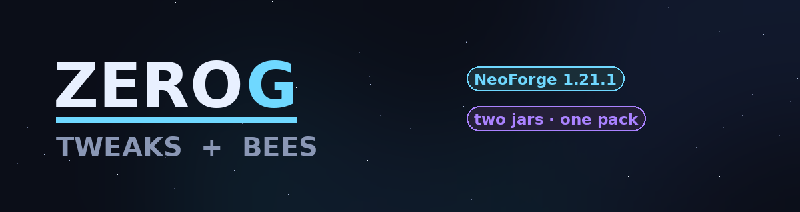
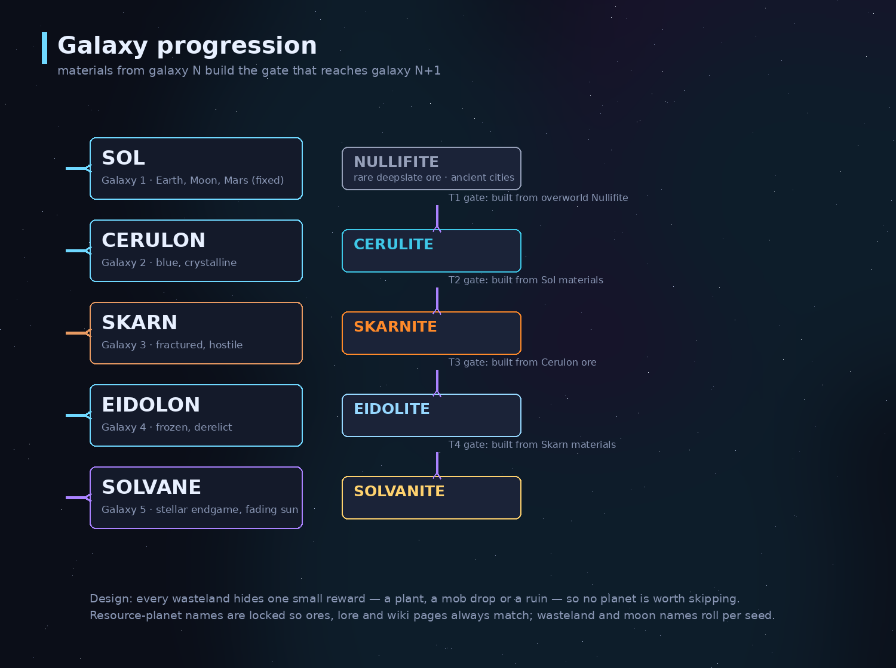
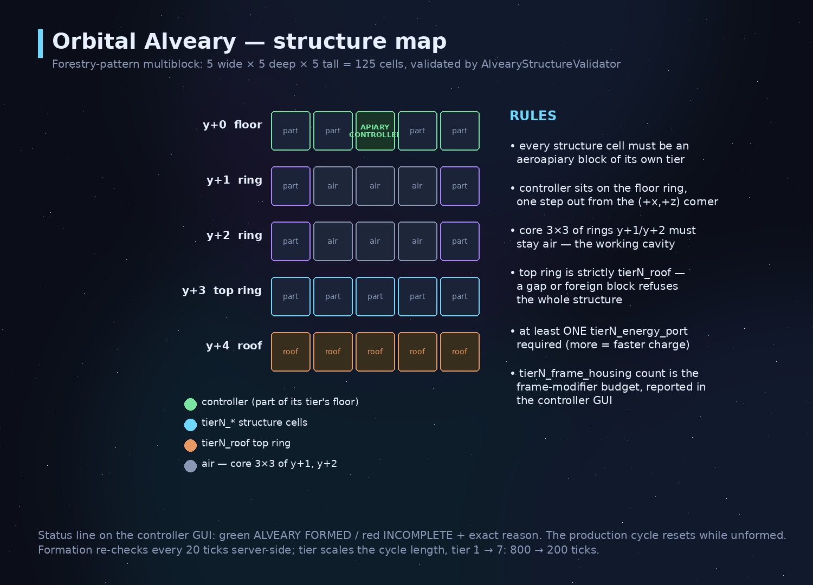
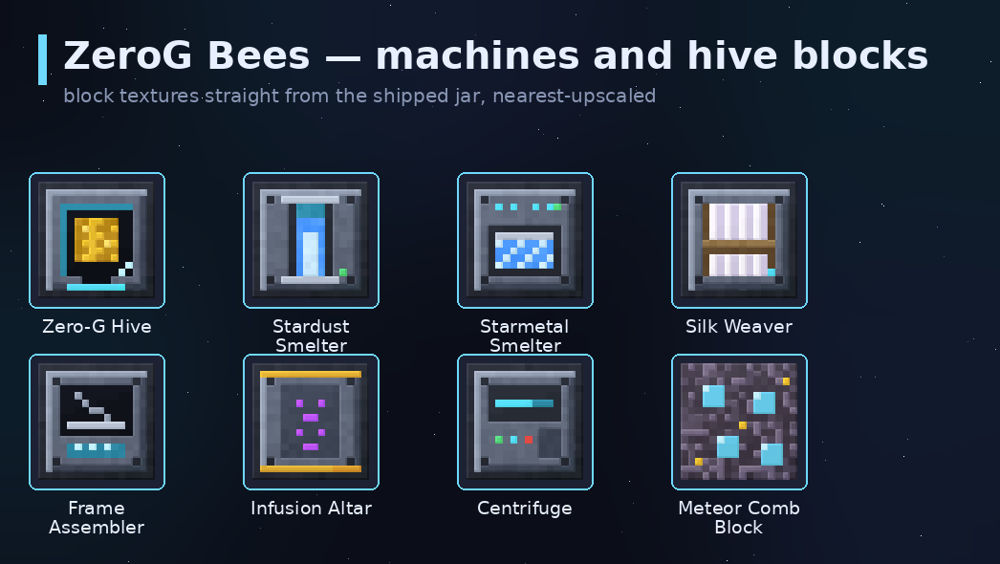
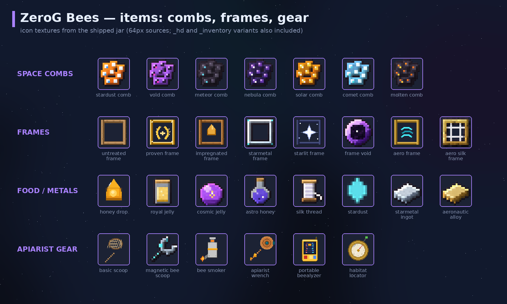
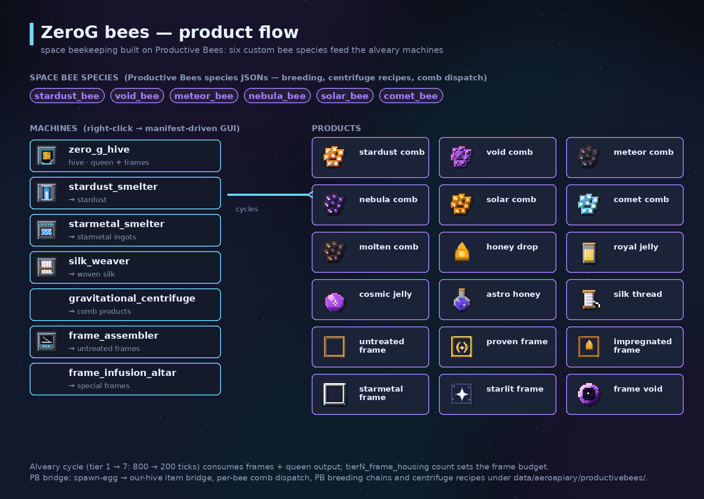
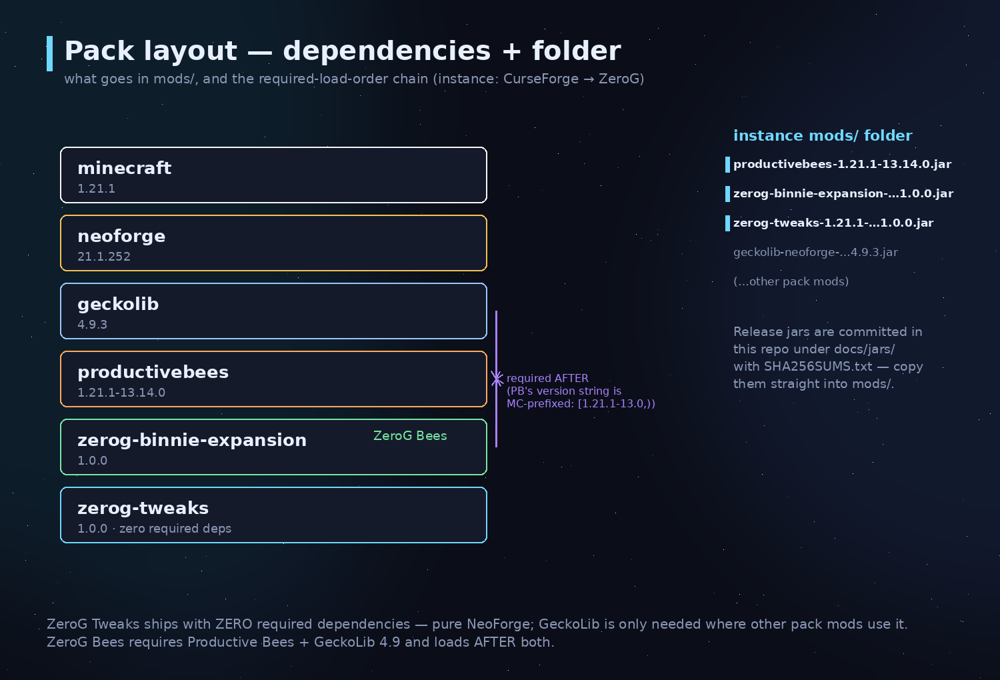

# ZeroG Tweaks + ZeroG Bees

Two NeoForge **1.21.1** jars that form the content backbone of the **ZeroG** modpack —
a shattered-void progression across five seeded galaxies, plus the orbital
beekeeping industry that runs on top of it.

| | ZeroG Tweaks | ZeroG Bees |
| --- | --- | --- |
| Mod id | `zerog_tweaks` | `aeroapiary` |
| Jar | `zerog-tweaks-1.21.1-1.0.0.jar` | `zerog-binnie-expansion-1.21.1-1.0.0.jar` |
| Version / size | 1.0.0 · 2,884,809 bytes | 1.0.0 · 3,905,219 bytes |
| Content | 878 blockstates · 340 items · 28 entities | 85 blocks · 65 items (closed id set) |
| Requires | NeoForge; the prepared Tidewraith runtime draft additionally needs GeckoLib 4.9.3 | Productive Bees **+** GeckoLib 4.9, loads AFTER both |
| Creative tab | `zerog_tweaks` | `itemGroup.aeroapiary` |
| Source | `src/` (this repo) | `Desktop/ZeroG_Mods/zero-g-Orbital-Bee's` (sibling project) |

**Baseline:** Minecraft **1.21.1** · NeoForge **21.1.252** · Java **21** (Temurin)

## Approved Tidewraith pair

The two approved designs and their ZeroG Tweaks IDs. Design files live on the
`Design` branch.
[Approved-model gallery and test instructions](https://github.com/ZeroG-Network-PTY-LTD/ZeroG-Tweaks/blob/Design/docs/tidewraith-approved/README.md)
· [HTML review](https://github.com/ZeroG-Network-PTY-LTD/ZeroG-Tweaks/blob/Design/docs/tidewraith-approved/review.html)
· [Backup of both completed design stacks](https://github.com/ZeroG-Network-PTY-LTD/ZeroG-Tweaks/blob/Design/docs/tidewraith-approved/approved-models-backup.zip).

- `zerog_tweaks:tidewraith`: the approved two-eye Abyssal face, repaired head
  join, original Phantom-inspired wings, body and tendrils. **Not a boss**.
- `zerog_tweaks:tidewraith_boss`: the approved eight-eye, voxel-built manta
  mouth model. **Boss**, retaining its authored 80-unit / 5-block wingspan,
  with Standard, Abyssal, Pearl and Storm palette variants. No x6 scale.

The runtime (entities, renderer, spawn eggs, game tests) is wired into `src/` on
`1.21.x`. Client appearance checks remain pending; see the verification ledger.
No natural spawning or campaign special-ability mechanics are enabled by this
update. The old source snapshots are retained for provenance, not selected as
the runtime assets.

---

## Docs map

| Doc | What's in it |
| --- | --- |
| [docs/HELP.md](docs/HELP.md) | **Player + admin help** — install, every machine, troubleshooting |
| [docs/zero-g-tweaks-bundle/](https://github.com/ZeroG-Network-PTY-LTD/ZeroG-Tweaks/tree/Design/docs/zero-g-tweaks-bundle) | Preserved authority asset/design bundle (design doc, sheets, generators) |
| [docs/jars/SHA256SUMS.txt](docs/jars/SHA256SUMS.txt) | Release-jar SHA256 hashes — verify before deploying |

---

## ZeroG Tweaks — what's inside

An Allthemodium-style progression mod: shattered-void Nullifite, a tiered galaxy
teleporter, planet ores, space woods, machines, and the food/economy layer that
ties the ZeroG planet network together.

**Content families**

- **86 planet/terrain blocks** — lunar/martian/abyssal stone sets, a glass + sand type per planet (lunar, rust, crystal, frost, tide, dune, shimmer), the Nullifite family, space woods.
- **4 standing crystals/clusters** — Brine Crystal, Frost Crystal, Cerulite Cluster, Prism Cluster. Real amethyst-cluster behavior: thin spike hitbox, place against any face, pop when support is removed, sheared off by pistons.
- **2 crops** — Rust Tuber Crop and Skyberry Bush, 4 growth stages each, bonemeal-able, with proper item models.
- **17 machine/functional blocks** — gate frames/controller/energy ports/lens housing/pad plate, alloy forge, combustion generator, fusion reactor + lamp, ore refinery, salvage station, crystal growth chamber, solar array, landing platform, cryo pod, spectral lantern.
- **65 food/util items** — 30+ dishes, planet materials, 5 smithing templates, galaxy gate keys, Heart of Solvane, Ration Pack, Neutralizer.
- **9+ gear sets** — astrium, cerulite, cyrrium, moonsteel, olympium, nullifite, radiante, salvium, skarnite, solvanite… full 9-piece kits (pick/shovel/axe/hoe/sword + 4 armor pieces).
- **Five prior live entity classes** — Crystal Stag, Frost Yak, Prismling, Rust Beetle and Dune Burrower. Their renderer polish remains separate work. The approved Tidewraith designs and runtime draft above are additional data, not two newly shipped entities; the original 28-mob design roster is not a claim that all 28 are implemented.

Gallery: [machines & gates](docs/images/gallery_machines.png) · [teleporter blocks](docs/images/gallery_teleporter.png) · [gear](docs/images/gallery_gear.png) · [armor](docs/images/gallery_armor.png) · [food & items](docs/images/gallery_food.png) · [mob sheets](docs/images/gallery_mobs.png)

---

## ZeroG Bees (`aeroapiary`) — what's inside

Zero-G beekeeping as a **required addon for Productive Bees** (`1.21.1-13.14.x`):
the Forestry-style Orbital Alveary, seven machines, tiers 1–7, and a full
space-comb/frames/genetics item set.

**The Orbital Alveary** — a formed 125-cell multiblock (5×5×5). Every structure
cell must be an `aeroapiary` block of the alveary's own tier (`tierN_*`), the
central 3×3 of the two middle floors stays air, the top ring is strictly
`tierN_roof`, and at least one `tierN_energy_port` is required. Composition
report counts frame housings; the controller GUI shows **green ALVEARY FORMED /
red INCOMPLETE** with the exact failing cell until it verifies.

**Tier controllers** — `apiary_controller` (counts as tier 1) plus
`tier2_controller` … `tier7_controller`, right-click activated, manifest-driven
GUIs (queen / drone / frames / products), tier-scaled production cycle
(800 ticks → 200 ticks from tier 1 to tier 7).

**Machines** (right-click, manifest-driven GUIs; tick via
`ZeroGMachineBlockEntity` + the shared `zerog_machine` BE type):
`zero_g_hive`, `stardust_smelter`, `starmetal_smelter`, `silk_weaver`,
`gravitational_centrifuge`, `frame_assembler`, `frame_infusion_altar`,
`genetic_splicer`, `geno_station`, `centrifuge`, `infusion_altar`,
`frame_component_assembler` — built from 70 tiered part blocks
(casings, hatches, roofs, ports, coil/loader/fan/etc).

**Space bees** — six Productive Bees species bridged into the pack:
comet · meteor · nebula · solar · stardust · void. PB breeding chains,
PB centrifuge recipes, bee_produce into named combs
(`stardust_comb` … `molten_comb`, comb blocks too), spawn-egg→our-hive bridge,
per-bee comb dispatch.

**Items (65)** — 4 comb tiers + blocks, stardust/starmetal/aeronautic alloys,
woven silk + silk thread, frames (untreated, proven, impregnated, honeyed,
chocolate, cryo, soul, starlit, starmetal, void, oblivion, solar, lunar,
healing, restraint, swift-mutation, cosmic vigor), apiarist + cosmic armor,
scoops, smoker, wrench, beealyzer/beealyzer portable, habitat locator,
grafters, serums, royal jelly (+ solidified), honey drop, astro honey,
cosmic jelly, alveary blueprint, confinement coil, advanced circuit.

---

## The two jars

Release jars are **committed in this repo** under [`docs/jars/`](docs/jars/) so an install never depends on a build machine.

| File | In `docs/jars/` | Also lives at |
| --- | --- | --- |
| `zerog-tweaks-1.21.1-1.0.0.jar` | ✔ | build/ output of this repo |
| `zerog-binnie-expansion-1.21.1-1.0.0.jar` | ✔ | Bee's build output (built 2026-09-30, sha `7ff60d42…`) |

**Note:** the Bee's STABLE_1.0.0.md references sha `2c327638…` from 2026-09-29 —
the jar was rebuilt on 09-30 (typed-listener + duplicate-supplier boot fixes) and the current release is `7ff60d42…`. SHA256SUMS.txt is the source of truth.

Verify before deploying:

    sha256sum -c docs/jars/SHA256SUMS.txt

Deploy law: copy into the instance mods folder
(`C:\Users\jakem\curseforge\minecraft\Instances\ZeroG\mods\`) and sha-verify the copy.

---

## Players: quick start

1. Install CurseForge → instance **ZeroG** (Minecraft 1.21.1, NeoForge 21.1.252).
2. Drop both jars from [`docs/jars/`](docs/jars/) into `mods/` **plus** the pack's `geckolib-neoforge-1.21.1-4.9.3.jar` (ZeroG Bees hard-requires it).
3. Verify hashes (`sha256sum -c docs/jars/SHA256SUMS.txt`), launch.
4. Both mods show their own creative tab; full guide in [docs/HELP.md](docs/HELP.md).

---

## Developers: build from source

Requirements: Windows box with Temurin **JDK 21** (WSL has no Java — build Windows-side).

        set JAVA_HOME=C:\Program Files\Eclipse Adoptium\jdk-21.0.12.101-hotspot
        gradlew.bat build --no-daemon --console=plain

Output: `build/libs/zerog-tweaks-1.21.1-1.0.0.jar` → copy into the instance mods dir, re-run the sha check.

- **ZeroG Tweaks** (this repo): first-ever build runs the full NeoForm pipeline (5–15 min); incremental runs ~10–15 s.
- **ZeroG Bees** (sibling repo `zero-g-Orbital-Bee's`, same recipe): vendored GeckoLib 4.9.3 in `libs/`, NeoForge 21.1.252, Productive Bees bridge under `data/aeroapiary/productivebees/`.
- One-host law: `.ex5` kit builds live on the VPS; local Algo OFF — don't cross-copy.

---

## Project structure (this repo)

    ZeroG_Tweaks/
    ├── src/main/java/net/zerog/tweaks/     Java source (registry/, event/, item/)
    ├── src/main/resources/                  assets + data + neoforge.mods.toml
    │   ├── assets/zerog_tweaks/             878 blockstates, models, textures, lang
    │   └── data/zerog_tweaks/               loot tables, recipes, tags
    ├── docs/HELP.md                         player + admin help guide
    ├── docs/images/                         README diagrams, gallery, logo
    ├── docs/jars/                           committed release jars + SHA256SUMS.txt
    ├── docs/zero-g-tweaks-bundle/           preserved authority bundle
    │   ├── resources/                       original asset/data bundle
    │   ├── sheets/                          art reference sheets (mobs, gear, blocks, armor, food)
    │   ├── generators/                      the Python scripts that generated all art/JSON
    │   └── ZeroG_Tweaks_Design_Doc.md       full design document (galaxies, teleporter, planets)
    ├── build.gradle / gradlew(.bat)         Gradle wiring (wrapper 8.x)
    └── .gitignore

## Illustrated collection and current implementation

Start with the [illustrated armour, Bees, materials and mobs guide](https://github.com/ZeroG-Network-PTY-LTD/ZeroG-Tweaks/blob/Design/docs/current-collection-guide-1.21.1.md).
It groups the designs by use, lists every armour family and apiary tier, and
distinguishes working Java features from asset-only studies and future updates.
The older hashed collection README is preserved as a historical design snapshot;
the illustrated guide and [runtime review](https://github.com/ZeroG-Network-PTY-LTD/ZeroG-Tweaks/blob/Design/docs/local-runtime-review-1.21.1.md)
describe the newer implementation.

Images are design sheets/software previews, not in-world screenshots. Eleven
isolated server tests and the client model/animation/texture upload check pass.
The complete mod, HD worn-armour mapping and Bees gameplay are not finished.

See [verification and reproducible test commands](https://github.com/ZeroG-Network-PTY-LTD/ZeroG-Tweaks/blob/Design/docs/verification-1.21.1.md)
for the exact test scope, normal build hash and remaining checks.

## Complete Blockbench design collection — Minecraft 1.21.1

The [collection guide](https://github.com/ZeroG-Network-PTY-LTD/ZeroG-Tweaks/blob/Design/docs/asset-collection-1.21.1/README.md) continues the design documentation from [`codex/tidewraith-approved-mobs`](https://github.com/ZeroG-Network-PTY-LTD/ZeroG-Tweaks/tree/codex/tidewraith-approved-mobs). The collection remains a **design snapshot**, not proof of in-game rendering. A separate gameplay pass converts 80 armour pieces and 100 material tools into real equipment and adds the approved spawnable Tidewraith pair. Eleven isolated server tests pass, including actual spawn-egg use. See the [runtime review](https://github.com/ZeroG-Network-PTY-LTD/ZeroG-Tweaks/blob/Design/docs/local-runtime-review-1.21.1.md) for completed code, tests and remaining review limits. This branch is a development update; no new release has been installed.

The full scene contains **609 model presentations** across 12 categories, including block-inventory duplicates and palette/style variants—not 609 distinct registered items or mobs. It includes 38 spawn-egg studies and 65 mob-drop models, with separate category showcases for lighter review.

- [Open the full Blockbench showcase](https://github.com/ZeroG-Network-PTY-LTD/ZeroG-Tweaks/blob/Design/docs/asset-collection-1.21.1/showcases/ZeroG_Full_Collection_1_21_1.bbmodel): categorized armour, apiary blocks/items, multiblocks, materials, mobs, drops and spawn-egg studies. Individual projects retain their animation clips.
- [Browse the HTML collection](https://github.com/ZeroG-Network-PTY-LTD/ZeroG-Tweaks/blob/Design/docs/asset-collection-1.21.1/review.html) locally, or read the [hashed inventory](https://github.com/ZeroG-Network-PTY-LTD/ZeroG-Tweaks/blob/Design/docs/asset-collection-1.21.1/catalog.json).
- **20 green-box vanilla-fitting armour sets**, using the material colours and surface styles from the supplied lineup. The rejected orange-box visor cages, bulky stacked plates and floating chest details are excluded from this collection. Faces, forearms and hands remain visible. Eight sets include animated-PNG studies and separate glow masks; equipment renderer support remains future work.
- **ZeroG Bees designs:** 85 block models, 65 standalone items plus block-inventory views, 19 frame designs, 8 multiblock assemblies and Apiarist/Cosmic wearable studies. Includes machines, genetics tools, serums, jelly, controllers, casing/tier structures and held-tool projects. Accepted bee entity models are still pending; rejected earlier bees are not restored.
- **Materials:** 39 families, 94 ore/storage blocks and 71 inventory models covering ingots, raw materials, nuggets, dusts, gems, crystals and fuels. The material pack preserves the original pixel art enlarged with nearest-neighbour sampling; it is not newly painted HD detail.
- **Mobs, eggs and drops:** immutable committed creature/style studies, coordinated egg models, drop items, reference sheets and aura studies. The approved repaired-face Tidewraith is the non-boss; the manta-mouth design is the boss and retains its authored size. Historical Tidewraith files are archived but omitted from the active showcase. The local runtime now includes both approved models, flight/eye/mouth clips, five unchanged texture palettes with glow masks, and working eggs. Natural spawning, campaign boss phases and approved drops remain unfinished.

### Future collection updates

Accepted vanilla-based space bees and Productive Bees integration; live mob registrations, AI, eggs, drops and boss mechanics; block GUI/menu bindings and frame/bee/comb/genetic slots; production exports; controller/hatchery/multiblock tests; Java armour rendering, animation and emissive support; then tested client builds and release packaging. These are planned features, not completed by this documentation update. See the [collection guide](https://github.com/ZeroG-Network-PTY-LTD/ZeroG-Tweaks/blob/Design/docs/asset-collection-1.21.1/README.md) for detailed descriptions, provenance and limits.

## Branches

| Branch | Contents |
| --- | --- |
| `Released` | **Major released code.** Default branch. Each release is merged in from its version dev branch (`1.21.x`, and later `26.1.x`, `26.2.x`, …). |
| `1.21.x` | **Dev branch for Minecraft 1.21.x.** Full NeoForge source, Gradle build, game tests. |
| [`Design`](https://github.com/ZeroG-Network-PTY-LTD/ZeroG-Tweaks/tree/Design) | All design work: Blockbench models, asset collections, art sheets, generators, Tidewraith studies. |
| [`Docs`](https://github.com/ZeroG-Network-PTY-LTD/ZeroG-Tweaks/tree/Docs) | Wiki and documentation: README, HELP guide, images/diagrams, release jars + `SHA256SUMS.txt`. |

## Roadmap — known open items

- ZeroG Tweaks × Bees cross-link: **ore_refinery cyrrium/aresite recipes** (needs both jars in the pack — both now ship).
- Multiblock formation is live; next: **textures_emissive → glowmask conversion** and geo/BER models (the authority stack has none — it animates via mcmeta frame sequences).
- 5 mobs are loot/interaction data only — live entity classes TBD.
- `ZGInteractions` shearing + bottle-filling behaviors are documented, not wired.

## Credits

**Jake M. and Co-Owner** — ZeroG Network PTY LTD.
Art is original placeholder-quality pixel art generated by the bundled `generators/` scripts.
"Productive Bees" is by its respective authors; GeckoLib by GeckoLib Team.
