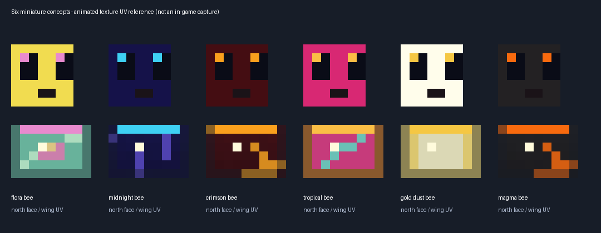
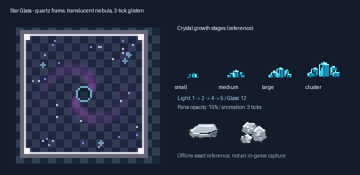
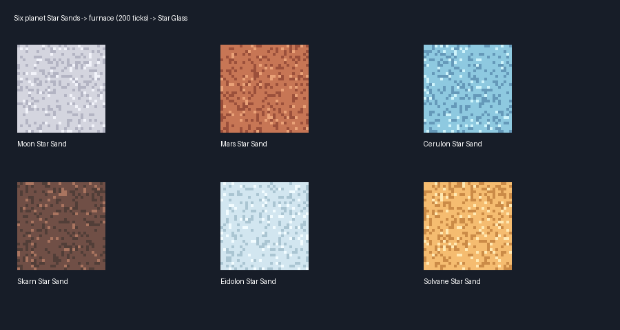

# ZeroG Tweaks

A NeoForge 1.21.1 content/companion mod for the ZeroG modpack — shattered-void
Nullifite progression, galaxy teleporters, planet ores, space woods, machine
blocks, and the food/economy layer that ties the ZeroG planet network's
economy together. This local work-in-progress also requires GeckoLib for the Tidewraith integration.

Current candidate **1.0.2-dev** · NeoForge **21.1.252** · Minecraft **1.21.1** · Java **21**

[Cerulon threading hotfix](docs/cerulon-threading-hotfix-1.21.1.md): occupied
planet hives now store bee data rather than constructing live bees on worldgen
workers. **53 isolated server tests passed**, including the new regression.
The older 1.0.1-dev candidate has this known crash; client/modpack retest remains pending.

New [half-size bees, hives, honeys and cosmic Blazes](docs/planet-bees-and-blazes-1.21.1.md):
twelve vanilla-rig bee families, matching hive/comb/bottle/bucket products,
animated wing patterns and planet nests; six Blaze types with eighteen palette
variants, matching rod drops and emissive accents. **52 isolated server tests
passed**; client graphics and the actual CurseForge modpack remain unverified.

The [dimension ecology guide](docs/dimension-ecology-1.21.1.md) adds soil,
farmland, grass and sands for all 34 dimensions, natural pools for the five
additional fluids, glowing flora/bugs, coloured gas vents and daily bounded
terrain-damaging impact remnants. **Back up saves: daily impacts are enabled
by default and configurable.** Alien crop/fruit varieties remain future work.

## Latest update — crystals, Star Glass and Cerulon

The [illustrated 1.0.1-dev update and installation guide](docs/crystal-material-update-1.21.1.md)
combines the latest Cerulon/Mossback/Prism Sentinel work with four budding
crystal families, refreshed crystal/ore textures, all sixteen ingot/raw-metal
pairs, six planet Star Sands and light-12 animated Star Glass. It includes
Liquid Starlight, Cerulean Soil and the expanded Cerulon biomes from upstream.
This is a development candidate, not a complete gameplay release.

[All updated ingots/raw materials](docs/images/crystal-material-update-1.21.1/ingots_raw_reference.png)
· [Full texture roster](docs/images/crystal-material-update-1.21.1/crystals_v2_preview.png)
· [Download the 1.21.1 NeoForge jar](docs/jars/zerog-tweaks-1.21.1-1.0.2-dev.jar)
· [SHA-256 checksums](docs/jars/SHA256SUMS.txt).

The historical images and collection remain available below. The new asset
revision has 96 texture PNGs and 80 editable Blockbench projects on Design.
Installation is performed only under the user's explicit request; earlier
Tweaks jars are backed up outside the mods folder, not permanently deleted.

## Illustrated collection and current implementation

New update: [in-game multiblock reference guide](https://github.com/ZeroG-Network-PTY-LTD/ZeroG-Tweaks/blob/Docs/docs/multiblock-reference-guide.md)
— press G for eight apiary layouts, layers from Y=0, 360° rotation, clickable
part coordinates and quantities. Genetics/cryo are separate external modules;
formation, world ghost placement and processing remain unfinished. This
guide is included in the current `1.21.x` development jar.

Start with the [illustrated armour, Bees, materials and mobs guide](https://github.com/ZeroG-Network-PTY-LTD/ZeroG-Tweaks/blob/Docs/docs/current-collection-guide-1.21.1.md).
It groups the designs by use, lists every armour family and apiary tier, and
distinguishes working Java features from asset-only studies and future updates.
The older hashed collection README is preserved as a historical design snapshot;
the illustrated guide and [runtime review](https://github.com/ZeroG-Network-PTY-LTD/ZeroG-Tweaks/blob/Docs/docs/local-runtime-review-1.21.1.md)
describe the newer implementation.

Images are design sheets/software previews, not in-world screenshots. Twelve
isolated server tests and the client model/animation/texture upload check passed
on earlier snapshots; these are historical results, not tests of 1.0.1-dev.
The complete mod, HD worn-armour mapping and Bees gameplay are not finished.

See [verification and reproducible test commands](https://github.com/ZeroG-Network-PTY-LTD/ZeroG-Tweaks/blob/Docs/docs/verification-1.21.1.md)
for the exact test scope, normal build hash and remaining checks.

## Complete Blockbench design collection — Minecraft 1.21.1

The [collection guide](https://github.com/ZeroG-Network-PTY-LTD/ZeroG-Tweaks/blob/Design/docs/asset-collection-1.21.1/README.md) continues the design documentation from [`codex/tidewraith-approved-mobs`](https://github.com/ZeroG-Network-PTY-LTD/ZeroG-Tweaks/tree/codex/tidewraith-approved-mobs). The collection remains a **design snapshot**, not proof of in-game rendering. A separate gameplay pass converts 80 armour pieces and 100 material tools into real equipment and adds the approved spawnable Tidewraith pair. Twelve isolated server tests pass, including actual spawn-egg use. See the [runtime review](https://github.com/ZeroG-Network-PTY-LTD/ZeroG-Tweaks/blob/Docs/docs/local-runtime-review-1.21.1.md) for completed code, tests and remaining review limits. This branch is a development update; no new release has been installed.

The full scene contains **609 model presentations** across 12 categories, including block-inventory duplicates and palette/style variants—not 609 distinct registered items or mobs. It includes 38 spawn-egg studies and 65 mob-drop models, with separate category showcases for lighter review.

- [Open the full Blockbench showcase](https://github.com/ZeroG-Network-PTY-LTD/ZeroG-Tweaks/blob/Design/docs/asset-collection-1.21.1/showcases/ZeroG_Full_Collection_1_21_1.bbmodel): categorized armour, apiary blocks/items, multiblocks, materials, mobs, drops and spawn-egg studies. Individual projects retain their animation clips.
- [Browse the HTML collection](https://github.com/ZeroG-Network-PTY-LTD/ZeroG-Tweaks/blob/Design/docs/asset-collection-1.21.1/review.html) locally, or read the [hashed inventory](https://github.com/ZeroG-Network-PTY-LTD/ZeroG-Tweaks/blob/Design/docs/asset-collection-1.21.1/catalog.json).
- **20 green-box vanilla-fitting armour sets**, using the material colours and surface styles from the supplied lineup. The rejected orange-box visor cages, bulky stacked plates and floating chest details are excluded from this collection. Faces, forearms and hands remain visible. Eight sets include animated-PNG studies and separate glow masks; equipment renderer support remains future work.
- **ZeroG Bees designs:** 85 block models, 65 standalone items plus block-inventory views, 19 frame designs, 8 multiblock assemblies and Apiarist/Cosmic wearable studies. Includes machines, genetics tools, serums, jelly, controllers, casing/tier structures and held-tool projects. Accepted bee entity models are still pending; rejected earlier bees are not restored.
- **Materials:** 39 families, 94 ore/storage blocks and 71 inventory models covering ingots, raw materials, nuggets, dusts, gems, crystals and fuels. The material pack preserves the original pixel art enlarged with nearest-neighbour sampling; it is not newly painted HD detail.
- **Mobs, eggs and drops:** immutable committed creature/style studies, coordinated egg models, drop items, reference sheets and aura studies. The approved repaired-face Tidewraith is the non-boss; the manta-mouth design is the boss and retains its authored size. Historical Tidewraith files are archived but omitted from the active showcase. The local runtime now includes both approved models, flight/eye/mouth clips, five unchanged texture palettes with glow masks, and working eggs. Natural spawning, campaign boss phases and approved drops remain unfinished.

### Future collection updates

The miniature bee and cosmic Blaze additions above supersede the historical
entity-pending notes in the original collection. Next: family-only hive
occupancy/genetics and Productive Bees integration; remaining creature
registrations/AI/boss mechanics; machine menus and production exports;
controller/hatchery/multiblock formation; Java HD worn-armour rendering and
animation; then client/modpack tests and release packaging. These remain
planned features, not claims of completion.

## Branches

| Branch | Contents |
| --- | --- |
| [`1.21.x`](https://github.com/ZeroG-Network-PTY-LTD/ZeroG-Tweaks/tree/1.21.x) | Minecraft 1.21.1 development code, runtime resources, Gradle and tests. |
| [`Design`](https://github.com/ZeroG-Network-PTY-LTD/ZeroG-Tweaks/tree/Design) | Blockbench projects, textures, concepts, sheets, collections and art generators. Independent history. |
| [`Docs`](https://github.com/ZeroG-Network-PTY-LTD/ZeroG-Tweaks/tree/Docs) | Illustrated documentation, guides, images, jars and checksums. Independent history. |
| [`Released`](https://github.com/ZeroG-Network-PTY-LTD/ZeroG-Tweaks/tree/Released) | Shipped code only; no direct commits or pushes. |

Older branches remain untouched. Never merge the Design/Docs histories into code
or vice versa. Full migration details are in the
[branch publication record](https://github.com/ZeroG-Network-PTY-LTD/ZeroG-Tweaks/blob/Docs/docs/branch-publication.md).

## What's in this mod

- **86 planet/terrain blocks, stone families, woods** — lunar/martian/abyssal stone sets, a glass and sand type for every planet (lunar, rust, crystal, frost, tide, dune, shimmer), the Nullifite family.
- **4 standing crystals/clusters** — Brine Crystal, Frost Crystal, Cerulite Cluster, Prism Cluster. Render as vanilla amethyst-cluster-style billboards and behave like real clusters: thin spike hitbox, place against any clicked face, pop when the support block is removed, sheared off by pistons (PushReaction.DESTROY).
- **2 crops** — Rust Tuber Crop (drops Rust Tuber / Baked Tuber) and Skyberry Bush (drops Skyberries), 4 growth stages each, bonemeal-able.
- **17 machine/functional blocks** — gate frames / controller / energy ports / lens housing / pad plate, alloy forge, combustion generator, fusion reactor + lamp, ore refinery, salvage station, crystal growth chamber, solar array, landing platform, cryo pod, spectral lantern.
- **65 food/util items** — 30+ dishes, planet materials, 5 smithing templates, galaxy gate keys, Heart of Solvane, Ration Pack, Neutralizer.
- **9+ gear sets** — astrium, cerulite, cyrrium, moonsteel, olympium, nullifite, radiante, salvium, skarnite, solvanite... full 9-piece kits (pick/shovel/axe/hoe/sword + 4 armor pieces).
- **Other mob work:** current code includes Crystal Stag, Dune Burrower, Frost Yak, Prismling, Rust Beetle, Azure Fowl, Glimmerfish, Mossback and the Prism Sentinel boss, alongside the approved Tidewraith pair. The latest Cerulon AI, natural-spawn rules, variants, arena, fluid and terrain work are preserved. These features are not covered by the earlier isolated test evidence; source presence alone is not in-game approval. Remaining mobs, AI, drops and progression still need implementation/testing.

## Getting started

### Requirements

- Java 21 (Temurin recommended), on PATH or set via JAVA_HOME.

This development runtime requires NeoForge **21.1.150 or newer** (built
against **21.1.252**) and GeckoLib **4.9.3** for NeoForge 1.21.1. The build resolves
the exact GeckoLib version from its Modrinth Maven release. Earlier published
jars may have different requirements; do not replace a working installation
with this unreviewed build.

### Build (developers)

    ./gradlew build          # Linux/macOS
    gradlew.bat build        # Windows

Output: build/libs/zerog-tweaks-1.21.1-1.0.2-dev.jar

First build pulls NeoForge, NeoForm and Parchment, and recompiles vanilla
sources — expect 5–15 minutes. Incremental builds after that run ~15s
(--no-daemon on low-RAM machines).

### Install (players)

1. Back up the instance/saves, then copy the current development jar from [Docs/docs/jars](docs/jars/) into your instance's mods/ folder. Keep only one `zerog_tweaks` jar installed; do not install the historical candidates together.
2. Add the GeckoLib 4.9.3 jar for NeoForge 1.21.1 into the same mods/ folder.
3. Launch — the mod appears as "ZeroG Tweaks" with its own creative tab (zerog_tweaks).

## Project structure

    ZeroG_Tweaks/                (this repo)
    ├── src/main/java/net/zerog/tweaks/        Java source
    │   ├── registry/                           BlockInit / ItemInit / CreativeTabs / block classes
    │   └── event/                              ZGInteractions (shearing, bottles)
    ├── src/main/resources/                     assets + data + neoforge.mods.toml
    │   ├── assets/zerog_tweaks/                blockstates, models, textures, lang (878 blockstates)
    │   └── data/zerog_tweaks/                  loot tables, recipes, tags
    ├── docs/zero-g-tweaks-bundle/              preserved asset/design bundle (authority snapshot)
    │   ├── resources/                          original asset/data bundle
    │   ├── java/                               ZGFoodItems / ZGInteractions / ZGFoods reference
    │   ├── sheets/                             9.1MB art reference sheets (mobs, gear, blocks)
    │   ├── generators/                         the Python scripts that generated all art/JSON
    │   └── ZeroG_Tweaks_Design_Doc.md          full design document
    ├── gradle/ + gradlew(.bat)                 Gradle wrapper 8.x
    ├── build.gradle / settings.gradle / gradle.properties
    └── .gitignore                              build/ and IDE outputs excluded

## Credits

Jake M. and Co-Owner — ZeroG Network PTY LTD
