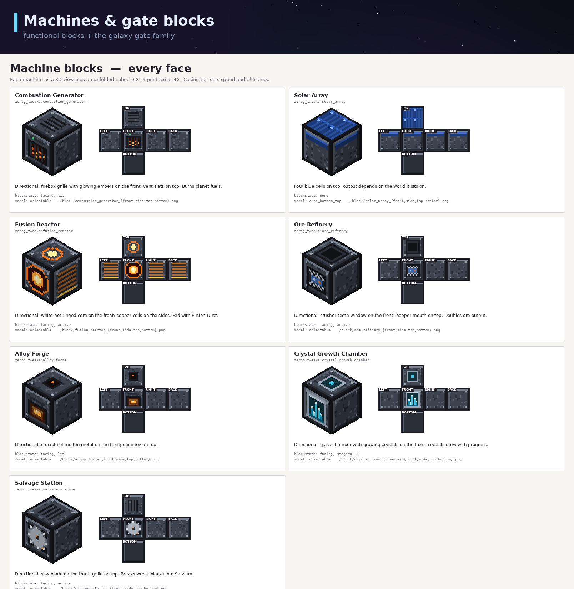

# ZeroG Tweaks + ZeroG Bees — Help & Troubleshooting

Player and admin guide for both ZeroG jars on **Minecraft 1.21.1 / NeoForge 21.1.252 / Java 21**.

Status tags used below:

- **[LIVE]** — shipped and functional in the current 1.0.0 jars.
- **[DATA]** — content exists as blocks/items/loot/tags but gameplay behavior ships later.
- **[PLANNED]** — from the design doc; not yet in code.

---

## 1. Install (players)

### What goes in `mods/`

| File | Jar | Needed by |
| --- | --- | --- |
| `zerog-tweaks-1.21.1-1.0.0.jar` | ZeroG Tweaks | everyone |
| `zerog-binnie-expansion-1.21.1-1.0.0.jar` | ZeroG Bees | bee content |
| `geckolib-neoforge-1.21.1-4.9.3.jar` | GeckoLib | **ZeroG Bees (required)** |
| `productivebees-1.21.1-13.14.0.jar` | Productive Bees | **ZeroG Bees (required)** |

1. Get the jars: `docs/jars/` in this repo, or a GitHub Release.
2. Drop them into your instance's `mods/` folder — for the standard pack:
   `C:\Users\jakem\curseforge\minecraft\Instances\ZeroG\mods\`.
3. (Recommended) verify integrity:
   `sha256sum -c docs/jars/SHA256SUMS.txt`
   — every copied file must read **OK**.
4. Launch through CurseForge. Both mods appear on the mod list;
   each adds its own creative tab (`zerog_tweaks`, "ZeroG Bees: Orbital Apiaries").

### First steps in game

- **Creative tab `zerog_tweaks`** — every planet block, machine block, gear set and food item. Try placing a Brine Crystal: it snaps to the clicked face like vanilla amethyst and pops if you break its support. **[LIVE]**
- **Creative tab "ZeroG Bees: Orbital Apiaries"** — the alveary kit: controllers, tier parts, the Zero-G Hive, all machines, combs, frames and apiarist gear. **[LIVE]**
- The ZeroG pack's progression path (galaxies, teleporter builds, bosses) is documented in the design doc — see [docs/zero-g-tweaks-bundle/ZeroG_Tweaks_Design_Doc.md](zero-g-tweaks-bundle/ZeroG_Tweaks_Design_Doc.md). Teleporter multiblock formation is **[PLANNED]** — the gate blocks and key items exist as content. **[DATA]**

---

## 2. ZeroG Bees — playing the alveary **[LIVE]**

### 2.1 Build your first alveary

An alveary is a **5 wide × 5 deep × 5 tall multiblock = 125 block cells**, validated live. Its controller must sit on the *floor ring*, one step out from the structure's (+x,+z) corner (the validator counts that controller cell as part of its tier's floor).

Layer recipe (bottom → top), for a tier-1 alveary:

| Ring | Blocks |
| --- | --- |
| `y+0` floor | 25 × tier-1 parts — exactly one of them is `tier1_controller` (or `apiary_controller`) in the corner cell |
| `y+1` ring | outer 16 cells = tier-1 parts; the central **3×3 must stay air** (working cavity) |
| `y+2` ring | same as y+1 — outer ring parts, air core |
| `y+3` top | full 5×5 of tier-1 parts |
| `y+4` roof | full 5×5 of `tier1_roof` only |

Rules the validator enforces (any violation = red status with the exact cell):

- every structure cell is an `aeroapiary` block belonging to **that tier** (`tierN_*` — a tier2 casing inside a tier1 ring rejects the whole structure);
- roof ring is strictly `tierN_roof` (a gap or foreign block = no formation);
- **at least one `tierN_energy_port`** somewhere in the structure (power input);
- `tierN_frame_housing` cells are counted and reported to the GUI as the frame-modifier budget.

Reading the controller: right-click the controller block. The GUI shows
**green "ALVEARY FORMED"** or **red "INCOMPLETE" plus the reason**
(e.g. "roof gap/foreign block at 12/64/-3"), a queen/drone/frames/products
layout per the machine manifest, and the production progress bar.
Formation re-validates every 20 ticks server-side; while unformed the production
cycle resets and nothing produces.

### 2.2 Controllers and tiers

| Controller | Structure tier | Cycle length |
| --- | --- | --- |
| `apiary_controller` | tier 1 (counts as `tier1_controller`) | 800 ticks |
| `tier2_controller` … `tier7_controller` | 2–7 | 720 → 200 ticks (tier-scaled) |

The controller block entity IS the multiblock's brain — place it first, build the rings around/above it, then right-click to check formation.

### 2.3 Machines **[LIVE]**

All machines open a manifest-driven GUI on right-click and tick server-side (shared `zerog_machine` block entity):

| Machine | Output / role |
| --- | --- |
| `zero_g_hive` | The base hive — queen + frames in, products out |
| `stardust_smelter` | Smelts stardust products |
| `starmetal_smelter` | Smelts starmetal ingots |
| `silk_weaver` | Weaves woven silk from silk thread inputs |
| `gravitational_centrifuge` | Centrifuges combs into their products |
| `frame_assembler` | Assembles untreated frames |
| `frame_infusion_altar` | Infuses special frames |
| `genetic_splicer` / `geno_station` | Genetics workbench blocks (GUI + data) |
| `centrifuge` / `infusion_altar` / `frame_component_assembler` | Companion processing blocks (GUI + data) |

### 2.4 The six space bees **[LIVE]**

Bridged through Productive Bees (`data/aeroapiary/productivebees/`):
**comet · meteor · nebula · solar · stardust · void** —
each with primary/secondary/particle colors, flower preferences,
selfbreed flags and comb production. The PB side gives you
breeding chains and centrifuge integration; our side dispatch each
bee's comb (`stardust_comb`, `void_comb`, `meteor_comb`, `nebula_comb`,
`solar_comb`, `comet_comb`, plus `molten_comb`) into the named comb items
and their comb blocks.

### 2.5 Frames **[LIVE]**

Frame items modify alveary production when loaded into
`tierN_frame_housing` cells (the GUI reports the housing budget):
untreated · proven · impregnated · honeyed · chocolate · cryo · soul ·
starlit · starmetal · void · oblivion · solar · lunar · healing ·
restraint · swift-mutation · cosmic vigor, plus the aero/aero-silk base frames.

---

## 3. ZeroG Tweaks — content guide

### 3.1 Blocks & terrain **[LIVE]**

86 planet/terrain blocks: lunar/martian/abyssal stone families with slabs/stairs/walls, one glass + sand type per planet (lunar, rust, crystal, frost, tide, dune, shimmer), space woods, and the Nullifite family (`nullifite_block`, `raw_nullifite_block`, `deepslate_nullifite_ore`, `nullifite_gate_frame`).

### 3.2 Crystals & clusters **[LIVE]**

Brine Crystal, Frost Crystal, Cerulite Cluster, Prism Cluster — vanilla-amethyst behavior: spike hitbox on a thin column (7px), place on any face, pop when support breaks, destroyed (not dropped) by pistons. They grow from their budding blocks (`budding_cerulite`, cerulean geode shells).

### 3.3 Crops **[LIVE]**

Rust Tuber Crop → Rust Tuber / Baked Tuber; Skyberry Bush → Skyberries. 4 growth stages, bonemeal works, item icons show the ripe stage.

### 3.4 Machines **[DATA → PLANNED behaviors]**

The 17 machine blocks (gate frames/controller/energy ports/lens housing/pad plate, alloy forge, combustion generator, fusion reactor + lamp, ore refinery, salvage station, crystal growth chamber, solar array, landing platform, cryo pod, spectral lantern) exist as blocks, textures and creative-tab content. Their gameplay behavior is designed (per the design doc: ore refinery doubles ore with up to 3× via upgrades, alloy forge combines metals, combustion generator burns planet fuels, solar array output scales by world, crystal growth chamber grows gems from clusters and energy dust) — wiring is on the roadmap. The Bees cross-link — **ore refinery cyrrium/aresite recipes** — is the next milestone now both jars ship.

### 3.5 Gear **[DATA]**

9+ full kits (pick/shovel/axe/hoe/sword + 4 armor pieces): astrium, cerulite, cyrrium, moonsteel, olympium, nullifite, radiante, salvium, skarnite, solvanite. Items craft/hold correctly; combat stats and equipment behaviors follow.

### 3.6 Food & economy **[LIVE/DATA]**

65 items: 30+ dishes (the design doc lists hunger/saturation/effects per dish — cryo chowder freeze immunity, scorch tail fire resistance, astronaut ration stacking), planet materials, 5 smithing templates, galaxy gate keys, Heart of Solvane, Ration Pack (never spoils), Neutralizer.

### 3.7 Mobs **[DATA]**

Five mobs ship as loot/interaction **data**: Crystal Stag, Amethyst Stalker, Prismling, Rust Beetle, Dune Burrower (28 full design sheets exist in the bundle). Live entity classes are a roadmap item — planned behaviors (Stag antler shearing, Frost Yak wool, bottle-filling) are documented in `ZGInteractions.java`, not wired yet.

---

## 4. Administrators / operators

### 4.1 Verify a deployment (deploy law)

    cd C:\Users\jakem\Desktop\ZeroG_Mods\ZeroG_Tweaks
    sha256sum -c docs/jars/SHA256SUMS.txt          # repo release jars
    sha256sum "C:\Users\jakem\curseforge\minecraft\Instances\ZeroG\mods\zerog-tweaks-1.21.1-1.0.0.jar"
    sha256sum "C:\Users\jakem\curseforge\minecraft\Instances\ZeroG\mods\zerog-binnie-expansion-1.21.1-1.0.0.jar"

The instance sha must equal the repo sha. Never deploy a jar you can't hash-match.

### 4.2 Rebuild from source (Windows-side; WSL has no Java)

    :: ZeroG Tweaks (this repo) — C:\Users\jakem\Desktop\ZeroG_Mods\ZeroG_Tweaks
    set JAVA_HOME=C:\Program Files\Eclipse Adoptium\jdk-21.0.12.101-hotspot
    gradlew.bat build --no-daemon --console=plain > build_log.txt 2>&1

    :: ZeroG Bees — C:\Users\jakem\Desktop\ZeroG_Mods\zero-g-Orbital-Bee's
    (same recipe; vendored GeckoLib 4.9.3 already in its libs/)

First build pulls NeoForge + NeoForm and recompiles vanilla (5–15 min). Incremental: ~10–15 s.
Triage: `findstr /c:"error:" build_log.txt`, then read around each hit.

### 4.3 Known-good runtime facts (hit for real — don't rediscover)

- **GeckoLib dependency** — ZeroG Bees crashes without it: add `geckolib-neoforge-1.21.1-4.9.3.jar`. The mods.toml declares `[4.9,)`.
- **Productive Bees version string** — PB declares `1.21.1-13.14.0`, so dependency ranges must be MC-prefixed: `[1.21.1-13.0,)`. A plain `[13.0,)` fails with "requires productivebees 13.0 or above" even though 13.14 is installed. Already correct in the shipped jar.
- **Multiblock vs standalone** — a controller placed alone works; it only reports INCOMPLETE until its ring structure verifies.
- **Registry reconciliation** — the Bee's id set is CLOSED against the authority jar (`Documents\Codex\2026-09-29\blo\outputs\ZeroG-Bees-1.21.1.jar`): lang diff shows 0 missing / 0 extra. Don't add "companion" ids not in the authority — they surface as checkerboard blocks in game.

### 4.4 Troubleshooting

| Symptom | Cause | Fix |
| --- | --- | --- |
| "ZeroG Oribtal-Bees has failed to load correctly" dialog, `Listener for event class Event …` | generic `addListener(lambda)` on the mod bus | fixed in this build (typed `addListener(Class, …)`); if you regress, restore the typed overload |
| `Duplicate registration <name>` on the mod list | bulk item pass ran over an already-registered name | snapshot `ITEMS.getEntries()` and skip existing names before bulk registration |
| `Invalid block entity aeroapiary:zerog_machine got Block{…}` on place/break | a machine-shaped block missing from `ModContent.FUNCTIONAL` | add every BaseEntityBlock id to FUNCTIONAL in the same change |
| Missing block/item textures in game | assets not merged from the authority bundle | rebuild from this repo's `src/main/resources` (complete assets are committed) |
| Item named correctly but renders magenta checkerboard | missing item model | add `assets/<ns>/models/item/<id>.json` (crop icons: point `layer0` at the ripe-stage texture) |
| Plants placed in world render black/shadowed | cross-billboard registered as plain cube (claims light cell) | fixed in this build — decor plants extend `BushBlock`, saplings extend `SaplingBlock` |
| Crystals "look like grass" / pop off / break placement | cluster model on a plain `Block` | fixed in this build — clusters extend `AmethystClusterBlock` with 6-facing blockstates |
| Controller never forms | roof ring not strictly `tierN_roof`, no energy port, foreign tier block, or air core blocked | read the exact reason string on the controller GUI and fix that cell |
| Out-of-memory / slow first launch on this laptop | full NeoForm pipeline | use `--no-daemon`, expect 5–15 min once |

Gallery references: [teleporter blocks](images/gallery_teleporter.png) · [gear](images/gallery_gear.png) · [armor](images/gallery_armor.png) · [food & items](images/gallery_food.png) · [mob sheets](images/gallery_mobs.png)

---

*ZeroG Network PTY LTD — Jake M. and Co-Owner. Questions about world/lore content: the design doc is canon; this file only documents shipped behavior.*