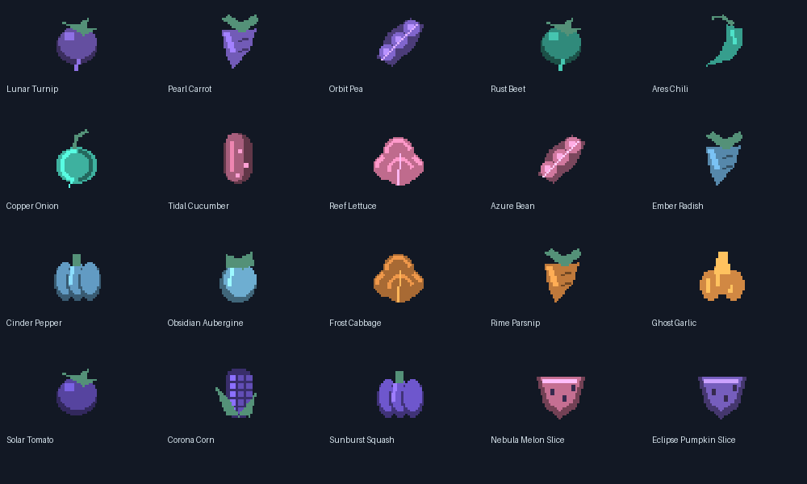

# Alien cave minerals, vines and twenty crop families

Original reproducible 32×32 pixel art; transparent plant silhouettes, clustered
highlights and shadow gradients. No copied vanilla texture bytes. `generate.py`
exports into a separate code checkout; original sources/manifest remain here.
The local game-dev packaging CLI is unavailable; these are native Minecraft PNG
and JSON assets, not canonical GLB packages or GPU-certified renders.

Six contrast palettes, with deterministic per-destination hue variation, give
all 34 planets their own berry item, head/body cave vines, supporting dripstone
rock and up/down pointed formations. Berries glow only when present, can be
harvested/replanted and use native vine growth/bonemeal. Mineral spikes use
native shapes, waterlogging and upward-point injury, with custom-family support
chains. They do not promise vanilla cauldron filling, mineral growth or falling
stalactite damage; unsupported custom spikes break rather than fall as entities.

Eighteen four-stage vegetables: Lunar Turnip, Pearl Carrot, Orbit Pea, Rust Beet,
Ares Chili, Copper Onion, Tidal Cucumber, Reef Lettuce, Azure Bean, Ember Radish,
Cinder Pepper, Obsidian Aubergine, Frost Cabbage, Rime Parsnip, Ghost Garlic,
Solar Tomato, Corona Corn, Sunburst Squash. Nebula Melon and Eclipse Pumpkin add
native age-7/attached-stem fruit growth, separate blocks, edible slices and seeds.
Surface vegetables belong to six planetary themes; cave berries have 34 IDs.
Village crop beds mix local vegetables on the destination's own farmland.

Natural villages use one candidate in each 50×50-chunk region, with offsets
16..33, guaranteeing 33 chunks minimum between candidate centres. Wet or steep
sites are rejected, so not every region receives a village. No demonstration
colonies in the next clean test save. Native terrain surfaces are retained around
farms; no rectangular green lawn or elevated ocean platform/pylon generation.

All existing design references and models remain untouched. Client visuals and
rarity/placement in extensive exploration need human review.
