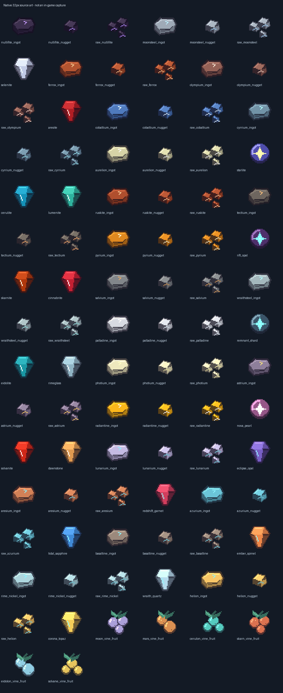
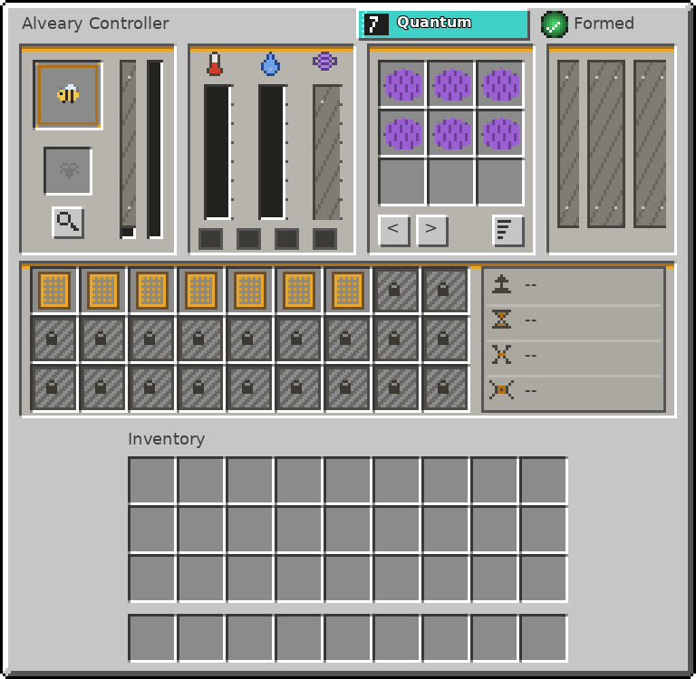

# 1.0.12-dev artwork, Orbital Bees controllers and vanilla sky hotfix

This is a **same-version development hotfix** for Minecraft **Java 1.21.1**,
NeoForge 21.1.252 and Java 21. It is not a Bedrock build. Existing IDs, recipes,
world generation, dimensions, hub saves, older gallery entries and released
branch history are preserved. The standalone Orbital Bees addon is not removed.

## Approved artwork direction

Vegetation combines enhanced-vanilla **A** shading with selective **C** glowing
buds and fruit. Materials use the magitech C ramp: cool violet/blue shadows,
readable facets and warm highlights. Soil and farmland contain **no gems or ore
art**; wet furrows are darker than dry ones. These original native PNGs are not
cropped concept illustrations or redistributed commercial texture-pack art.

This publication includes the earlier planetary art, botany and wood/dust pass
plus the next targeted repairs:

| Coverage | Change |
| --- | --- |
| Planet terrain | 34 matte soils and dry/wet farmland sets, shaded grass/vegetation and mineral art from the approved first rollout. |
| Wood/leaves and dust | 24 wood-family surfaces and 17 dust textures receive coherent volume and hue-shifted shading. |
| Blank bee icons | 63 white addon PNGs are replaced by their recovered **coloured default** Blockbench layers; two already-coloured source layers remain unchanged. |
| Foods and mob drops | 84 food/material/reward sprites are regenerated from the existing catalogue with the approved ramp. |
| Material items | 86 ingot/nugget/raw/gem/orb sprites now show readable volume rather than prototype bars/cubes. |
| Cave families | 34 dripstone blocks, 340 tapered up/down variants, 34 pointed-dripstone inventory icons and 34 clustered cave berries. |
| Vine fruits | Six themed fruit sprites match the existing climbable vines. |
| Gourds | Nebula, Aurora and Solar melons and Eclipse pumpkin gain detailed side/top rind, ribs and stems. |
| Vents and flowers | Planetary gas vents, flare vent and vent rock gain new surfaces; Ember Torchflower gains flared petals/calyx/stamens. |
| Terminal faces | Seven tier controller fronts plus apiary-controller and genetic-splicer terminal panels. Existing geometry and tier facing states retained. |
| Moonsteel | Both hands use the final **X-axis 180-degree correction**. Geometry, UVs, positions, scales and non-hand displays are unchanged. |

The bee icon issue was traced to resource priority: the saved refresh pack was
below `mod_resources`, where the original addon supplied white defaults. Normal
ZeroG resources and its built-in refresh pack now contain the same recovered
coloured art. The validator reproduced the original 63 failures and passes
65 resolved icon bindings with the updated artifact. Player options were not
rewritten; this is not proof against every third-party shader/tint modification.

## Orbital Bees apiary/alveary GUI

The supplied controller generator/specification are preserved on **Design**.
The native adaptation keeps vanilla-grey bevels, honey trim, recessed slots,
grouped hive/climate/products/power/frame panels and sealed overlays. It preserves
the exact **256×250** reference window and **3×3 output grid**. Output pages
preserve the addon's **18** possible products without covering slots. It applies
to all seven tier controllers, the apiary controller
and ZeroG hive when their verified menu contract matches.

- All real machine and 36 player slots keep their indices, handlers and original
  item filters. Moving them on screen does not add storage or change recipes.
- Formation/error text and cycle percentage update from the server once per
  second. Structure errors wrap and provide a full tooltip.
- **Sort** reorders copies of product stacks on the server after checking the
  open menu ID, real machine, distance, validity and expected slot count. It does
  not delete stacks or modify frames/input slots.
- Info/Climate/Energy/Automation/Structure ledger tabs use the supplied atlas;
  panel tooltips explain the bee, frame, product and gauge areas. Original
  modifier icons remain, with `--` rather than invented multipliers.
- Temperature/humidity gauges show actual biome values, not fabricated bee
  tolerance bands.
- Full GeckoLib models render only for animated-render-shape blocks. Ordinary
  baked machines no longer get a second full model drawn over their terminal.

**Backend limits remain explicit:** the installed addon provides 2–7 real frame
slots, not the reference's 27-frame tier progression. Lifespan/genome analysis,
gravity tolerance, FE/honey/catalyst tank state, auto-eject and destructive Void
controls still require separate backend implementation. Their reserved spaces
remain sealed; this hotfix does not pretend those gameplay features work.
At 1080p, use GUI scale 3 or lower to fit the full controller window.

## Vanilla planetary sky with larger coloured stars

The live renderer no longer draws the universe panorama. Minecraft supplies the
normal sky, sun, moon, sunrise and clouds. A separate planet-only overlay adds
**480** larger scattered stars with gently glistening halos and independent,
smooth **green → blue → yellow → purple** gradients. The native small stars
remain underneath. Stars fade with daylight and rain, and are suppressed while
underwater, blinded or affected by Darkness. Each planet has a stable different
orientation, using a private deterministic RNG rather than the server world's
shared random source. Existing acid precipitation and storm gameplay remain.

The old panorama is retained in historical galleries/source archives but is no
longer used for the current sky. Star Glass is not removed or retextured by this
sky change.

## Verification, installation and remaining review

The latest colleague updates are retained: the Concord Vault Sentinel chamber
has a domed roof, and its old Prismling structure spawn override is removed.

## Locked art standard and transport next stage

The [shared art-direction lock](https://github.com/ZeroG-Network-PTY-LTD/ZeroG-Tweaks/blob/Design/docs/art-direction-lock.md)
records the approved A/C palettes, hue-shifted shading, centred readable sprites,
wet/dry farmland distinction, no ores in dirt, selective glow, and the requirement
that inventory and placed artwork agree. It includes an explicit Claude handoff
and evidence requirements so generators cannot silently restore old placeholders.

The supplied [transport reference and implementation plan](https://github.com/ZeroG-Network-PTY-LTD/ZeroG-Tweaks/tree/Design/docs/transport-next-stage)
are archived unchanged on Design. Six tier families, ports, cells and Null Links
are the next stage, not new working networks in this JAR. Capability names and
generated models alone do not establish interoperability or functional transfer.

## Verification details

- Production Gradle build and source/runtime/pack/JAR asset-hash checks.
- Java-only contract check executes the installed addon's actual slot table for
  all nine interfaces; counts/indices/positions match without launching a game.
- Same-version installation backs up the previous Tweaks JAR outside `mods` and
  leaves the other mod JARs and existing saves alone.
- No new game client or server is launched for these build/asset checks.
- GUI rendering, drag/drop, shift-click, Sort, resize, high GUI scales, stars and
  Iris/shader interaction still require player review; offline previews are not
  screenshots or claims of successful GPU tests.

The remaining model audit counts **model files**, including inherited/trimmed
variants, not registered items. Legacy-sized/unreviewed textures are review
flags, not proof of broken art. The whole mod's weapon/armour atlases and every
remaining old item are **not** advertised as fully re-authored.

[Download current 1.0.12-dev](jars/zerog-tweaks-1.21.1-1.0.12-dev.jar) ·
[SHA256 checksums](jars/SHA256SUMS.txt) ·
[Native source and editable projects](https://github.com/ZeroG-Network-PTY-LTD/ZeroG-Tweaks/tree/Design/docs/art-rollout-v3) ·
[GUI specification, provenance and generator](https://github.com/ZeroG-Network-PTY-LTD/ZeroG-Tweaks/tree/Design/docs/alveary-controller-gui-v1).
