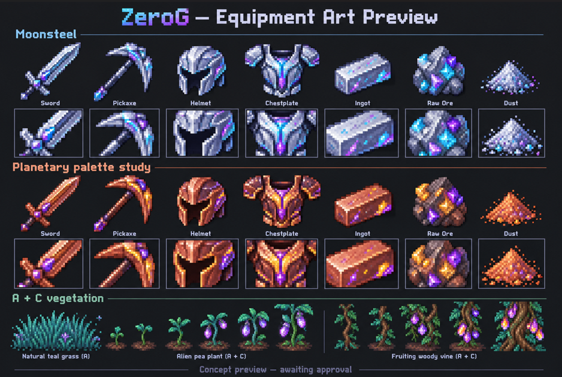
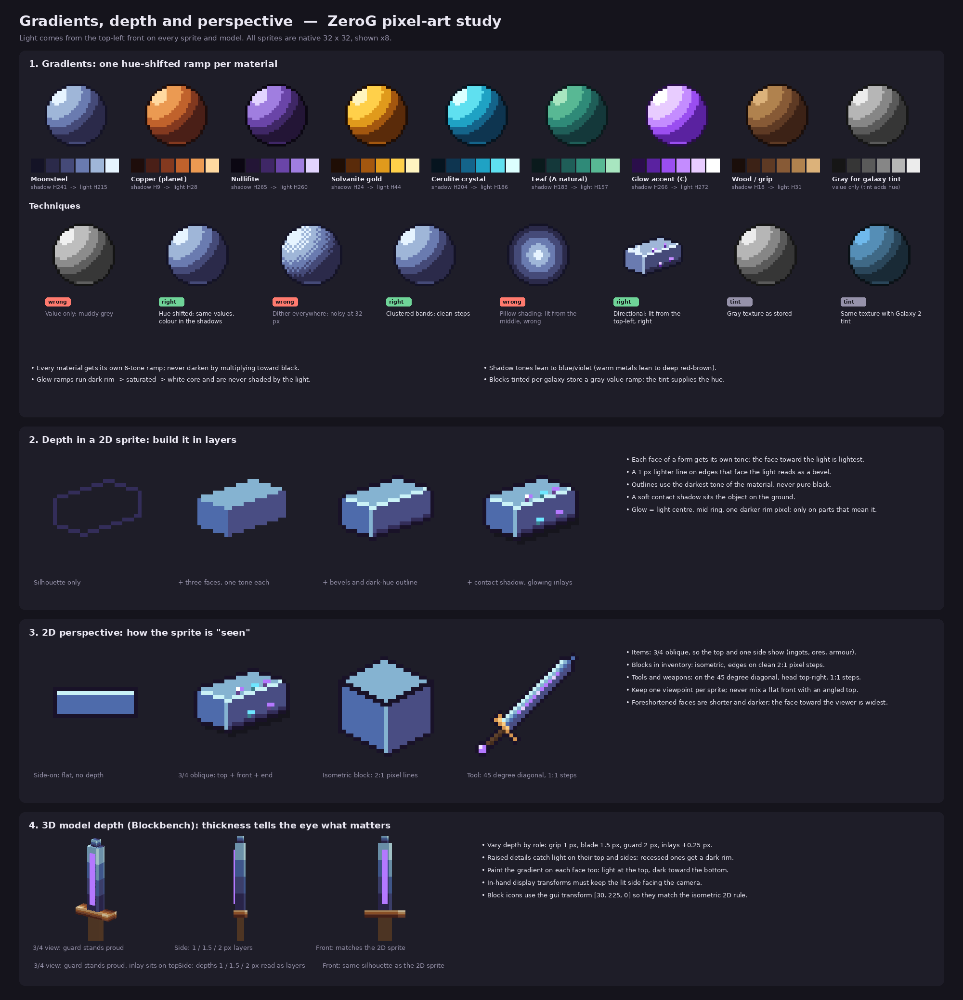
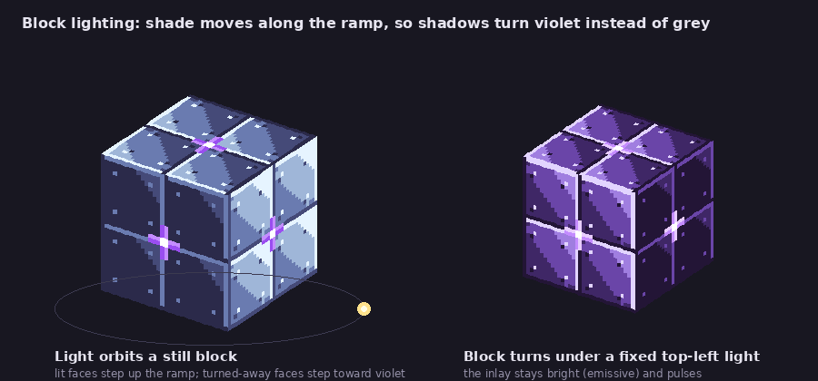
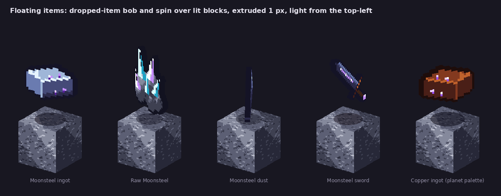

# ZeroG approved art direction — required for Claude and all contributors

User-approved direction, 2026-10-05. Apply to every new texture and generator, and to repairs of older artwork. Do not replace approved artwork with generic flat placeholders.

## Equipment, materials and inventory sprites

Use C: readable Minecraft silhouettes with selective sci-fi/magitech accents. Author native 32×32 sprites unless a verified UV contract requires another size. Use coherent pixel clusters, cool purple/blue hue-shifted shadows and warm or pale highlights; avoid flat recolours, noisy dithering and mixed pixel densities. Center the visible silhouette within the canvas with deliberate padding; assess tools at their intended handheld diagonal, not just their bounding box. Do not mistake transparent pixels for missing artwork.

Weapons must read as metal, grips as grips, dust as granular piles, ingots as beveled ingots. Restrict bright accents to meaningful channels, crystals and energy cores. Painted glow is not proof of runtime emission or block lighting.

## Vegetation and terrain

Blend A natural shading and C selective luminous buds/fruit. Distinguish leafy bushes, narrow stems, grasses, flowers and crops; show developing vegetables across growth stages. Retain transparent gaps and clean silhouettes. Wood needs bark and end grain; leaves need foliage clusters and breathing space. Dirt and dry/wet farmland must NOT contain gems or ore. Wet farmland needs darker moist furrows without looking like ore.

## Blocks and transport

Keep inventory, placed models and source Blockbench textures consistent. Machine fronts need unmistakable terminals or typed glyphs. Transport must retain the supplied 4/6/8-pixel family widths, tier palette, semantic connection colours and UVs. Enhance material shading and seams, not the meaning of controls. Upscaling a 16-pixel source is not HD detail: a native 32-pixel revision requires checking every UV and animation frame.

## Reference sheet (user-approved 2026-10-04)

`art-direction/zerog_equipment_art_reference.png` is the target look for every new or repaired ZeroG texture. The sheet is still captioned "Concept preview — awaiting approval", but the user approved it as the standard on 2026-10-04. Match it before anything else in this file; where older art disagrees, this sheet wins.

**Rows on the sheet**
- Moonsteel set: sword, pickaxe, helmet, chestplate, ingot, raw ore, dust (top row inventory size, second row enlarged).
- Planetary palette study: the same items re-coloured for a warm copper/rust metal with the same violet crystal accents. This shows how one design carries across planet palettes.
- A + C vegetation: natural teal grass (A), an alien pea plant through its growth stages (A + C), and a fruiting woody vine (A + C).

**What to copy**
- Native 32 x 32, one pixel density per sprite, silhouette centred with even padding. Tools sit on the handheld diagonal, head top-right.
- Outlines are a dark hue of the material (deep navy, deep brown), never pure black.
- Hue-shifted ramps: metal shadows go blue/purple, highlights go pale or warm, with a clean white specular streak along edges (blade, pick curve, helmet crown). 4 to 6 tones per material, clustered, no noise dithering.
- C accents only where they mean something: a glowing violet/cyan inlay down the blade fuller, a crystal at the pick head and pommel, a visor ridge on the helmet, a core in the chestplate. Accents glow with a lighter centre and one darker rim pixel.
- Armour is chunky and layered: rounded helmet with a dark visor slot; chestplate with stacked pauldrons, a raised breastplate and a centre core.
- Ingot: beveled bar with a lit top face, a mid front, a dark end, and two or three embedded crystal flecks.
- Raw ore: a lumpy rock chunk with faceted crystals (bright facet, mid facet, dark facet) in two accent colours.
- Dust: a soft granular pile, darker at the base, with a few bright sparkle pixels.
- Planet variants keep the same shapes and accents and only swap the metal ramp (for example copper: dark brown outline, orange mid, peach highlight).
- Vegetation: A shading for leaves, stems and grass (teal-green ramps, layered blades, a few sparkles); C only for buds, pods and fruit (luminous purple with a pale centre). Growth stages read clearly from sprout to fruiting. Woody vines show bark, twist and leaf clusters with gaps.

**What not to do**
- No flat single-colour fills, no upscaled 16 px art passed off as 32 px, no pure black outlines, no glow on parts that have no reason to glow, no off-centre or cropped silhouettes.

## Lighting, gradient and depth references (user-approved 2026-10-04): follow to the T

These three renders are mandatory references alongside the sheet above. Every new item sprite, block texture and 3D model must match them. If a texture looks right flat but wrong when it is lit or turned, it fails.

| File | What it locks |
| --- | --- |
| `art-direction/zerog_gradients_depth_perspective.png` | The nine material ramps (Moonsteel, copper, Nullifite, Solvanite, Cerulite, leaf, glow accent, wood, tint gray) with hue notes; right/wrong technique pairs; 2D depth layering; 2D perspective per asset type; 3D model depth in Blockbench. |
| `art-direction/zerog_block_lighting.gif` | How a block reads under light: faces step along the hue-shifted ramp (shadows go violet, never grey), and glow inlays stay emissive. |
| `art-direction/zerog_floating_items.gif` | How dropped/held items read in 3D: 1 px extrusion, light from the top-left, darker extruded edges, crystal and inlay accents that pulse, contact shadow. |

**Rules taken from these renders**
- **Ramps:** one 6-tone hue-shifted ramp per material. Use the exact hex values in `generator/style_kit.py` (`RAMPS`) unless the user approves a new ramp. Never darken by multiplying toward black.
- **Shading:** shade by moving along the ramp index. A face toward the light steps up one or two tones; a face turned away steps down toward the violet or deep-brown end.
- **Bands:** clustered bands, no noise dithering, no pillow shading. The light always comes from the top-left front.
- **Glow (C accents):** the dark rim, then the saturated tone, then a white core. Glow is emissive: it is never shaded by the light and may pulse in animations.
- **Galaxy-tinted blocks:** store a gray value ramp. The tint supplies the hue.
- **2D perspective:**
  - items use a 3/4 oblique view (top + front + end);
  - blocks are isometric on 2:1 pixel steps;
  - tools and weapons sit on the 45° diagonal, head top-right.
  - Keep one viewpoint per sprite.
- **3D depth by role:** grip 1 px, blade 1.5 px, guard 2 px, inlays +0.25 px. Block icons use the GUI transform `[30, 225, 0]`. Extruded item edges are one to two tones darker than the face.

**Regenerating:** the renders come from `art-direction/generator/` (Python 3 + Pillow):
- `python3 gradient_panel.py <out.png>` builds the gradient section;
- `python3 depth_study.py <out.png>` builds the depth and perspective sections;
- `python3 anims.py <out_dir>` builds both GIFs.

`style_kit.py` holds the ramps, sprite builders and the ramp-step lit renderer, so new previews can be checked under the same light.

## Required review evidence

For every batch provide original source/generator, palette and material description, inventory-size and enlarged contact sheets, model/UV checks, alpha and animation metadata checks, and source/JAR byte consistency. Test inventory alignment, hands and placed appearance when a client test is authorized. Label concept previews, static inspections and actual in-game captures accurately; never claim a concept image is installed art.

Keep names and registry IDs stable. Update the generator as well as generated output so future runs cannot undo corrections. Review all active resource-pack layers to prevent obsolete textures overriding the new art.

## Claude handoff

Read this note before producing assets. Do not introduce bland, off-centred replacements. Compare changes against the approved A/C sheet and current native previews; preserve existing approved detail. Submit a small preview batch before broad replacement if the visual language changes. Code belongs on 1.21.x, design on Design, guides/images/JARs on Docs; do not merge their unrelated histories.
