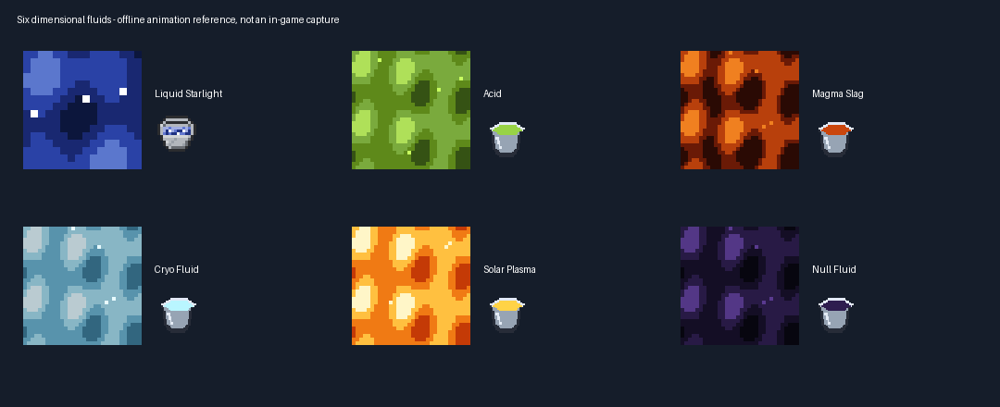

# Alien farms, caves and collectable liquids — 1.0.7

Minecraft Java 1.21.1 · NeoForge 21.1.252 · development candidate.
This guide supplements, rather than removes, the illustrated
[planet atlas and gate assembly](planet-generation-1.0.6.md),
[bee/hive/comb guide](planet-bees-and-blazes-1.21.1.md),
[armour and mob catalogue](current-collection-guide-1.21.1.md) and
[apiary diagrams](multiblock-reference-guide.md).

## Liquid colour/family identities and inventory categories

Every currently implemented liquid has a separate registered source ID, flowing
ID, placeable liquid block and matching filled bucket. All IDs below use the
`zerog_tweaks:` namespace. Colour is authored in the texture, not selected by
renaming a bucket or dyeing an arbitrary source. Distinct bee families can share
a coordinated palette while retaining their own IDs and products.

| Inventory tab | Source/block ID | Colour identity | Bucket item ID |
| --- | --- | --- | --- |
| Planetary Liquids | `liquid_starlight` | Pale cyan starlight | `liquid_starlight_bucket` |
| Planetary Liquids | `acid` | Lime/green | `acid_bucket` |
| Planetary Liquids | `magma_slag` | Ember orange/brown | `magma_slag_bucket` |
| Planetary Liquids | `cryo_fluid` | Ice blue | `cryo_fluid_bucket` |
| Planetary Liquids | `solar_plasma` | Solar gold | `solar_plasma_bucket` |
| Planetary Liquids | `null_fluid` | Deep violet | `null_fluid_bucket` |
| Bee Honeys | `moon_honey` | Cyan midnight | `moon_honey_bucket` |
| Bee Honeys | `mars_honey` | Crimson-family amber | `mars_honey_bucket` |
| Bee Honeys | `cerulon_honey` | Flora-family pink | `cerulon_honey_bucket` |
| Bee Honeys | `skarn_honey` | Magma orange | `skarn_honey_bucket` |
| Bee Honeys | `eidolon_honey` | Frost white/cyan | `eidolon_honey_bucket` |
| Bee Honeys | `solvane_honey` | Gold dust | `solvane_honey_bucket` |
| Bee Honeys | `flora_bee_honey` | Flora pink | `flora_bee_honey_bucket` |
| Bee Honeys | `midnight_bee_honey` | Midnight cyan | `midnight_bee_honey_bucket` |
| Bee Honeys | `crimson_bee_honey` | Crimson amber | `crimson_bee_honey_bucket` |
| Bee Honeys | `tropical_bee_honey` | Tropical gold | `tropical_bee_honey_bucket` |
| Bee Honeys | `gold_dust_bee_honey` | Gold dust | `gold_dust_bee_honey_bucket` |
| Bee Honeys | `magma_bee_honey` | Magma orange | `magma_bee_honey_bucket` |

For each source `ID`, the moving fluid is `zerog_tweaks:flowing_ID`. For example:
`zerog_tweaks:cryo_fluid`, `zerog_tweaks:flowing_cryo_fluid`, and
`zerog_tweaks:cryo_fluid_bucket` are different registry entries.

The existing `zerog_tweaks:liquids` creative tab remains registered and is now
labelled **ZeroG: Planetary Liquids**, containing six buckets. A new
`zerog_tweaks:honey_liquids` tab, **ZeroG: Bee Honeys**, contains twelve buckets.
Both are alphabetically ordered. Existing food, tools, combat, blocks,
ingredients and spawn-egg categories are retained. The fish-containing bucket
is deliberately not counted as a plain liquid bucket.

Use an empty vanilla bucket on a **source block** to collect its exact family;
use the filled bucket to place that source again. Flowing currents cannot be
scooped, matching vanilla's source-only rule. Sources do not form infinite
two-bucket pools. Full family hives can also be harvested with an empty bucket,
retaining their existing smoke/bee-anger handling. Containers use the actual
vanilla water-bucket silhouette and an original liquid-colour overlay, not a
full cube icon. All eighteen liquids retain animated still and flowing strips.

These are the eighteen implemented liquids, not a promise of a new liquid for
every one of the 34 destinations. Naturally placed pools still follow their
existing planetary associations. JEI or other third-party inventory managers
may expose their own search/category UI; the tabs here are Minecraft's creative
inventory categories, not a custom JEI integration.

## Twenty alien crops and seeds

| Planetary theme | Four-stage vegetables |
| --- | --- |
| Moon | Lunar Turnip, Pearl Carrot, Orbit Pea |
| Mars | Rust Beet, Ares Chili, Copper Onion |
| Cerulon | Tidal Cucumber, Reef Lettuce, Azure Bean |
| Skarn | Ember Radish, Cinder Pepper, Obsidian Aubergine |
| Eidolon | Frost Cabbage, Rime Parsnip, Ghost Garlic |
| Solvane | Solar Tomato, Corona Corn, Sunburst Squash |

Nebula Melon (Cerulon theme) and Eclipse Pumpkin (Moon theme) add two native
stem/attached-stem fruit families, edible slices, seed recipes and full fruit
blocks. They are not carved pumpkin faces or lanterns. All twenty have separate
plantable seed items. Existing grains, Rust Tuber and Skyberry remain available.

Vegetables grow on native planetary farmland, require suitable light and support
bonemeal. Mature plants drop their own food and seeds. Produce is edible;
produce-to-seed recipes and composting are supplied. New seeds join vanilla's
farmer plantable-seed tag. A bounded server-side sensor allows farmers to find
custom farmland without replacing vanilla AI. Village beds mix three local
vegetable types, and structure chest loot includes seeds. These changes do not
implement bespoke alien trades, universal breeding-food acceptance or new cooking
recipes for every vegetable.

## Thirty-four cave families

Each dimension keeps a separate `<dimension>_cave_berry`,
`<dimension>_cave_vines`, `<dimension>_cave_vines_plant`,
`<dimension>_pointed_dripstone` and `<dimension>_dripstone_block` identity.
The namespace is `zerog_tweaks`; for example, `zerog_tweaks:mars_cave_berry`.

Original 32×32 art uses transparent silhouettes, clustered highlights and
pixel gradients. Six contrast families—purple Moon, teal Mars, pink Cerulon,
blue Skarn, amber Eidolon and violet Solvane—receive deterministic per-destination
hue variation. They contrast with the native ground rather than simply becoming
the same colour as the biome. Cave generation selects the destination's own
formations and hanging vines. Berries can be eaten, planted, picked and ripened
with bonemeal; only berry-bearing vines emit their light.

Custom pointed formations use native pointed geometry, up/down orientation,
waterlogging, support chains and upward-point injury. Unsupported custom spikes
break and drop. **Mineral growth, cauldron filling and falling stalactite entity
damage are not implemented**; do not mistake native geometry for complete vanilla
dripstone mechanics.

## Rare villages that follow the ground

One candidate is selected per **50×50-chunk region**, with an offset of 16–33
chunks on each axis. This is not one village per fifty individual chunks.
Candidate centres are at least **33 chunks / 528 blocks** apart; wet, steep or
otherwise unsafe sites are rejected, so some regions have no village at all.

Ground height is taken from the solid surface, not elevated to sea level. Accepted
sites clear/fill only a bounded footprint. Deep support pillars and elevated ocean
platforms have been removed. Soil/farmland, masonry and wood follow the destination;
existing surface blocks remain around the farm and outer transition band instead
of stamping a green rectangular lawn over every planet. Existing block entities
and protected gate sites are still checked before construction.

The new clean showcase is prepared **without demonstration colonies**. Old played
saves are not erased. These generator changes affect newly generated settlements,
not already built villages in explored chunks. For an uncontaminated comparison,
use the new showcase rather than the 1.0.6 demonstration save.

## Verification boundary

All three required isolated NeoForge tests passed in the final run, including
crop/berry loot, food properties, bonemeal, native gourd production, custom
cave-family support, all 34 gate return routes, and placement/source collection
for all eighteen liquid buckets. The server then saved every dimension and shut
down successfully. Earlier runs passed assertions but hung unloading chunks;
the final test waits 400 ticks after cross-dimension travel before shutdown.
Transcript: `20261003_225427_-PplanetHubTests.log` (UTC filename; local test date
4 October 2026). Seven source/generation contract checks also passed.

The fresh exported world is **ZeroG Planet Showcase 1.0.7 — Seed 0**, folder
`ZeroG_Planet_Showcase_1_0_7_Seed0`, seed **0**, hub spawn **62 / 65 / 0**.
The export confirms 68 gates, no demonstration colonies and no changes to existing
saves. It is a prepared test world, not a normal seed-0 vanilla world.

The normal clean production build passed (`20261003_225818_clean.log`).
Packaged model references passed: 7,318 models, 1,372 blockstates and 3,160
declared atlas-generated trim sprites. All 18 bucket overlays match their source
hashes and all 36 still/flow texture strips have valid animation metadata.
The original 698 crop/cave PNGs are checked against the Design manifest and the
packaged payload; new seeds retain the nine original farmer-plantable entries.
GameTest classes are excluded from the shipped JAR.

[Download 1.0.7-dev](jars/zerog-tweaks-1.21.1-1.0.7-dev.jar)
· [Checksums](jars/SHA256SUMS.txt).
The pre-push pull also preserved the incoming Concord Vault update (`bb2069fa`):
ten designed room templates. All ten NBTs parse, and the final normal build passed
again (`20261003_230504_build.log`). These rooms were not part of the crop/liquid
GameTests; their encounters still need their own gameplay review.

SHA-256: `5a77f2b6cf4bcf956ef60ace9bc7d19b83b1b6822c2026ee95d50a5d4eecb5f8`.
Client appearance, extensive village/biome exploration and full modpack/GPU
compatibility still require the player's in-game review. No client or existing
save was launched by this work.
