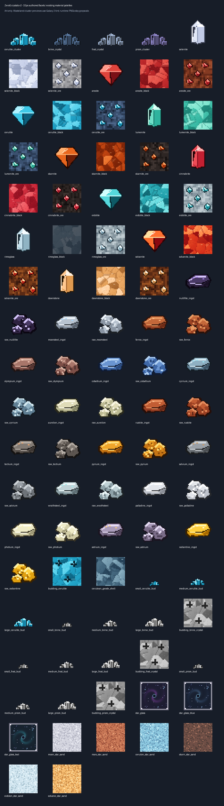
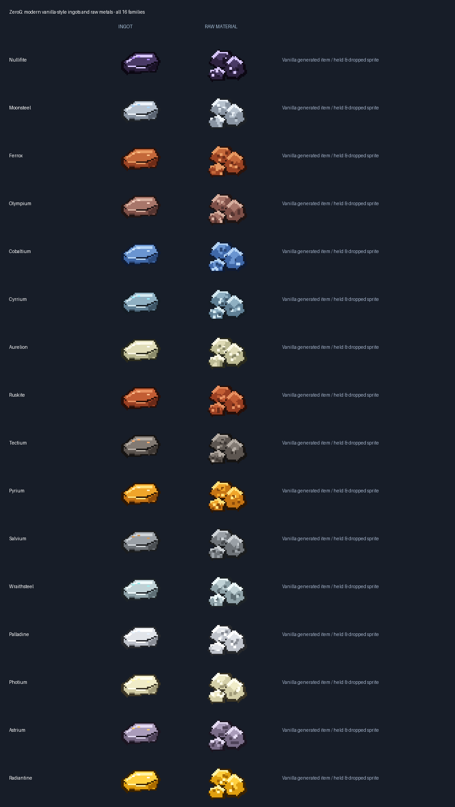
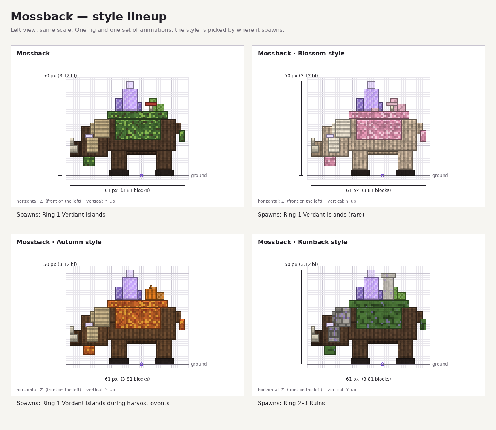
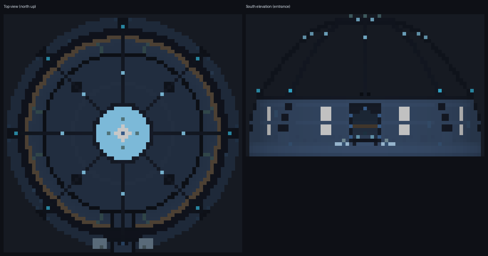

# ZeroG Tweaks 1.0.1-dev — Minecraft 1.21.1

Development candidate for **Java 21**, **NeoForge 21.1.150+** (built against
21.1.252) and **GeckoLib 4.9.3 for NeoForge 1.21.1**. Not Minecraft Bedrock,
Fabric or Forge. This is not a finished gameplay release or a CurseForge upload.

## New crystals, metals and glass

Four crystal families — Cerulite, Brine, Frost and Prism — grow from budding
roots through small, medium, large and mature clusters. Growth uses vanilla
amethyst random ticking, all six attachment directions and waterlogging.
Light levels are **1 / 2 / 4 / 5**. Budding roots drop nothing; immature buds
require Silk Touch. Existing mature-cluster loot/progression is retained.
Brine, Frost and Prism remain grayscale source textures with dimension tinting.

Ten crystal/gem families have updated items, ores and faceted storage textures:
Selenite, Aresite, Cerulite, Lumenite, Skarnite, Cinnabrite, Eidolite, Rimeglass,
Solvanite and Dawnstone. Rimeglass storage remains translucent.

All sixteen metal families have modern vanilla-style ingot and raw-metal
sprites: Nullifite, Moonsteel, Ferrox, Olympium, Cobaltium, Cyrrium, Aurelion,
Ruskite, Tectium, Pyrium, Salvium, Wraithsteel, Palladine, Photium, Astrium and
Radiantine. Vanilla generated-item models retain inventory, held and dropped
rendering; these are not opaque six-sided inventory cubes.

### Star Glass — not Sky Glass

Star Glass has quartz edging, a translucent nebula and an animated singularity
projection. It emits **light level 12**. Sixteen 64×64 frames run at **3 ticks
per frame**, interpolated. The background pane is approximately 15% opaque;
the quartz frame, stars and projection are brighter. This is a texture-based
depth illusion, not a parallax shader or coloured dynamic lighting.

Right-click a placed block with purple/magenta, blue/light-blue or cyan/green
dye to select purple, blue or teal. A changed colour consumes one dye outside
creative mode. Silk Touch returns the default purple item.

Moon, Mars, Cerulon, Skarn, Eidolon and Solvane Star Sands are falling blocks.
Each furnace recipe produces **one Star Glass in 200 ticks**. Find the sands
under Natural Blocks and glass under Building Blocks. No new sand terrain
placement is added in this revision; no new Sky Glass identifiers are added.

## Latest repository work included

This candidate incorporates upstream code through
[`1f75e35e`](https://github.com/ZeroG-Network-PTY-LTD/ZeroG-Tweaks/commit/1f75e35e65d7462c09c034c91e44bb52214e15ec),
not only the new artwork:

- Mossback: neutral Cerulon grazer, four styles, breeding/parent following,
  retaliation and leap-slam behaviour, models, textures, animations and egg wiring.
- Crystal Stag and Prismling AI/model updates; Azure Fowl and Glimmerfish
  registrations, rendering and Cerulon spawn rules.
- Prism Sentinel arena and Concord Prism boss integration, with Cerulean,
  Aurelion, Nebulite and rare Radiant variants.
- Liquid Starlight: light 12, swimmable fluid and bucket, animated textures,
  underwater fog, Slow Falling and Night Vision effects.
- Cerulean Soil and six additional Cerulon biomes: Glimmer Sea, Starbloom
  Meadow, Cerulean Peaks, Concord Quarries, Starlight Caverns and Geode Depths.
- Cerulon geode/cave placement and mining progression changes; no restoration
  of the removed free Cerulite storage-block terrain patches.
- Existing 80 armour pieces, 100 material tools, approved Tidewraith pair,
  refinery and eight-layout apiary reference guide are retained.

The [full illustrated guide](current-collection-guide-1.21.1.md) preserves the
armour, tools, Bees, frames, machines, mobs, eggs and drops descriptions.
Productive Bees integration, most apiary menus/processing, multiblock formation,
HD worn-armour mapping and remaining creature/campaign systems remain unfinished.
Source presence does not certify every feature in the actual modpack.

## Blockbench and references

The new revision contains **96 texture PNGs and 80 texture-embedded editable
Blockbench projects**. Most textures are newly authored 32×32 pixel art;
Star Glass uses 64×64 frames. The historical collection and its hash roster are
preserved, rather than presented as updated runtime evidence.

- [New editable projects](https://github.com/ZeroG-Network-PTY-LTD/ZeroG-Tweaks/tree/Design/docs/asset-collection-1.21.1/crystals-amethyst-style-v2/blockbench)
- [New local HTML gallery](https://github.com/ZeroG-Network-PTY-LTD/ZeroG-Tweaks/blob/Design/docs/asset-collection-1.21.1/crystals-amethyst-style-v2/review.html)
- [Texture manifest and source generator](https://github.com/ZeroG-Network-PTY-LTD/ZeroG-Tweaks/tree/Design/docs/asset-collection-1.21.1/crystals-amethyst-style-v2)

PNG/GIF illustrations are offline asset references, not Minecraft or Blockbench
screenshots. The Blockbench glass project displays frame zero; the game's
texture animation is provided by mcmeta. No desktop import/visual approval is claimed.

## Install in CurseForge for testing

Download [zerog-tweaks-1.21.1-1.0.1-dev.jar](jars/zerog-tweaks-1.21.1-1.0.1-dev.jar)
and check its entry in [SHA256SUMS.txt](jars/SHA256SUMS.txt).

1. Close Minecraft and back up the instance/saves.
2. Use the **ZeroG Java/NeoForge 1.21.1** CurseForge profile.
3. Keep only one jar providing `zerog_tweaks`; move the older Tweaks jar to a
   backup folder outside `mods`, then copy this candidate into
   `C:\Users\jakem\curseforge\minecraft\Instances\ZeroG\mods`.
4. Ensure GeckoLib 4.9.3 for NeoForge 1.21.1 is installed; test in a disposable
   new world first. Keep any separate Binnie expansion only if otherwise compatible.

Publishing itself does not install or launch the game. The user separately
requested installation into the ZeroG CurseForge instance; older conflicting
Tweaks jars are moved to a recoverable backup outside mods. Saves/configs and
other mods are preserved. No CurseForge website project/release is created.

## Verification boundary

52 isolated server GameTests passed, covering the existing suite plus crystal
growth/waterlogging/light, 34 farming families, five new fluid registrations,
impact container safeguards, twelve bee/hive families, honey harvesting and
Blaze palette persistence and existing saplings on all planet soils. Normal clean build and packaged-art checks must also
pass before installation/publication. Client rendering, worldgen frequency,
long-running impacts and actual ZeroG-modpack compatibility remain unverified.
See [candidate evidence](crystal-material-build-evidence.json),
[ecology](dimension-ecology-1.21.1.md), and [bees/Blazes](planet-bees-and-blazes-1.21.1.md).
