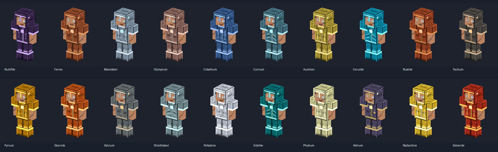
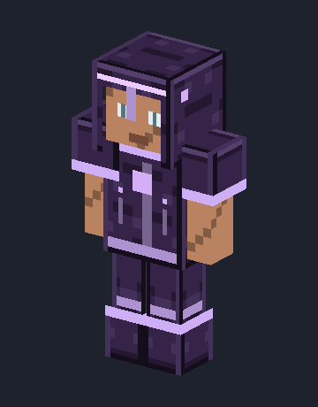
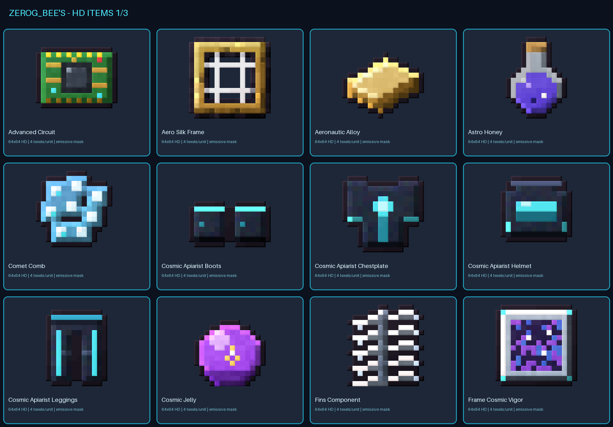
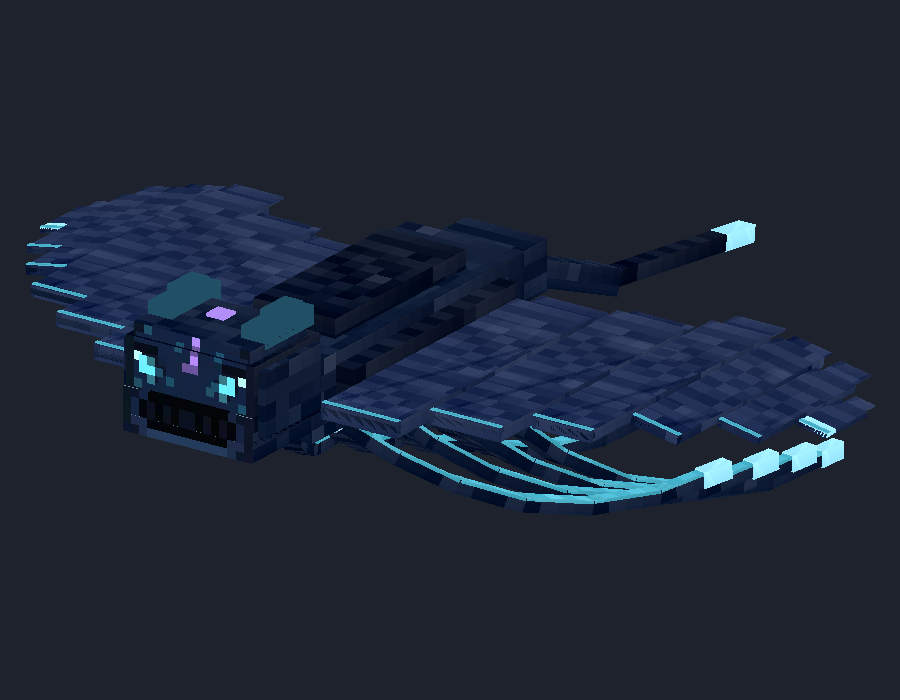
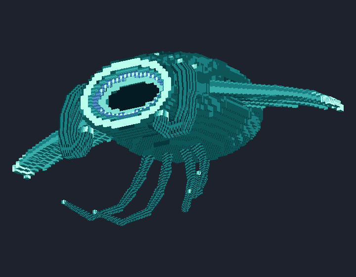
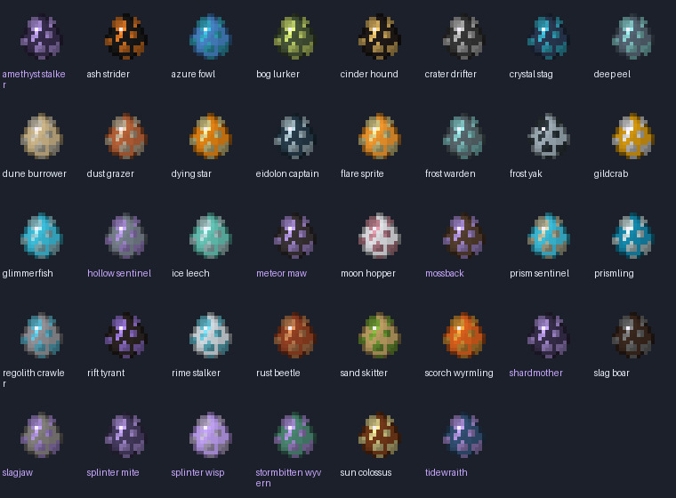

# ZeroG 1.21.1 — illustrated collection guide

This update continues the [approved Tidewraith branch](https://github.com/ZeroG-Network-PTY-LTD/ZeroG-Tweaks/tree/codex/tidewraith-approved-mobs), combining the complete local design collection with tested equipment and Tidewraith Java integration. It is a development update, not a complete gameplay release. Images below are preserved design sheets and software previews, not Minecraft screenshots.

## What is included

| Collection | Included designs | Current runtime status |
| --- | --- | --- |
| Material armour | 20 fitted sets / 80 pieces | Wearable, repairs, durability, attributes and enchantment/trim tags; new HD geometry mapping remains pending |
| Material tools | Sword, pickaxe, axe, shovel and hoe for each of 20 families | 100 functional vanilla-derived tools; provisional tiers, not planet progression gates |
| Bees/apiary blocks | 85 models | Design assets; working machine menus and production are pending |
| Bees inventory | 65 standalone items + 85 block-inventory views | Design assets; not all registered in this Tweaks runtime |
| Frames | 19 designs within the inventory collection | Inventory-insert studies; slot mechanics pending |
| Apiary structures | 8 multiblock assemblies | Authored layouts; formation/processing not implemented here |
| Apiarist wearables | 8 individual pieces | Player/held-item design studies; not the 20 material sets |
| Materials | 39 families, 94 blocks, 71 inventory models | Existing Tweaks content plus preserved design catalogue |
| Creature studies | 28 mobs + 37 Shattered Skies style models | Most remain asset-only; do not confuse variants with unique entities |
| Drops and eggs | 65 drop models and 38 egg studies | Most creature registrations pending; Tidewraith pair has working runtime eggs |
| Approved Tidewraith pair | Non-boss plus boss and three alternate boss palettes | Spawnable; flight, eyes, mouth and boss palette persistence tested |

The combined showcase has **609 presentations across 12 categories**, including inventory duplicates and palette variants. It does not represent 609 unique registered entities/items.

## Armour — fitted to the player

The approved green-box design uses the Minecraft humanoid rig and close-fitting shells. Shoulder and wrist cuffs remain slim. Eye/mouth openings are transparent; forearms and hands stay exposed. Neutral arms are not spread, and medial leg-shell adjustments reduce neutral-pose z-fighting. The rejected orange-box bulky cages and floating chest pieces are excluded from the active collection.

Every family includes helmet, chestplate, leggings and boots, plus sword, pickaxe, axe, shovel and hoe:

Astrium, Aurelion, Cerulite, Cobaltium, Cyrrium, Eidolite, Ferrox, Moonsteel, Nullifite, Olympium, Palladine, Photium, Pyrium, Radiantine, Ruskite, Salvium, Skarnite, Solvanite, Tectium and Wraithsteel.

All 80 pieces are real Java armour items with equipment slots, durability, family repair ingredients and protection attributes. Right-click equip is tested across all 80. Eight matching full-set bonus portions are implemented:

| Family | Implemented portion |
| --- | --- |
| Nullifite | Fall-damage immunity |
| Moonsteel | 50% fall-damage reduction |
| Ruskite | 25% fire-damage reduction |
| Skarnite | Fire/lava immunity |
| Eidolite | Freezing-damage immunity |
| Cobaltium | +10% mining speed |
| Ferrox | +1 total toughness, without stacking |
| Astrium | +2 maximum health, removed on unequip |

These require all four matching pieces. Other planned ability portions are not claimed as implemented. The equipment runtime currently uses existing vanilla-layer textures, **not the new fitted HD study geometry**. Worn-model mapping, first/third-person fit review, animated equipment textures and emissive armour rendering remain unfinished.

Eight sets have 12-frame, 2.4-second animated-PNG studies: Nullifite, Moonsteel, Cerulite, Wraithsteel, Eidolite, Astrium, Radiantine and Solvanite. A flipbook image is not proof of an animated worn renderer.

## ZeroG Bees — complete non-bee design stack

This section packages the apiary ecosystem by use. It does not claim a finished Productive Bees add-on. Rejected bee entity designs are not restored; accepted vanilla Bedrock-style bees with space textures, original eyes/wings and suitable glow are still pending.

### Apiary structures and tier parts

| Assembly | Included component studies |
| --- | --- |
| Tier 1 Rustic Alveary | Controller, casing, frame housing, hatch and roof |
| Tier 2 Controlled Alveary | Controller, dryer, fan, heater, humidifier, glass, housing and shell parts |
| Tier 3 Industrial Alveary | Energy port, frame loader, honey port, input/output hatches and structure parts |
| Tier 4 Aeronautic Alveary | Pressure port, rotor, vent, controller, hatches, glass and shell |
| Tier 5 Atmospheric Star Alveary | Stabilizer, crown, controller, energy port and structure parts |
| Tier 6 Nebula Refractory | Fluid/energy ports, focus, lens, pylon and structure parts |
| Tier 7 Quantum Queen Chamber | Coil, emitter, column, pillar, ports, frame housing and shell |
| Cosmic Alveary | Separate cosmic multiblock design |

Standalone machine studies include the ZeroG hive, apiary controller, centrifuge, gravitational centrifuge, frame assembler, frame component assembler, frame infusion altar, infusion altar, genetic splicer, geno station, silk weaver, stardust smelter and starmetal smelter. Meteor and nebula comb blocks are also included.

### Frames, products, genetics and held tools

The 19 frame studies are untreated, impregnated, proven, chocolate, restraint, soul, healing, honeyed, oblivion, cryo, aero, aero silk, starlit, starmetal, lunar, solar, swift mutation, cosmic vigor and void. They are designed as inventory inserts, not bulky wearable objects. Effects, frame housing slot logic and balancing remain future work.

Products include astro honey; comet, meteor, molten, nebula, solar, stardust and void combs; cosmic/royal/solidified royal jelly; ordinary, lunar, solar and void pollen; honey drops; silk thread and woven silk. Components include advanced circuits, confinement coils, fins, stardust, aeronautic alloy, starmetal ingots and nuggets.

Genetic/utility studies include the portable beealyzer, habitat locator, serum vial and trait serum. Held-tool projects cover aeronautic/basic/sturdy/magnetic scoops, the Apiarist wrench, bee smoker, copper/diamond grafters and alveary blueprint. The collection preserves held-item views; that alone does not prove first-person placement in Java.

The Apiarist and Cosmic Apiarist outfits each have four wearable studies. Their inventory icons above are not a screenshot of their worn appearance. Functional controller/hatchery GUIs, frame/bee/comb/genetic slots, FE/fluid processing, recipe handling, outputs and export automation are **not implemented by this asset publication**.

## Materials, blocks and inventory art

The material studies contain 39 ores, 16 raw-storage blocks and 39 processed-storage blocks. Inventory items include ingots, raw materials, nuggets, gems, crystals, dusts, pearls, shards and fuels. Blocks use six-faced geometry; inventory materials use transparent front/back treatments rather than opaque placeholder cubes. The original material pixel art was nearest-neighbour enlarged from 16×16 to 64×64: this is preserved pixel art, not newly painted HD detail.

The running source now also fixes ashfall, crater dust and snowpack to eight-layer deposits, and Charwood, Gildwood, Hoarwood and Shardwood fences to actual wooden fences rather than incompatible wall states. Existing registry IDs are preserved.

## Approved Tidewraith pair, other mobs and drops

The repaired-face creature is the regular Tidewraith. The manta-mouth model is the boss, retaining its authored dimensions rather than applying six-times-player scaling. Geometry, UVs and source PNG bytes are preserved. Runtime includes the regular texture and four boss palettes (base, Abyssal, Pearl and Storm), each with its matching glow mask.

Both eggs create the correct entity. The pair flies, periodically blinks, and triggers authored mouth motion on successful attacks. The boss has a boss bar and saved/clamped palette index. Testing stats are 30 health / 4 attack for the regular and 180 health / 8 attack for the boss; these are not final campaign balance. There are 19 imported authored clips, but controllers currently activate flight, blink and mouth-open only. Natural spawning, approved drops and campaign boss phases remain pending.

Other creature studies, palettes, drops and aura sheets are retained as existing design work, not presented as newly approved or universally spawnable. The full names are in the [category inventory](asset-collection-1.21.1/README.md#catalogue-by-use).

## Open and review

- [Full Blockbench catalogue](asset-collection-1.21.1/showcases/ZeroG_Full_Collection_1_21_1.bbmodel)
- [Twenty fitted armour sets](asset-collection-1.21.1/showcases/ZeroG_All_20_Armour.bbmodel)
- [Apiary blocks](asset-collection-1.21.1/showcases/Category_Apiary_blocks.bbmodel), [items/frames](asset-collection-1.21.1/showcases/Category_Apiary_items_and_frames.bbmodel), [multiblocks](asset-collection-1.21.1/showcases/Category_Apiary_multiblocks.bbmodel), [Apiarist wearables](asset-collection-1.21.1/showcases/Category_Apiarist_wearables.bbmodel)
- [Material blocks](asset-collection-1.21.1/showcases/Category_Material_blocks.bbmodel) and [items](asset-collection-1.21.1/showcases/Category_Material_items.bbmodel)
- [Mob drops](asset-collection-1.21.1/showcases/Category_Mob_drops.bbmodel), [egg studies](asset-collection-1.21.1/showcases/Category_Spawn_eggs.bbmodel), [approved Tidewraith pair](asset-collection-1.21.1/showcases/Category_Approved_Tidewraith.bbmodel)
- [HTML catalogue](asset-collection-1.21.1/review.html) — download/open locally; GitHub displays HTML source rather than running this page.

Combined catalogue scenes are static layout previews. Open individual projects to play their clips. The full scene is texture-heavy; category files are lighter. The immutable snapshot has a hash roster for 1,381 files. The [runtime review](local-runtime-review-1.21.1.md) records the server/client test scope, import exception and unfinished features. No CurseForge instance or user world is modified by publishing this branch.
