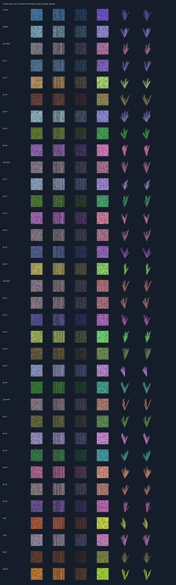
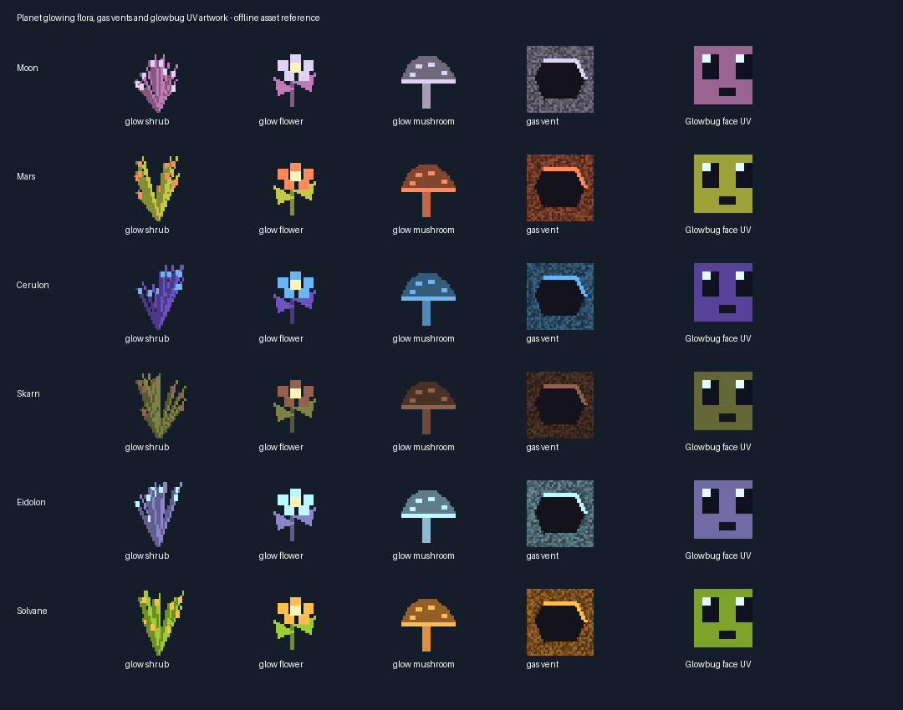

# Planet ecology and daily impacts — 1.0.1-dev

This candidate combines the [crystal/material update](crystal-material-update-1.21.1.md)
and latest repository code with the new dimensional terrain/fluids/ecology.
Minecraft **Java 1.21.1**, NeoForge **21.1.150+** (built against 21.1.252),
GeckoLib **4.9.3**, Java **21**. Not Bedrock or a complete gameplay release.

## Farming, grass and plants

All **34 registered dimensions** have their own soil, grass block, short grass,
two-block tall grass, farmland and Star Sand IDs. The six named planets are
Moon, Mars, Cerulon, Skarn, Eidolon and Solvane; the other 28 are galaxy slots
and moon systems. Default wasteland palettes remain identifiable across galaxies.

- Hoe soil/grass into the matching farmland; do not till with a solid block overhead.
- Farmland is 15/16 block high, with moisture 0–7 and dry/wet top textures.
  Water within four blocks/rain hydrates it. Trampling, obstruction and drying
  without a crop return it to its own soil, not vanilla dirt.
- Vanilla wheat/seeds grow on it. Short/tall grass supplies vanilla wheat seeds
  by chance; shears or Silk Touch preserves the plant. Silk Touch preserves
  grass blocks; otherwise grass drops its matching soil.
- Grass spreads only to its own soil; bonemeal grows its themed short grass,
  and short grass can become its own tall grass.
- Small fertile/vegetation patches are added to planetary biomes, without
  replacing their caves, ores, biome selectors or established terrain wholesale.
  Existing planet trees/saplings are reused; oak/birch mix supplies vanilla tree
  behavior, including oak apples and existing sapling loot where applicable.
- Named planets receive glowing shrubs/flowers and decorative mushrooms
  (light 4/4/6). Decorative mushrooms do not implement huge-mushroom growth.
  Existing flowers, mushrooms and other vegetation remain intact.

Alien vegetable/fruit varieties and further tree species remain a later pass;
this update provides their farming foundation, not fictional finished crop systems.

## Six liquids and natural pools

| Liquid | Habitat | Light | Implemented contact behavior |
| --- | --- | --- | --- |
| Liquid Starlight | Cerulon caves | 12 | Slow Falling and Night Vision; upstream cave pools preserved |
| Acid | Toxic wasteland biomes | 4 | Poison II, armour wear, dropped items dissolve after five seconds of continuous contact |
| Magma Slag | Skarn/volcanic biomes | 12 | Thick, slow flow; burning/lava damage |
| Cryo Fluid | Eidolon/frozen biomes | 2 | Slowness/freezing; full Eidolite protection |
| Solar Plasma | Solvane biomes | 15 | Custom heat damage bypassing Fire Resistance; full Skarnite/Eidolite/Solvanite protection |
| Null Fluid | Moon/barren biomes | 6 | Gentle upward float and fall-distance reset |

Each has a real bucket, source/flowing states, underwater fog and animation.
The five additional liquids have native 32px still / 64px flowing frames.
Fluid lakes are rare surface-pool attempts in the listed biomes; existing oceans
are not replaced. Lakes can fail when vanilla lake placement conditions reject
a site. These features affect **new chunks only**.

Implemented adjacency conversions follow the design: Acid + water/lava makes
Sludgestone/Toxic Mud; Starlight + water/lava makes Crystal Sand/Prismstone;
Magma + water/Starlight makes Slag/Rift Glass; Cryo + water/lava makes Glacial
Ice/Frostrock; Plasma + water/Cryo makes Slag Glass/Sunspot Rock; Null + lava
makes Deepslate Nullifite Ore. Downward-flow interactions are not promised;
NeoForge's source adjacency registry controls these reactions.

Neutralizer/Heatproof Plating equipment-upgrade components, Freeze Ward effect
integration, nearby Nullifite glow enhancement and machine fluid recipes are
still unfinished. Do not infer those from a named item or fluid being registered.

## Glowbugs and gas vents

The initial six small pollinating insects use the vanilla **Java** bee rig/AI with original
planet-coloured art, blinking eyes, emissive eye/wing masks, working species
eggs and inherited breeding. Natural spawns are low-weight groups of 1–2 in
named-planet biomes on suitable grassy ground. They do not provide dynamic
world lighting or complete the separate Productive Bees add-on. The newer
[twelve-family bee revision](planet-bees-and-blazes-1.21.1.md) supersedes their
initial artwork and adds half-size rendering/hitboxes, hives and honey products.

Gas vents use tinted vanilla campfire smoke motion/sprites. Cover the vent to
stop its plume. Moon gas gives Slow Falling, Mars weakness, Cerulon Night
Vision, Eidolon slowness; Skarn/Solvane gas can ignite nearby living entities.
Vent light is 2, except Solvane 8. Occasional vents appear with fertile patches
on named planets; this is not a complex pressure/atmosphere simulator.

## Daily comet/asteroid impacts — terrain damage enabled

Human-approved cycle: **one Minecraft day = 24,000 ticks**. The scheduler checks
at night (day tick 18,000 onward), with at most one successful impact per active
ZeroG dimension/day. Success is saved across restarts. Inactive dimensions are
not force-loaded; missed days do not produce a catch-up barrage.

Candidates are 80–144 blocks from a player, at least 64 blocks from every player,
and within already loaded terrain. Unsuitable candidates are retried; an impact
is **not guaranteed** when there is no valid loaded site. A bounded radius-4
crater is excavated, leaving meteorite fragments and two mining-gated ore nodes.
Rock/gem extraction uses existing mining levels and loot. Sound, smoke, burst
particles and coordinates announce the event. There is no animated incoming
sky projectile or entity-damaging explosion in this first pass.

Validation rejects containers/block entities, unbreakable blocks, liquids and
unrecognised building materials before changing the whole volume. **Player-built
natural stone/soil cannot be distinguished from terrain.** Claims/protection-mod
integration is not implemented. Back up saves and use a disposable world first.

Config: `config/zerog_tweaks-common.toml` → `dailyImpacts = true`, `impactRadius = 4`
(range 2–6). Set `dailyImpacts = false` to disable the damaging event. Publishing
and installation do not launch the game or alter existing saves.

## Models, gallery and testing

[Editable ecology projects](https://github.com/ZeroG-Network-PTY-LTD/ZeroG-Tweaks/tree/Design/docs/asset-collection-1.21.1/dimension-ecology-v1/blockbench):
357 PNGs and 233 projects, in addition to the crystal revision's 96 PNGs/80
projects. These are offline references/editable studies, not verified desktop
imports or in-game visual approval.

See [build/test evidence](crystal-material-build-evidence.json) for the final
candidate hash and exact checks. Client graphics, natural-pool frequency,
long-running impact cadence and the actual CurseForge modpack still require
player testing even when isolated server checks pass.
