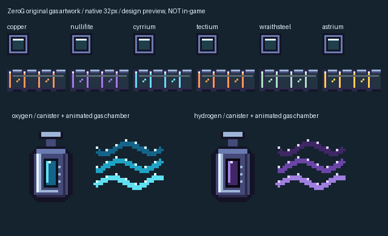

# Original ZeroG gas transport artwork

Approved first gas scope: oxygen and hydrogen, measured in mB. These assets are original ZeroG drawings, not Mekanism assets. Native resolution is 32 pixels, with C-style magitech steel, hue-shifted highlights/shadows and transparent chamber windows.

- Six gas-tube tier atlases: copper, nullifite, cyrrium, tectium, wraithsteel and astrium.
- Oxygen canister: cyan. Hydrogen canister: violet. Both centred with matching silhouettes.
- Eight-frame gas wisp animations per gas, three ticks per frame.
- Tube UV contract: six-unit end cap and side strip y=10..16, using Minecraft's 0..16 UV coordinates. Validate against actual gas-tube geometry before shipping.

Run `python generate.py` to reproduce the textures and native preview. Add `--code <code-checkout>` to generate and install runtime models, blockstates, loot, tags and textures. UTF-8 language values and existing registry names are preserved. The manifest contains texture sizes and hashes; the runtime audit compares every source resource byte with the production JAR.

## Runtime implementation and review boundaries

Runtime registration, persistent canisters and six gas-tube tiers are implemented on 1.21.x. Targeted server checks passed for fills, separation, quantities, blocked deliveries and reload; automatic routing and canister exchange are included in the final regression batch. See Docs `docs/gas-transport-2026-10-07.md` and its delivery receipt for final build/install evidence. Remaining review:

1. Inspect real in-game inventory, tube connections, tank contents and flowing wisps.
2. Approve shader/lighting readability and sustained transfer cues.
3. Define survival gas production and exact recipe costs later; current filled canisters are creative examples, not a complete survival production chain.

Gas production recipes, pressure hazards and biological effects are not invented by this art pass. Survival costs remain deferred.
