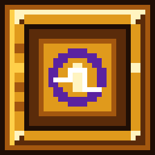

# Controller plans, travel hologram and creative GFE cell

Minecraft1.21.1 / NeoForge / same1.0.12-dev. Repository candidate; installed JAR
and player saves are not changed by this delivery.

## Standing gate schematics

Open the controller with an empty main hand. Choose **Plans**, then **Tier1–6**.
Use **Worlds** to return to destination selection. The selected plan is a standing
wireframe, not a flat diagram or an automatic builder. It is anchored to the
actual controller and respects resolved structural orientation. If previewing a
smaller tier whose service row cannot include the current terminal's offset,
the preview centre moves so the terminal itself stays fixed.

Green means correct; cyan means missing; red means a different block occupies
the slot. Plans expire after60seconds; repeating the same plan toggles it off.
They do not load chunks or modify the formed tier. Owner/proximity checks remain.

## Player jump costs

| Formed tier | FE per successful group jump |
| --- | ---: |
|1|100,000|
|2|200,000|
|3|400,000|
|4|800,000|
|5|1,600,000|
|6|3,200,000|

These are exact fixed gate tariffs, not the old configured formula. Passenger
count, intra-galaxy travel and Refracting Lens no longer change gate-jump prices.
Admin gates remain free. Return gates pay according to their own formed tier.
Charge is deducted once after a player successfully changes dimension. Cancelling
or failing validation/countdown/destination does not debit. Existing stored FE
and legacy battery capacities are retained; Recall items keep separate old pricing.

## Above-controller hologram and transition

A transient, rotating wire galaxy and selected-planet marker appear above nearby
controllers, with galaxy/tier, selected world, stored FE/jump cost and countdown.
Choose destinations through the controller's normal Worlds buttons; the hologram
reflects that server-selected world. It is **not** a new free-form destination picker.
It refreshes every10ticks while counting down, every40ticks otherwise, expires
after3seconds and renders within32blocks. No saved display entities or chunk loaders.

Gate dimension jumps use the existing galaxy-to-planet animation. SHORT retains
the shortened version; an old OFF setting now uses FULL for owner-enabled gate
jumps. Other dimension travel without a gate destination packet stays vanilla.
Rendering, text readability and shader appearance require client approval.

## Creative energy cell

Find **Creative GFE Energy Cell** in **Z-Admintools**. It has original gold,
eight-frame animated32×32 artwork and block light15. Inventory and placed models
share the same texture. GFE is an unlimited-supply display label; transport uses
the existing FE capability, not a new incompatible energy unit.

- Creative placement only; survival item pickup is blocked.
- No survival recipe or block loot. Operator commands remain administrative tools.
- Unlimited source; extract-only, cannot be charged.
- **300,000FE/tick total**, shared across all six faces and direct output/pull.
- Automatically supplies adjacent compatible receivers without loading chunks.
- Connected cable and receiver limits still apply; it does not bypass a gate's intake rate.
- Removing it revokes cached capabilities; authorized placement persists on reload.

## Verification / remaining approval

Initial red regression reproduced the old Tier1 tariff. A first green run passed
all four gate/optional-travel tests, including actual cooperative teleport with
one debit. Expanded final run **passed all10required tests**
(`20261008_222923_runWorkflowTests.log`, UTC filename): exact six-tier tariffs/all
plan selections, relocated-controller re-anchoring, packet roundtrip, real co-op
teleport/single debit, invalid destination without debit, ownership,384flexible
service placement combinations, duplicate/shared service rejection, real generator
charging, creative/survival placement and pickup, shared-face quota/simulation,
next-tick refill, removed-handler rejection and reload. Creative-mode checks use a
normal ServerPlayer; Minecraft's mock always reports Creative. No client was launched.

Clean production build passed (`20261008_223050_clean.log`). Asset inspection
checked7,979models,1,529blockstates,3,963PNGs and130animation metadata files with
zero binding errors. Test fixtures/classes are excluded from the production JAR.

Candidate: `docs/jars/zerog-tweaks-1.21.1-1.0.12-dev-gate-hologram-cell-20261009.jar`.
SHA-256: `b6125e58ed4e36cb10d9e6bfa65c01696fb414c2e41d836310d4393881354d31`.
The matching generator/source art lives on Design; runtime bindings/code on1.21.x.
The nine-section specification preceded implementation; bundled skill validators
were unavailable, so requirements/test traceability was checked manually.

Remaining machine recipe/upgrade pages and undefined biology/survival costs
remain on the separate machinery TODO; this gate delivery does not close them.
