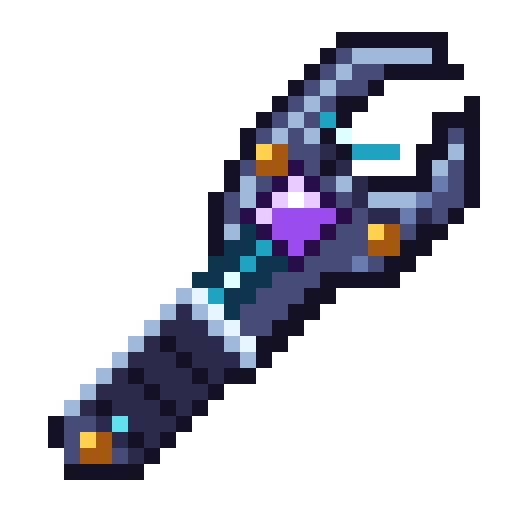

# Powered gate lights and Flux Wrench — 9 October 2026

## Gate pillar effects

A complete gate with stored FE lights its pylon columns. Idle pillar-top lamps use
short, blue beacon beams. Engaging the gate activates columns in sequence, raises
cyan beams during warm-up and pulses the surrounding glow as launch approaches.
The existing upward particles, rift and launch effects are retained.

These are visual beacon-style lights, not actual beacon blocks: no buffs, new
entities, chunk tickets or world-scanning renderer. The server sends bounded
pillar-top positions only to nearby clients. The client checks that each top is
still a loaded, lit Gate Pylon before drawing it. No travel fees or destination
rules changed. Hologram packet protocol2 requires matching updated client/server.

## Wrench artwork

The owner approved the new sci-fi concept: open jaws, dark metal/grip, pale bevels,
cyan circuitry, violet power socket and small gold fasteners. The existing
`zerog_tweaks:flux_wrench` ID, tool behavior and handheld positioning are preserved.
Its32x32 transparent sprite is authored separately using the locked style-kit
palettes; it is not a downscaled AI concept sheet. The preview's3D concept is not
an implemented Blockbench mesh; Minecraft retains the generated/extruded item.

Design source: `Design/docs/flux-wrench-sci-fi/generate.py` (run AFTER the old
full-art-rollout-v4 generator). `approved-concept.png`, native sprite, enlarged
nearest-neighbor preview and image-tool prompt are saved alongside it.

## Player review

1. Power a complete gate. Pillars should light and show short blue lamps.
2. Engage while standing on the pad. Watch the beams grow and pulse during the
   normal countdown; successful travel should keep its existing tariff.
3. Discharge the idle gate: the lamps should switch off within a second, plus
   normal network synchronization delay.
4. Inspect Flux Wrench in inventory and both hands; verify its existing tool
   interactions still work. Shader appearance remains a separate client check.

## Isolated verification

All5 `zerog_gate_display` tests passed, including powered/unpowered pillar state,
bounded pillar positions, status packet round-trip, exact tariffs, Plan/Build
controls and failed-destination safety. Disposable server exited normally.
Transcript: `20261009_000343_runWorkflowTests.log`. These checks do not certify
actual shader beam appearance or player-held texture quality.

The clean production build and asset audit passed (zero errors). Runtime/source
wrench PNG SHA256 matches `964f1cb70b63a1d450347a9f1c3202a10511dce8283306645c326ceb8f175446`.
Same-version1.0.12-dev JAR SHA256:
`e8a41d1921a294195960aeeb7e8109d141b9737667fab8bd2b57c063c6bb61da`.
Published binary: `docs/jars/zerog-tweaks-1.21.1-1.0.12-dev-pillar-wrench-20261009.jar`.
The old diagnostic build is backed up outside mods; saves and other mods unchanged.

## Pending separately

One randomized surface-level landing pad per dimension requires the agreed
shared-pad return-routing contract. No existing pads, dimensions or saves were
removed or regenerated in this batch. Undefined biology and exact survival
crafting costs remain deferred. Launch diagnostics are retained for another
failure; the owner reported the latest teleport succeeded, without a captured
failure identifying the earlier cancellation's cause.
