# Native artwork gallery — approved A/C rollout

These sheets display the actual exported runtime PNG pixels, at native inventory
size and enlarged with nearest-neighbour sampling. **They are asset previews, not
Minecraft client captures or a claim of in-game visual approval.** The illustrated
item silhouettes are not new registry entries. Equipment uses C magitech accents;
vegetation combines A natural shading with selective C luminous buds and fruit.

The reviewed batch covers 1,111 unique PNGs, including 180 equipment sprites, 20 worn
armour atlases, 40 vanilla-compatible armour sheets, 17 dusts, 22 ingots and 22 raw
materials and 120 shared native 32px armour-trim overlays. Botanical coverage includes four wood/leaf families, distinct crop
growth anatomy, older cereal stages, ground gourd vines, cave/wall vines and six
planetary kelp families. Transport previews retain their verified 16px UV budget;
they are not upscaled art advertised as HD.

The remaining 2,432 runtime PNGs are explicitly retained, not claimed re-authored.
They include entity art, fluids, GUI components, building blocks and previously
approved or vanilla-inherited resources. Soil/farmland retain coherent dirt
textures without ore or gemstone decoration; wet soil remains distinct.

## Equipment and materials

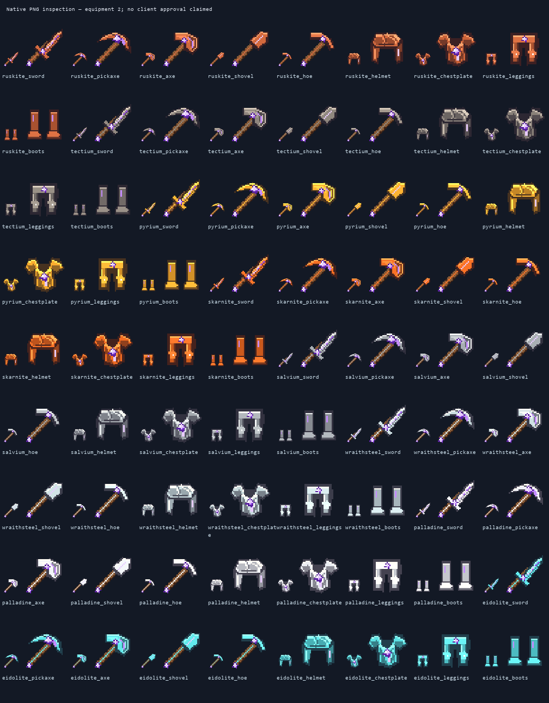
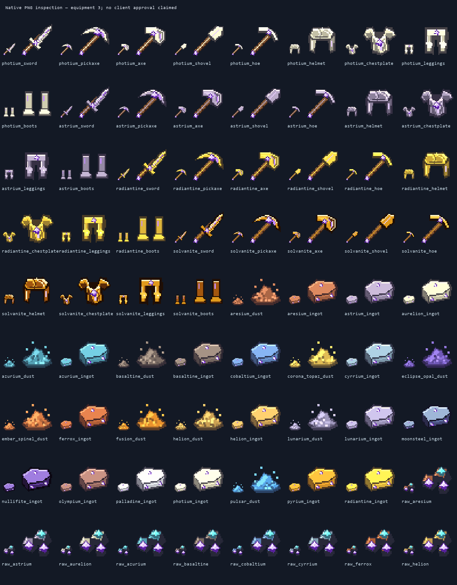
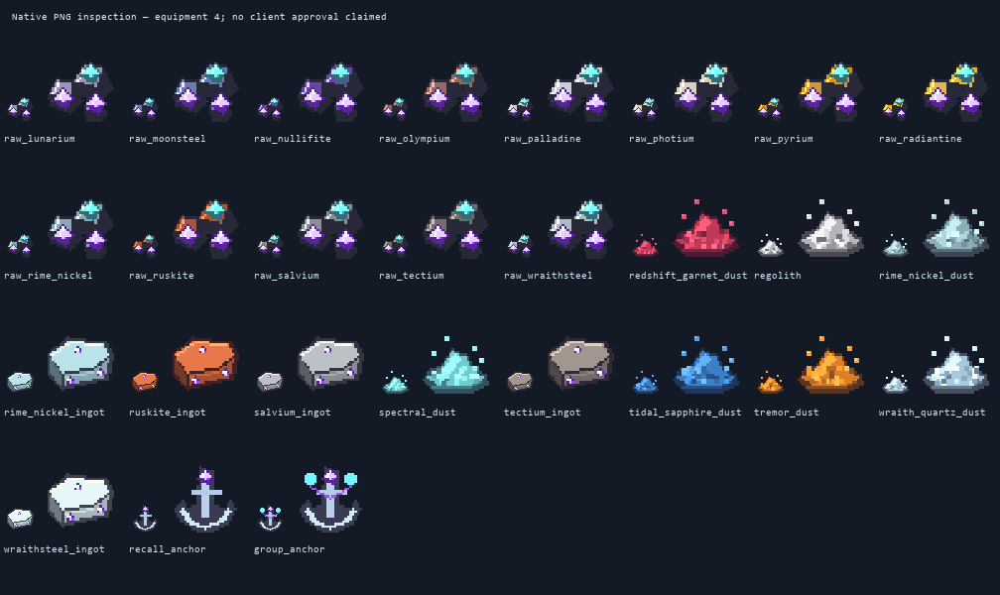

## Plants, growth stages and environmental vegetation

Seven crop families have separate silhouettes: low root rosettes, climbing
pea/bean stems with pendant pods, branching pepper/okra/tomato bushes, wide leafy
heads, cereal seedheads, asparagus spears and ground-running gourd vines. Visible
young fruit develops into the matching food-item colour. Growth bindings are
preserved; a painted vine or stem does not imply an added support-item mechanic.

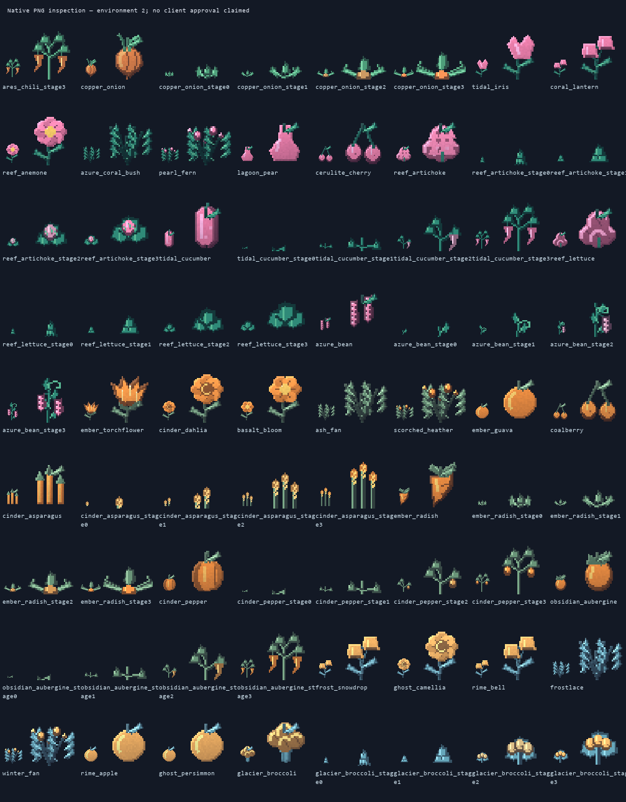
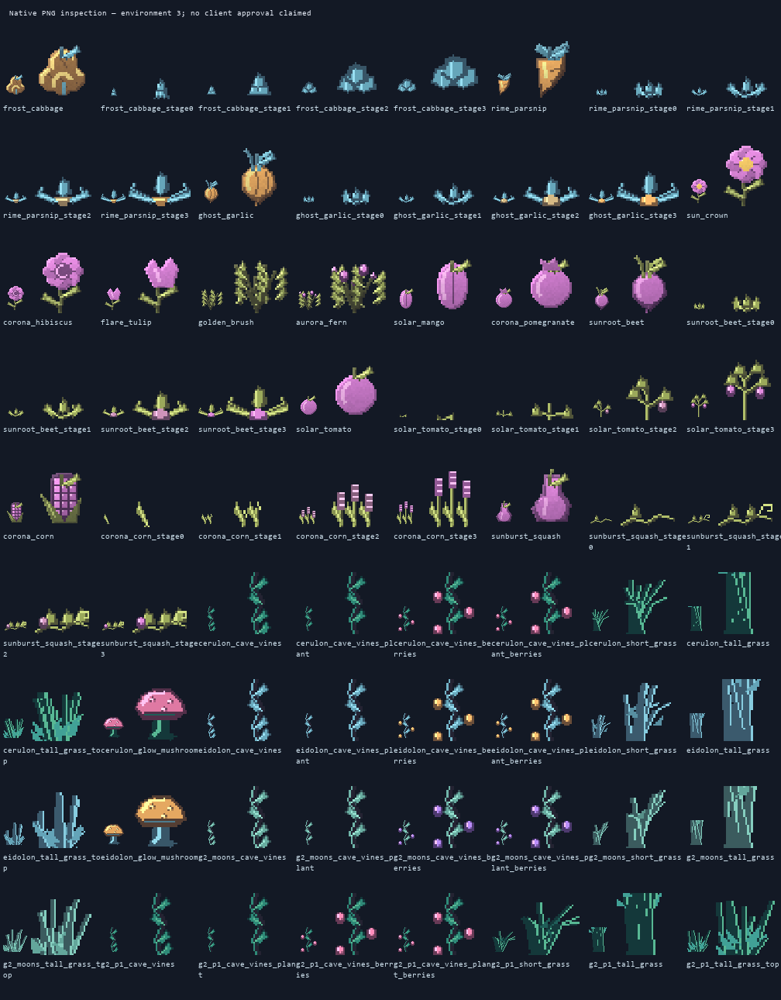
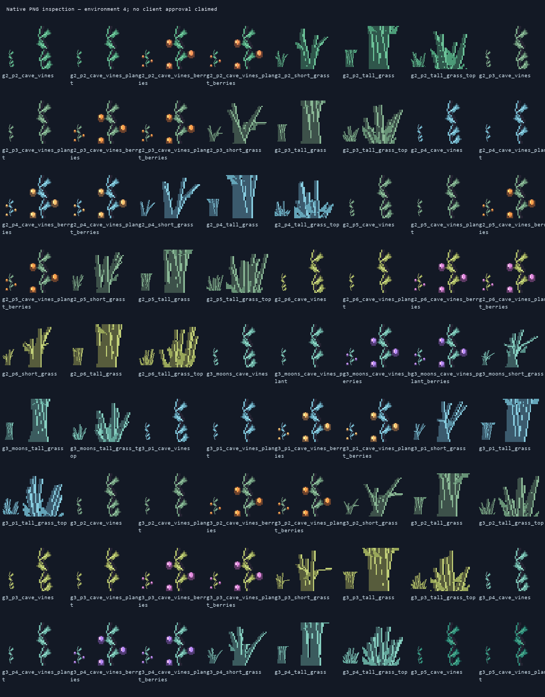
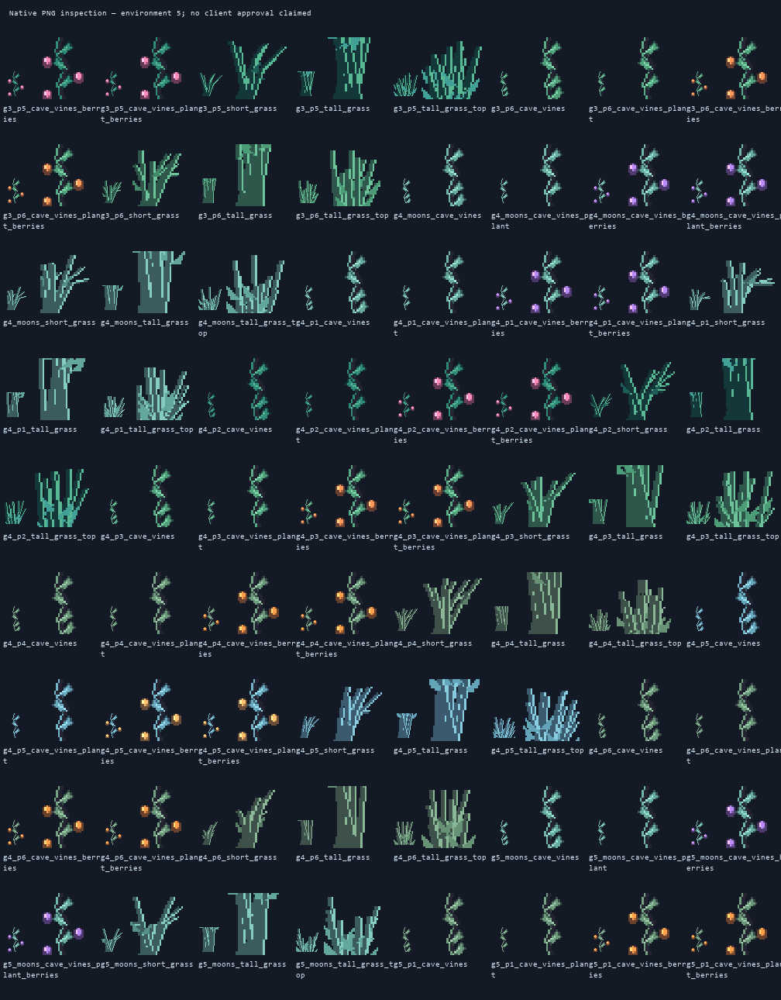
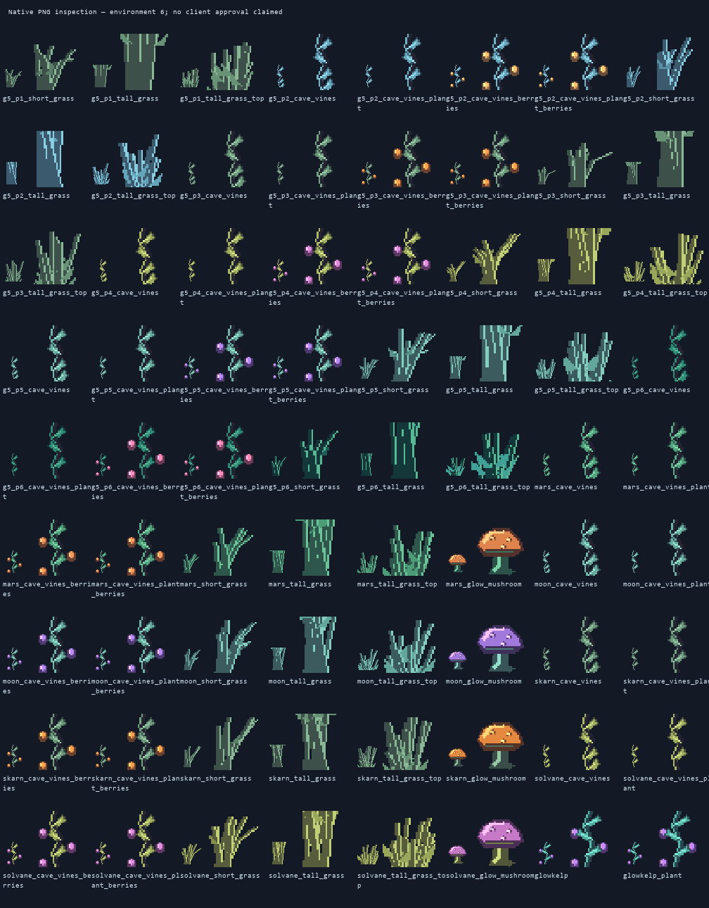
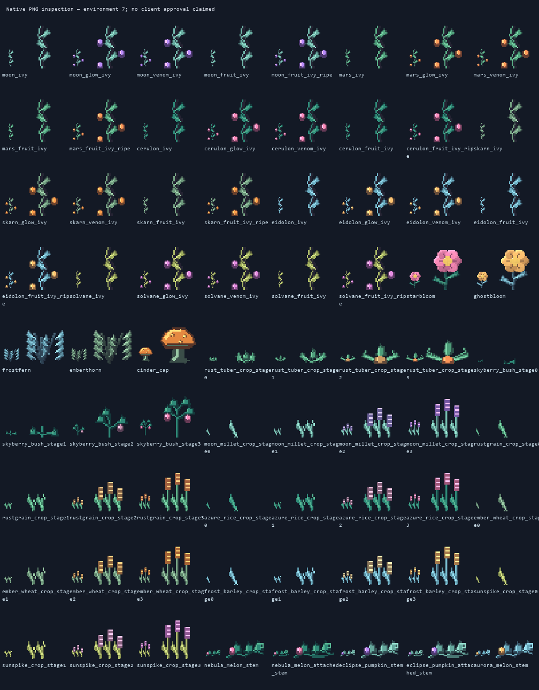
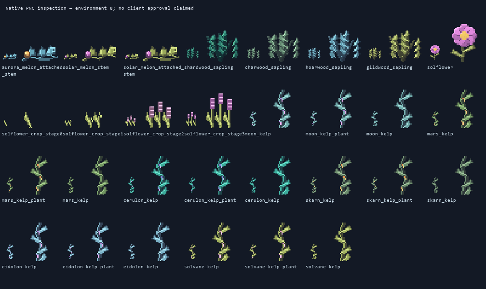

## Transport

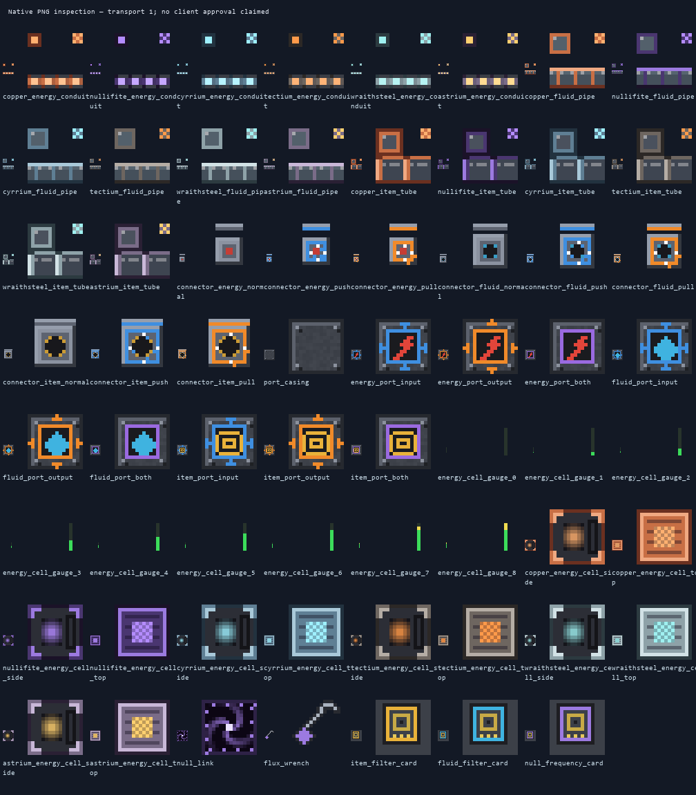

## Aligned inventory armour trims

These sheets show the shared overlay pixels, not stand-alone armour icons. All
2,400 existing trim item overrides combine the new base sprite with one of 120
native 32px piece/material overlays. Overlay alpha stays within the corresponding
helmet/chestplate/leggings/boots silhouette. Material IDs, item predicates and
worn trim-pattern assets are preserved. No 16px trim template is stretched or
passed off as native artwork.

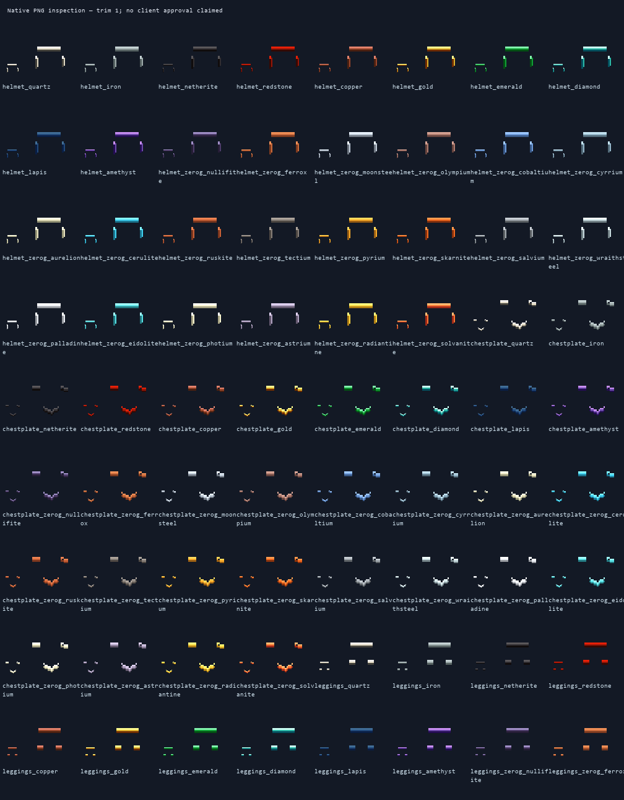
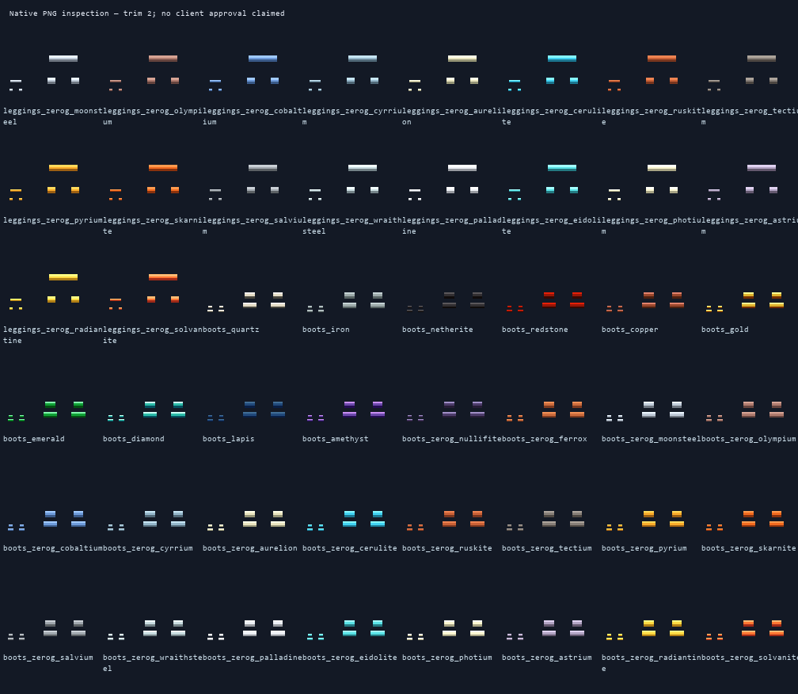

Only Moonsteel and Olympium are currently activated as geo-rendered worn armour;
the other prepared armour atlases do not imply twenty active 3D renderers.
Olympium's selective inlays now have a matching glowmask and verified GeckoLib
metadata. Canonical named six-tone ramps follow the latest approved Design style
kit, while other approved planetary palettes retain their identity.

## Receipts and editable sources

- [Exact texture coverage, hashes, UV/animation/resource-layer checks](manifest.json)
- [340 editable two-face sprite-source Blockbench project hashes](blockbench-sprite-source-manifest.json)
- [Faithful Ironfall source export receipt](ironfall-export-manifest.json)
- [All 2,400 inventory trim bindings and alignment](trim-alignment-audit.json)
- [Immutable original code-HEAD texture hash baseline](baseline-head-textures.json)
- [Authoritative generator, native sources and limitations on Design](https://github.com/ZeroG-Network-PTY-LTD/ZeroG-Tweaks/tree/Design/docs/full-art-rollout-v4)

The editable sprite projects are texture sources, not replacements for worn armour
or held-tool geometry. Moonsteel retains its approved geometry, positions, scales
and X-axis half-turn; source/runtime atlas and all twenty hand transforms were
checked. Server/build checks cannot replace a player's client visual inspection.
