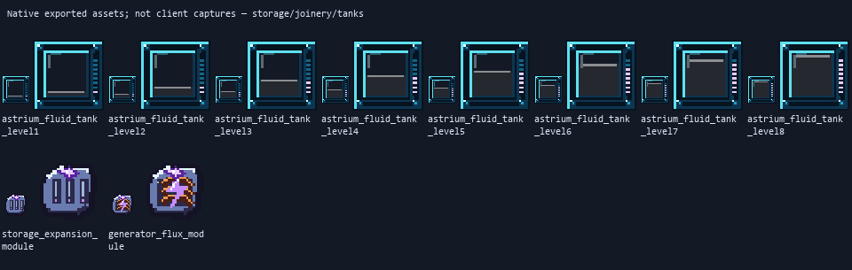
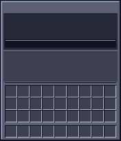
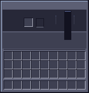

# Original storage, joinery and tank artwork

Actual native exported texture previews, **not in-game captures**. The artwork
uses the approved A/C forms and exact indexed six-tone canonical palettes, with
carved wood grain, layered panel frames, lattice cutouts, storage latches, machined
tank rims and selective energy accents. Transparent pixels are intentional.

The new four-wood panel doors and lattice trapdoors are additional designs;
existing doors/trapdoors remain intact. Chest/barrel inventory icons use their
placed models. Storage modules and generator modules have separate native 32px
magitech sprites. Tanks use six material tiers and nine discrete fill levels;
their neutral translucent backing conveys amount without falsely baking a
particular stored liquid colour.

## Native faces and inventory sprites

## Native GUI backgrounds

These are background panels only. Pale labels, fluid identity, amounts, face
buttons, fuel, flames, FE fill and upgrade values are rendered by the synchronized
screens. Blank regions are not missing icons or permanently active controls.

## Scope and source

108 original PNGs, 110 block models and 24 editable embedded-texture Blockbench
sources. Runtime storage is 27 slots, with one capacity module unlocking 54 slots;
the tank and generator interactions belong to their separately tested code, not
to these artwork previews. Chest artwork is static—no animated opening lid is
claimed. Worn equipment, existing doors and vegetation were not altered here.

[Hashes, palette roles, active-layer verification and validation](manifest.json).
[Generator, contracts and editable sources on Design](https://github.com/ZeroG-Network-PTY-LTD/ZeroG-Tweaks/tree/Design/docs/storage-joinery-v1).

Static asset checks do not establish client visual or gameplay approval.
