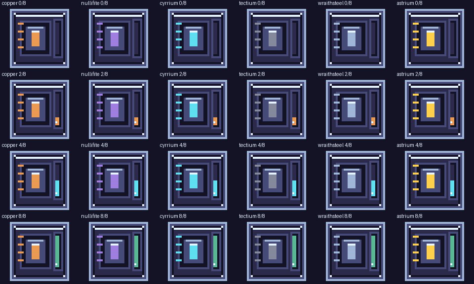

# Machine GUI repair and charge indicators

Same Minecraft 1.21.1 / **1.0.12-dev**. Hub and planetary saves remain untouched.

## Screenshot faults and fixes

- **Centrifuge / Starmetal Smelter:** the replacement screen incorrectly required
  exactly the original inventory size. The two legitimate upgrade-card slots made
  it reject these menus and open the old addon screens: a missing-background
  checkerboard and a title drawn twice. The gate now accepts these verified slots.
- **Combustion Generator:** the Fuels button moves to the right-hand controls,
  below Show fuel, leaving the full machine-title area unobstructed.
- **Solar Array / Fusion Reactor:** a visible, filtered Flux-module slot installs
  the existing maximum of three modules. Solar remains an energy producer, not an
  FE consumer. Module removal cannot discard energy above the reduced capacity.
  The slot is a view of the existing saved module count, not duplicate storage.

## New original cell artwork

All six cells retain their dimensions, UVs, capacity and connections. Their new
32px casings identify tier, while the gauge shows actual charge: amber low,
cyan intermediate and green high. The moving highlight is an eight-frame pixel
animation. These are source-art previews, not rendered gameplay screenshots.

## Successful-work feedback

Processing machines, combustion/solar/fusion generators, genetics, alvearies,
Silk Weaver, Centrifuge and Starmetal Smelter now emit restrained moving activity
particles and quiet purpose-related vanilla sounds **only when work advances**.
Hot processing uses flame/crackle feedback; biological work uses luminous
particles; mechanical work uses sparks and a mechanical sound. This introduces
no permanent chunk tickets or background machine registry.

This is not a claim that every machine now has bespoke moving mesh parts or
original recorded audio. Custom gear/piston/rotor animations, individual sound
design and remaining legacy machine coverage stay on the TODO list.

## Verification and review

The static layout audit covers 37 profiles but does not certify GPU rendering.
All **85 selected isolated gameplay tests passed**. The first attempt using only
the holder namespace selected no tests and is deliberately not counted: these
fixtures use `zerog_tweaks` as their template namespace. The correct run also
includes `zerog_legacy_cards`. Final build/asset hashes and installation evidence
are recorded in the [delivery receipt](machine-gui-activity-delivery-2026-10-07.json).
Inspect all four repaired menus at your GUI scale, install and
remove Flux modules, check cells empty/part/full and compare active/idle machines.
Client appearance, sound balance and shader compatibility await your playtest.

Survival recipe costs, approved gas specifications and the other existing
progression/ecology tasks are not completed by this visual repair.
