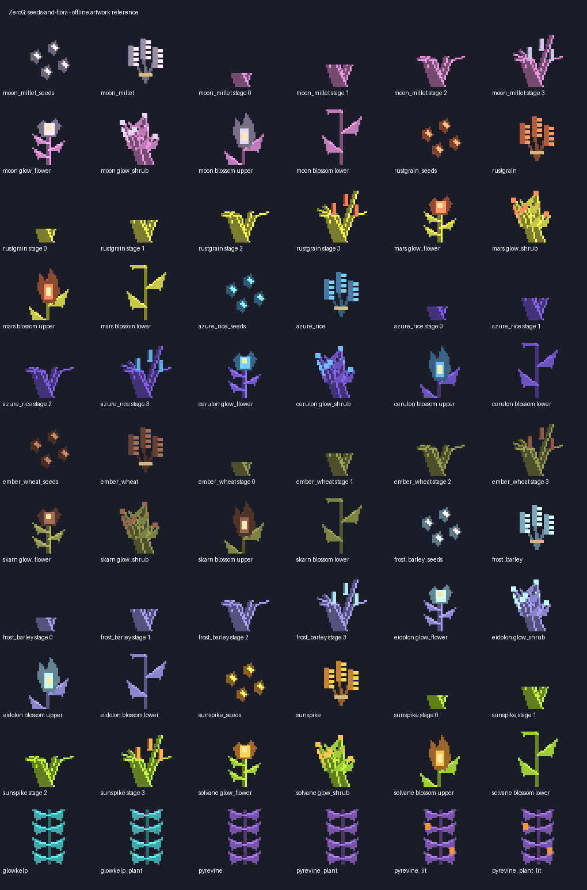
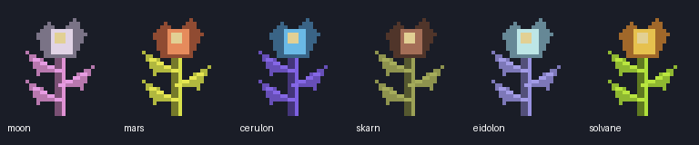
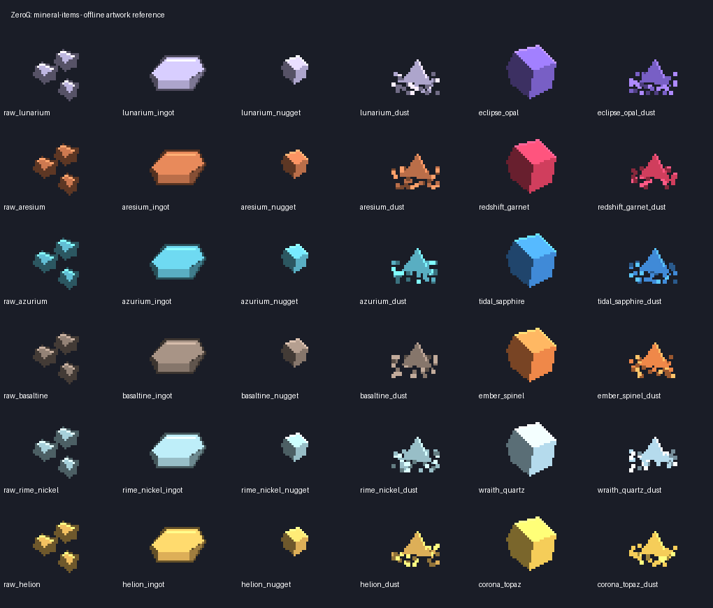
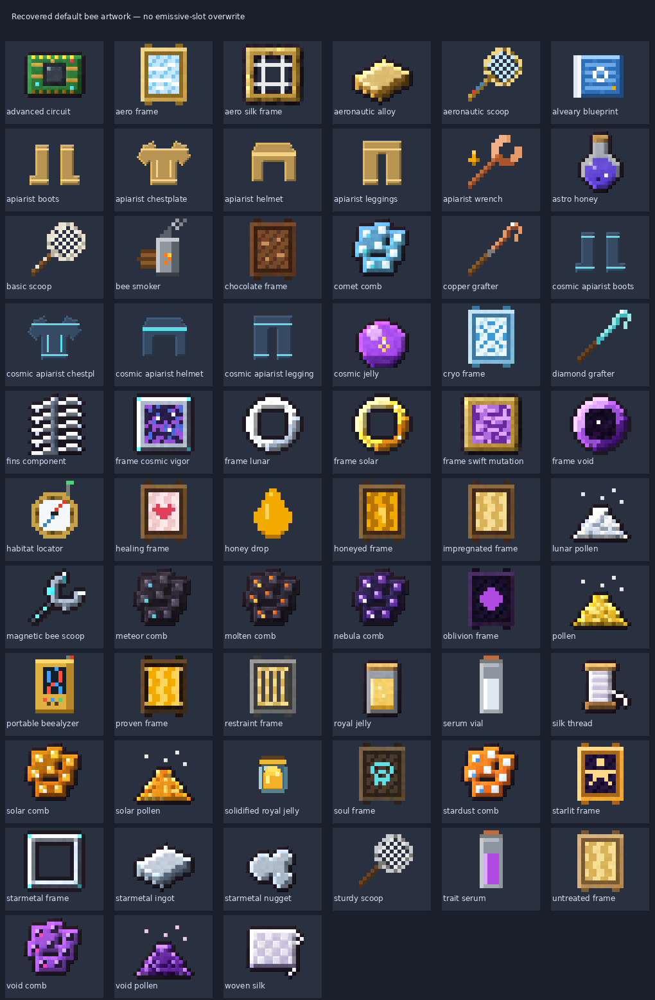
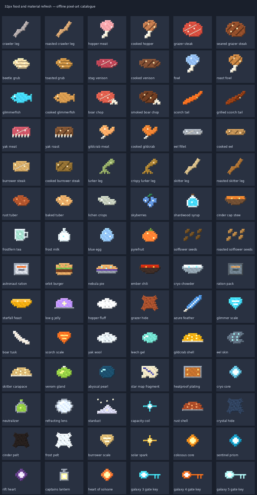
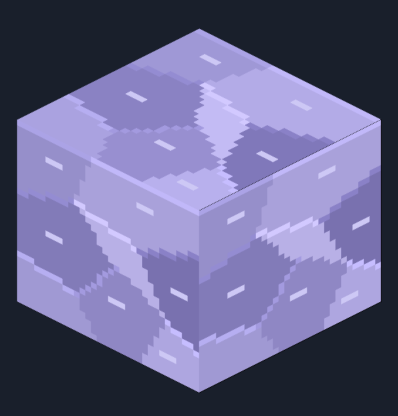

# Planet artwork, seeds and exploration minerals — 1.0.3-dev

Minecraft **Java 1.21.1**, NeoForge **21.1.252**, Java **21**. This is a
development candidate, not a release. This pass uses original, deterministic
32px pixel artwork and editable Blockbench projects. The sheets and GIF below
are offline artwork references, **not in-game screenshots**.

## Planting and appearance

All 34 dimensional soils, grass-block sides/tops and dry/moist farmland textures
have a new coherent clumped-pixel treatment. Furrows have shadowed channels and
highlighted ridges; moist soil is darker. Existing vanilla-height farmland,
water hydration, trampling and conversion to the matching soil are preserved.
Short grass and both halves of tall grass are redrawn as tapered shaded blades.
Tall grass now also occurs in small fertile ecology patches.

Six two-block Torch Blossoms add stepped calyxes, contrasting pollen and
alternating leaves. They are inspired by vanilla torchflower's crossed-plane
silhouette ([Mojang's torchflower reference](https://www.minecraft.net/pt-pt/article/torchflower)),
not copied Mojang texture bytes. Mature flowers and shrubs, blossoms,
Glowkelp and Pyrevine have eight-frame pulsing highlights. This is **texture
animation, not geometric wind sway or shader emissivity**. Existing plant block
light levels remain; new blossoms emit block light 4.

New growable crops use vanilla crop light, irrigation and bonemeal rules, four
visual age stages, dedicated plantable seeds and mature harvest/seed loot:

| Planet/theme | Crop | Common metal | Rare gemstone |
| --- | --- | --- | --- |
| Moon/barren | Moon Millet | Lunarium | Eclipse Opal |
| Mars/desert | Rustgrain | Aresium | Redshift Garnet |
| Cerulon/ocean | Azure Rice | Azurium | Tidal Sapphire |
| Skarn/volcanic/toxic | Ember Wheat | Basaltine | Ember Spinel |
| Eidolon/frozen | Frost Barley | Rime Nickel | Wraith Quartz |
| Solvane/crystal | Sunspike | Helion | Corona Topaz |

Each crop harvest crafts into two seeds. Planet grass has an additional 8% seed
pool, with only the lower half of tall grass dropping it. Structure bonus loot
also supplies seeds. Existing Rust Tuber gains plantable Rust Tuber Seeds;
existing Solflower Seeds now plant a four-stage Solflower crop. Neither existing
ID is removed. Crops survive on vanilla or planetary farmland. Six grains are
simple low-value food, not new tool progression or combat buffs. Raw grains go
in Food & Drinks; new seeds and blossoms go in Natural Blocks. Seeds/harvests
have vanilla-like composter probabilities.

Glowkelp retains underwater upward growth; the extra low-density lake placement
only accepts **vanilla water**, not acid, lava or other dimensional fluids. The
three ocean-slot biomes retain their existing denser placement without duplication.
Pyrevine retains hanging downward growth and harvestable lit berries. No new
underwater vine species or fluid-specific kelp species are claimed.

## Minerals and rarity

Twelve new material families are additive. Six metals have ore, raw pieces,
dust, nuggets, ingots, ingot blocks and raw-material blocks. Six gemstones have
ore, gems, dust and gem blocks. This adds **30 material blocks and 36 material
items**, plus crops/seeds and six blossoms. Ore blocks appear in Natural Blocks,
storage blocks in Building Blocks, and crafting ingredients in Ingredients.

Common ore uses size-8 veins with eight attempts per chunk from Y=-48 to 112.
Rare gems use size-3 veins, one attempt in sixteen chunks, from Y=-48 to 48.
These are placement attempts, not guaranteed deposits. All 34 dimensions map
to a themed family pair through their existing biome sets. Common ores require
iron; rare gem ores require diamond. Silk Touch/Fortune and block packing/
unpacking are supported. Metals smelt/blast from ore, raw material or dust.
Dust crafting consumes a piece of flint and an ingot/gem; it is not an animated
machine recipe. No new tools, armour tiers or progression bypasses are added.

Existing Buried Observatory, Mars Crash Site, Sunken Lab, Collapsed Forge,
Frozen Outpost and Solar Shrine chest tables gain a bonus exploration pool of
raw metal, a low-weight gem, seeds or nothing. Existing loot is preserved. This
does **not** add new structure templates or change asteroid payloads.

Natural cosmic Blazes now have spawn weight 1, single-entity groups, an extra
1-in-8 placement roll, a limit of three **currently loaded** living cosmic Blazes
per dimension, and 128-block separation. Galaxy-slot biomes use matching themes.
Unloaded mobs are not a global saved-world population census; eggs/spawners do
not receive this natural-spawn scarcity check. Spawn frequency is untested in game.

## Inventory repairs

The separate `aeroapiary`/Binnie JAR's white silhouettes were traced to white
glow-mask exports in primary texture slots. A required top-priority built-in
client pack restores 63 visible item layers from embedded default texture
sources; the two already-coloured layers stay unchanged. Eight armour inventory
icons are redrawn. This does not rebuild Binnie or change its gameplay.
84 Tweaks food/material icons are redrawn and centred. Starlite's diagonal
checker texture is replaced with faceted side/top artwork. Six stellar items
have cosmetic vanilla enchantment glint, without adding enchantments or stats.

## Verification and install scope

Normal Gradle build and packaged-asset inspections only. **No server tests and
no client launch were run for 1.0.3-dev**, per the user's choice. The 53-test
result in the 1.0.2 threading-hotfix guide is historical and does not validate
these new crops, spawn balance or resources at runtime. The hive worldgen
threading fix is preserved. All new resources still need client/world review.

Ore and flora additions affect **newly generated chunks**, not existing terrain.
No worlds or configuration files are reset. Prior daily impacts remain enabled
according to the existing config; back up saves before experimentation.

The installation target is only
`C:\Users\jakem\curseforge\minecraft\Instances\ZeroG\mods`.
Earlier matching Tweaks JARs are recoverably moved outside `mods`; GeckoLib,
Productive Bees, Binnie and unrelated mods are preserved. Fully restart the
CurseForge Java client to load the candidate. No Bedrock installation or launch.

Code stays on `1.21.x`; editable art, source generators and 138 new Blockbench
projects stay on `Design`; this guide, previews and build archive stay on `Docs`.
Local preparation is not publication; commits/pushes await approval.
