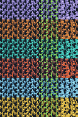

# Planet atmosphere, admin weather tester and native alien vines

Minecraft **Java 1.21.1**, **NeoForge 21.1.252**, **Java 21**, **GeckoLib 4.9.3**.
This development candidate preserves existing item/block/dimension IDs.

## Try the weather

In Creative mode, open **Z-Admintools**, take **Planetary Weather Tester**, and
right-click it on a ZeroG planet. Alternatively:

```mcfunction
/give @s zerog_tweaks:weather_tester
```

The screen offers automatic planetary weather, clear/stop, cold fog, snow
blizzard, steam, volcanic ash, geyser spray, dust clouds, dust devil, acid rain
and lightning/thunder. Clicking closes the screen so the effect can be seen.
The preview stays local to the player's client, resets when the dimension
changes, and requires Creative mode. It never sends destructive weather
commands or changes the Overworld. Quality/thunder/extra-flash controls are
available from the same screen and the title-screen **ZeroG Weather** button.
Choosing an effect enables Low quality if weather was Off; Minecraft's Minimal
particle setting still suppresses emitted particles. Step outside shelters to
see precipitation. Reduced sky flashes stay enabled by default; this is not a
photosensitivity safety guarantee.

| Environment | Automatic visual weather |
| --- | --- |
| Cold Eidolon themes and icy/frozen biomes | Fog or windblown snow/blizzards |
| Mars themes | Rust dust clouds and dust devils |
| Skarn and ash/lava/basalt biomes | Volcanic ash gusts |
| Cerulon and Solvane themes | Electrical particles, cosmetic bolts and local thunder |
| Acid/toxic/mud-flat biomes | Green alien rain particles, **no damage** |
| Airless Moon and galaxy moons | No automatic atmospheric storms; manual preview remains available |

Automatic events retain six-minute cycles and 90-second windows, independently
offset per dimension. Low emits at most four particles/tick; High twelve;
Decreased halves the budget. Fog can limit visibility. Lightning does not
start fires, damage mobs, transform entities or spawn server lightning.
Funnels have no suction or block destruction. Acid-rain gameplay is intentionally
deferred until the mod's progression and protection systems are planned.

## Steam fields and hot-world cones

Newly generated fertile patches may contain clusters of three to six
`<theme>_ambient_vent` blocks; supported hot-world patches can instead build
small dormant basalt/obsidian volcanic cones. They emit existing themed smoke
with no hazard random ticks, no lava flows and no eruptions. Footprints reject
non-natural surfaces, blocked headroom and block entities. Existing visited
chunks are not regenerated. Original `*_gas_vent` IDs retain their historical
behaviour; use the new **Ambient Vent** items for the non-damaging versions.
Geyser preview is a local spray effect, not a destructive fluid fountain.

## Native vines and fruit

Each of Moon, Mars, Cerulon, Skarn, Eidolon and Solvane gains four original,
32×32 transparent climbing vine designs. Galaxy planets choose their established
ecology theme. New tree canopies and suitable natural cave walls can grow them.
Vines attach to sturdy faces like vanilla, climb, spread by random ticks and
drop their vine item with shears. They need support; they cannot attach to
every transparent/non-sturdy block.

| Suffix | Behaviour |
| --- | --- |
| `_ivy` | Ordinary climbing ivy |
| `_glow_ivy` | Light level 8 |
| `_venom_ivy` | Green luminous markings, light 6, **visual-only; no poison** |
| `_fruit_ivy` | Randomly ripens; bone meal ripens immediately; right-click harvests fruit; ripe light 7 |
| `_vine_fruit` | Edible fruit, 3 food points; no harmful effects |

Find vines and ambient vents in **Natural Blocks**, fruit in **Food & Drinks**.
Existing hanging cave berries and their 34 dimensional colour families remain.
The broader plant/shrub artwork overhaul is a later planned update.



## Only the designed planetary villagers

New planetary settlements now have eight residents of their planetary species,
not six vanilla villagers plus two species residents. The six admitted models
and all their authored styles remain unchanged. Existing vanilla villagers on
ZeroG planets convert as they tick on the server. Native conversion plus saved
villager data preserves trades, inventory, age, names and profession; the new
entity retains its newly registered UUID. Overworld villagers are unchanged.
Existing played saves are not directly edited or erased by installation.

## Larger animated stars

The universe panorama gains clearer, brighter nebular detail. Its actual output
is **1774×887**, not 4K. Linear filtering is retained. The sky renderer adds
much larger star cores than the previous design, independently paced twinkling,
slow colour variation and soft radial halos; the panorama continues rotating.


The existing **ZeroG-Atmosphere-0.1.zip** supplies experimental ray-marched
volumetric clouds and haze when selected in compatible Iris/Sodium. It is a
separate optional shader, not part of the JAR and not Optimum Realism. Low/High
native weather works without shaders. The owned Optimum pack is preserved as a
resource pack; it must not be selected as an Iris shader. GPU compatibility,
client appearance and performance still need player review; server checks
cannot certify shader visuals.

## Verification and preserved guides

[Download 1.0.9-dev](jars/zerog-tweaks-1.21.1-1.0.9-dev.jar) ·
[All archived JAR checksums](jars/SHA256SUMS.txt).

SHA256: `52762d11f2dab4a4586a6c6dfaa73245abf23f948d1c178668113be96485f96a`.
The identical JAR was installed first in the user's ZeroG CurseForge `mods`
folder; the older 1.0.8 JAR was recoverably backed up outside `mods`. Dependencies
were preserved. Native weather is enabled at Low quality, with reduced flashes
kept on. The existing correct Iris shader selection was preserved.

A separate **ZeroG Planet Showcase 1.0.9 — Seed 0** save is exported: seed **0**,
hub spawn **62 / 65 / 0**, **68 active gates**, **34 independently generated
planet destinations** and **60 nearby inspection villages**. Older played saves
and showcases were not modified. Use this named save to inspect the ready hub;
creating an ordinary new vanilla seed-0 world is not the same prepared hub.

Evidence: final fresh server transcript `20261004_005224_-PplanetHubTests.log`
passed all six required tests and exited normally; normal clean production build
`20261004_010133_clean.log` passed in 1m27s with test sources excluded.

All six required isolated NeoForge server checks passed in the final fresh run,
including villager conversion/trade/inventory preservation, native wall-vine
support/climbing/fruit ripening, non-random-ticking ambient vents, the 34-planet
hub, all 18 buckets, the existing 20 crop families and 34 cave families. Every
dimension saved and the disposable server exited normally. The first migration
fixture incorrectly assumed 35 world ticks meant 35 entity ticks; forcing its
remote chunk and waiting for actual conversion fixed the test without changing
the production conversion path.

Saved entity-region validation found **60 inspection villages**, **480 unique
resident UUIDs**, **zero vanilla planetary villagers**: 104 Lunari, 56 Rustborn,
64 Glintfolk, 120 Ashwrights, 72 Hollow Kin and 64 Sunwardens. The six authored
source geometries/animations and 504 admitted texture payloads remain unchanged.
Packaged model, crop, bee, liquid and new-atmosphere artwork references passed.
The final artifact resolves 7,391 models, 1,402 blockstates and 3,160 generated
atlas sprites; preserves 698 crop/cave PNG payloads, 622 ecology/bee payloads,
311 editable UV projects, all 18 bucket overlays and 36 fluid animation strips.
These assertions do not certify terrain-wide feature abundance or client visuals.
No human client is launched by this workflow.

[1.0.8 authored species reference](planetary-villagers-1.0.8.md) ·
[All preserved item artwork](runtime-item-catalog-1.0.6.md) ·
[Gates, apiaries, planetary terrain and building diagrams](planet-generation-1.0.6.md) ·
[Crops, caves and all liquid IDs](crops-caves-liquids-1.0.7.md).
