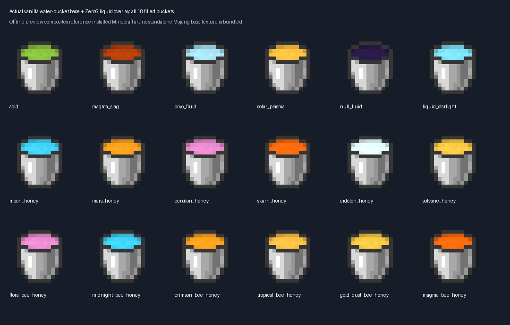
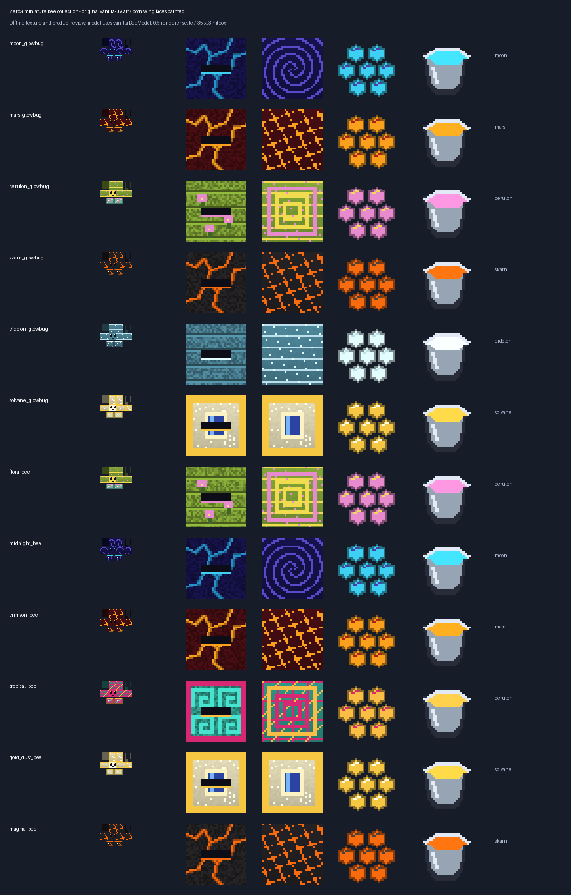
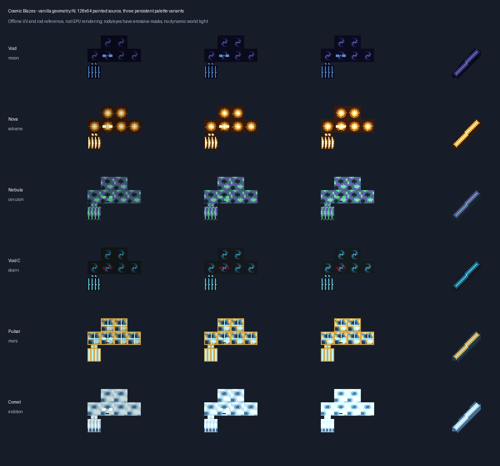

# Planet bees, hives and cosmic Blazes — 1.0.1-dev

Minecraft Java **1.21.1**, NeoForge **21.1.252**, GeckoLib **4.9.3**, Java **21**.
These additions are in ZeroG Tweaks itself, not replacements for vanilla or
Productive Bees assets. The separate Binnie/Bees machinery remains unfinished.

## Half-size bee families

The six supplied concepts are Flora, Midnight, Crimson, Tropical, Gold Dust
and Magma. They join the existing six named-planet Glowbugs. All twelve use
the actual vanilla Java bee model/AI at **0.5 adult scale**; the collision box
is **.35 × .3 blocks**. Babies retain vanilla baby scaling. Antennae, stinger,
legs and symmetric wings are kept; no bulky custom bee geometry is introduced.

Both wing UV faces carry the family pattern. Eight PNG frames cycle every
three ticks through the renderer, alongside blinking eyes and emissive accents.
Entity animation is explicit frame selection; a PNG mcmeta alone would not
animate a bee texture. Emissive accents do not cast light into the world.

| Family | Home | Visual theme |
| --- | --- | --- |
| Flora / Cerulon Glowbug | Cerulon | Green floral planks, pink flowers, mint wings |
| Midnight / Moon Glowbug | Moon | Violet star swirls, cyan hive seams |
| Crimson / Mars Glowbug | Mars | Crimson stone, warm ember accents |
| Tropical | Cerulon | Teal/pink geometric glyphs and warm wings |
| Gold Dust / Solvane Glowbug | Solvane | Cream/gold frame and blue inset |
| Magma / Skarn Glowbug | Skarn | Dark basalt-like faces, orange seams |
| Eidolon Glowbug | Eidolon | Frost blue, white highlights |

Each has a matching hive, honeycomb, honey bottle, placeable honey and bucket.
Hives have distinct side/front/top faces and animated honey-full drips. At
honey level 5, shears yield three matching combs; a bottle or empty bucket
collects that hive's honey and resets the honey level. Smoke protection,
comparator output, vanilla nectar delivery, storage/release and Silk Touch bee
preservation are retained. Bottled honey behaves like a vanilla honey bottle;
custom honeys are viscous and cannot create infinite sources or irrigate crops.

All eighteen liquid buckets (including Starlight and dimensional fluids) now
use the **actual vanilla water-bucket base**, with only liquid pixels recoloured
through a second texture layer. The metal silhouette/rim/handle and transparency
are unchanged. Earlier original bucket icons in the study sheets are superseded.

Vanilla AI allows bees to share hives: **products follow the hive family, not
the occupant's genotype**. Family-only occupancy, breeding genetics, comb
processing and Productive Bees integration remain future work.

Low-weight natural groups spawn on suitable ground in the named biomes. Rare
hives with two stored bees are generated on fertile patches in **new chunks**;
existing chunks are not retrofitted. Eggs are available in the spawn-egg tab.

[60 editable bee/hive/product projects](https://github.com/ZeroG-Network-PTY-LTD/ZeroG-Tweaks/tree/Design/docs/asset-collection-1.21.1/miniature-planet-bees-v1/blockbench).
The new revision supersedes the initial six ecology insect textures, retained
only for provenance. Art follows the references but is not claimed to exactly
match the concept's lighting or to be visually approved in-game.

## Cosmic Blaze variants

Void (Moon), Nova (Solvane), Nebula (Cerulon), Void-C (Skarn), Pulsar (Mars)
and Comet (Eidolon) reuse vanilla Blaze geometry, head tracking, three rings
of orbiting rods, bobbing and hostile AI. Each chooses one of three palette
tones; the choice persists through saving and synchronizes to clients.

Original **128×64** source atlases respect the **64×32 logical UVs**. Rod faces
match the creature palette; emissive masks highlight eyes and rod accents.
Working eggs, low-weight hostile planet-biome spawns and six recoloured rod
drops are included. Rod drops follow vanilla player-kill/Looting-style rules.

These retain **vanilla fireball combat and flame particles**. Comet's ice is
visual, not frost-combat mechanics; Void-C does not simulate black-hole physics.
Dropped/held rod items do not have a custom fullbright renderer or dynamic
world-light effect. Comet shards/non-vanilla geometry remain a future design pass.

[18 editable Blaze palette projects](https://github.com/ZeroG-Network-PTY-LTD/ZeroG-Tweaks/tree/Design/docs/asset-collection-1.21.1/planet-blazes-v1/blockbench)
are bind-pose studies; runtime orbit animation is inherited Minecraft code.

## Verification limits

52 isolated Java/NeoForge server tests passed, including half-size species,
valid hive storage, honey/comb harvesting, persistent Blaze palettes and
existing saplings on all thirty-four planet soils.
These are not a client visual review, a complete modpack compatibility test,
an end-to-end natural-spawn frequency test or approval of the artwork.
See [build evidence](crystal-material-build-evidence.json) and
[terrain/fluids/impact warnings](dimension-ecology-1.21.1.md).
