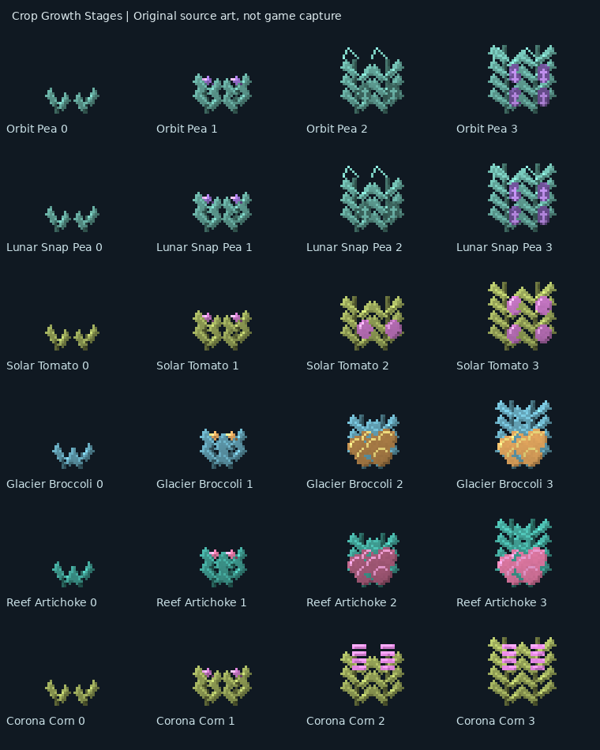
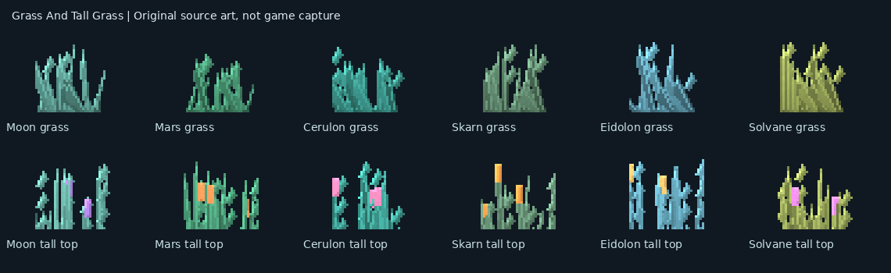

# Planet botany — 1.0.11-dev

Minecraft Java 1.21.1 · NeoForge 21.1.252 · Java 21 · GeckoLib 4.9.3.
This is a development candidate, not a major release. Installation and gameplay
visual approval are separate from publication.

## Fifty additional botanical families

Counts refer to plant/fruit families, not seeds, block states or texture files:
18 flowers + 12 shrubs + 12 tree fruits + six vegetables + two melons = **50**.
They are added alongside the existing plants and foods; old IDs are not removed.

| Planet theme | Flowers | Shrubs | Tree fruits | New farm produce |
| --- | --- | --- | --- | --- |
| Moon | Selenite Bell, Lunar Lotus, Crater Daisy | Silverfern, Moon Thistle | Moon Plum, Selenite Fig | Lunar Snap Pea |
| Mars | Copper Poppy, Dust Orchid, Rust Lily | Red Dune Brush, Filter Fern | Ares Apricot, Dust Date | Martian Okra |
| Cerulon | Tidal Iris, Coral Lantern, Reef Anemone | Azure Coral Bush, Pearl Fern | Lagoon Pear, Cerulite Cherry | Reef Artichoke |
| Skarn | Ember Torchflower, Cinder Dahlia, Basalt Bloom | Ash Fan, Scorched Heather | Ember Guava, Coalberry | Cinder Asparagus |
| Eidolon | Frost Snowdrop, Ghost Camellia, Rime Bell | Frostlace, Winter Fan | Rime Apple, Ghost Persimmon | Glacier Broccoli, Aurora Melon |
| Solvane | Sun Crown, Corona Hibiscus, Flare Tulip | Golden Brush, Aurora Fern | Solar Mango, Corona Pomegranate | Sunroot Beet, Solar Melon |

Galaxy-slot worlds use their existing mapped planetary theme. Colours contrast
fruit and blossoms with leaves rather than tinting every surface uniformly.

## Crops: visible growth and harvest

The eighteen existing vegetables keep their IDs and inventory produce artwork.
Their refreshed four-stage plant textures show sprouts, blossom buds, developing
produce and ripe vegetables. Six new vegetables bring the four-stage crop total
to **24**. Plant the corresponding seeds on suitable farmland; native crop
hydration, growth and bonemeal behaviour remain in use. Mature crop breaking
yields produce and seeds. Produce is edible; seed-conversion recipes and
additional structure-chest seed loot make the new crops discoverable.

**Nebula Melon, Eclipse Pumpkin, Aurora Melon and Solar Melon** use native
Minecraft stem/attached-stem growth. The latter two are new families. Gourd
blocks have ribbed directional shading and slices/seeds with matching colours.
Four slices drop from a broken gourd; nine slices craft its block, and slices
can be converted into planting seeds.

The GIF cycles four source sprites for inspection. Runtime plants change their
texture with growth state; this is **not** continuous animated-texture playback.

## Tree fruit pods

Twelve edible, plantable fruit items create miniature cocoa-style pods on the
matching wood family, including its stripped/log/wood variants:

| Theme | Supported wood |
| --- | --- |
| Moon, Eidolon | Hoarwood |
| Mars, Skarn | Charwood |
| Cerulon | Shardwood |
| Solvane | Gildwood |

Pods grow through three ages using native cocoa growth and bonemeal. Mature
empty-hand right-click picking yields **two fruits** and resets the pod to its
first stage. Breaking a mature pod yields three fruits; immature pods yield one.
New trees generated through the planetary ecology feature can carry themed
pods. Existing trees are not retroactively populated. Sapling-grown trees can
be populated manually by planting fruit items on their matching trunks.

## Grass, flowers and shrubs

All **34 planetary grass sets** receive original 32×32 short-grass sprites and
continuous two-block tall-grass silhouettes with leaf veins, seed heads and
directional dark/light ramps. Native crossed planes preserve transparent spaces
between blades. These are plant sprite changes, not replacement ground textures.

New natural flower/shrub placement follows themed fertile ecology patches in
newly generated terrain. The 18 flowers participate in native flower tags for
bee use and each has a dye recipe. New plants, produce and seeds are compostable.
Natural Blocks and Food & Drinks expose the appropriate entries; the combined
villager-plantable seed tag contains 37 distinct entries, retaining prior seeds.
No new venom, thorns or acid damage is introduced by this update.

## Downloads, editable assets and verification

- [1.0.11-dev JAR](jars/zerog-tweaks-1.21.1-1.0.11-dev.jar)
- [SHA256SUMS.txt](jars/SHA256SUMS.txt)
- [Original sources, generator and manifest on Design](https://github.com/ZeroG-Network-PTY-LTD/ZeroG-Tweaks/tree/Design/docs/planet-botany-v2)
- [50 editable Blockbench projects with embedded textures](https://github.com/ZeroG-Network-PTY-LTD/ZeroG-Tweaks/tree/Design/docs/planet-botany-v2/blockbench)
- [Minecraft 1.21.x code](https://github.com/ZeroG-Network-PTY-LTD/ZeroG-Tweaks/tree/1.21.x)

SHA256: `db022ac00cf3ff7c867e9734f096ee9c6a2a0ef7741cc7aeaf079ceac25e6ec4`.
The clean production build and final artwork packaging build passed. All seven
required isolated server checks passed, including the expanded crop/gourd
families and pod growth/support/edible loot. Eight asset audits passed, checking
312 new source/runtime/JAR PNG identities, all 50 editable projects, valid UVs,
state/model references, seed tags and preserved earlier assets. Test classes
are absent from the distributed JAR. Existing weather, hive threading, liquid
and planetary resident checks also passed.

Headless tests do not certify GPU appearance or performance. No user Minecraft
client was launched and no played saves were modified. Publication alone does
not install the new JAR; do not keep two ZeroG Tweaks versions in `mods` if you
choose to install it later. Retain a backup of the older version outside `mods`.
