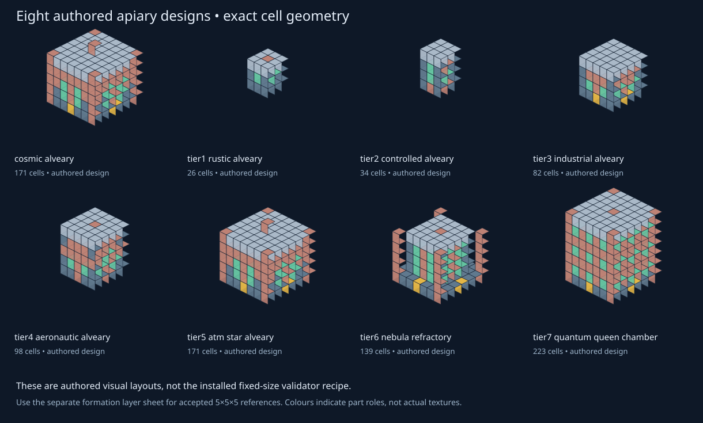
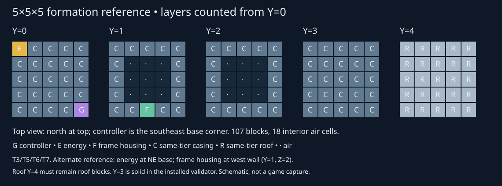

# 1.0.12-dev — The Signal and hub inspection district

Minecraft Java 1.21.1 · NeoForge 21.1.252 · Java 21 · GeckoLib 4.9.3.
This is a development build, not a completed campaign release.

## Prologue: The Signal

Earth was the Concord's intended refuge. Their Pathfinder crashed beneath it;
its shattered gate core became the humming Nullifite. Sculk gathered around
the vibrations, and ancient cities grew around the wreck sites. Existing ore
placement is unchanged.

Pick up Raw Nullifite from the ground for the first time. The Moon relay hears
the signal and sends a Courier, due at the next nightfall (tick 13,000). If you
are offline, on another planet, or no safe loaded site is available, delivery
waits for a safe Overworld night instead of force-loading land or losing it.
Sleeping through the whole night postpones delivery to a later night.

The Courier arrives 48–96 blocks from your current position and reports X/Z
coordinates. Its 7×5×7 crash remnant has a fractured hull, meteorite crater,
accessible chest and Broken Console. It contains **one Dormant Wisp (Echo)**
and **one Concord Codex**. Inspect the pod for *Falling Star*, then right-click
the Codex to open its three pages and earn *Builder's Template*.
On your first main-hand interaction with a Lunari on the Moon after delivery,
they greet you as "the one who answered the signal". Normal trading is preserved.

The console's first log:

> Refuge signal received. Courier dispatched. Rebuild the gate. We are waiting.

### Crafting the Gate Controller

The Dormant Wisp is a **hard crafting requirement**. The revised 3×3 recipe is:

| | | |
| --- | --- | --- |
| Nullifite ingot | Tinted glass | Nullifite ingot |
| Redstone | Nullifite gate frame | Redstone |
| Nullifite ingot | Dormant Wisp | Nullifite ingot |

The former central-bottom redstone block is replaced by the Wisp. Crafting
consumes the Wisp; Echo is now inside the controller. The existing *First Gate*
advancement retains its ID and awakening line. Existing controllers are not
deleted or retroactively invalidated.

### Lost items and multiplayer

If you have neither a Wisp nor a controller seven full Minecraft days after
the first delivery (168,000 server ticks), one replacement Courier can arrive
on a later safe night. There are at most two deliveries per player: repeated
ore pickups do not reset the schedule or farm pods. The check covers your
inventory, ender chest and controllers you placed after receiving the signal.
It does not search arbitrary storage chests belonging to you or other players.
Tracked controllers in unloaded chunks are conservatively treated as present;
the mod does not load those chunks to check them.

Ancient-city chests have an additional **5% chance** to contain a Dormant Wisp.
This appends one loot pool without replacing vanilla loot. Chests whose loot
was already generated are not refilled. This chance is a starting balance value.
Player schedules, delivered positions and recovery state are saved by UUID,
independently of the player entity, so logout, death and restart retain them.

### Safety and compatibility limits

Delivery validates the whole footprint before editing it: flat natural dirt,
sand or Overworld stone; open sky; no liquids, block entities, player blocks,
world-border crossings or protected arrival gates. Terrain damage is limited
to the shallow remnant footprint; no explosive entity is spawned. Finding a
safe site can take several nights in dense forests or heavily built-up land.

Automatic delivery pauses when detected claim mods lack a verified adapter
(including FTB Chunks, Open Parties and Claims, Flan, Cadmus and named claim
systems). It does **not** bypass claims. Ancient-city backup loot remains
available. Arbitrary server-side/plugin protection systems are not certified;
admins should add a verified integration before enabling this story delivery
in such environments.

The Codex explains that Echo initially remembers Moon and Mars. Full survival
tiered star-chart progression remains unfinished: this update does not claim
to implement all six gate tiers, full villager dialogue trees, or the five-act
campaign. Existing operator-bound T6/test-hub travel is retained for inspection.

Current inventory icons reuse the mod's Remnant Shard for the sleeping Wisp
and vanilla's written-book sprite for the Codex; bespoke art is later work.

## Hub showcase

Use your existing **ZeroG Planet Test Hub** world. If the reserved northern
district is empty and the separate bee expansion is installed, the update
automatically places its exhibits. Your gates and existing planet terrain are
not regenerated. If that district contains construction, placement refuses
instead of destroying it. Operators can retry with `/zerog hub exhibits`.

Walk north from the hub to **X 62, Y 64, Z -17**:

- Eight exact authored apiary layouts: Cosmic and T1–T7, in rows Z -42/-74.
- Four validator-compatible 5×5×5 formation references: T3/T5/T6/T7, Z -102.
- Ten original Concord Vault rooms, in rows Z -134/-164, with labels.
- Layer-zero signage and separate genetics/splicer/cryo service references.

The eight authored designs and the installed add-on's fixed 5×5×5 validator
are different. Signs distinguish them. T1/T2/T4 lack registered energy ports
and are **not** presented as forming machines. Cosmic uses the existing T5
parts. Formation examples still need ordinary power/setup; they are not
claimed to produce items automatically. Existing hive-threading fixes remain.

The baseline has the controller at the southeast base corner, energy input at
the northwest base corner, and frame housing in the south wall at Y=1. An
alternative keeps the controller fixed but moves energy to the northeast base
corner and frame housing to the west wall at Y=1, Z=2. Both must retain the
entire same-tier roof and the eighteen interior air cells. Other service blocks
need the exact same-tier registry prefix; external genetics/cryo modules are
not arbitrary substitutes. These are formation rules, not proof every possible
port location implements item/fluid transfer.

Future build clips can demonstrate these validated baseline/alternate placements.
This update includes still schematic guides, not claimed in-game build videos.

The ten rooms are **inspection copies of the Concord Vault schematics**, not
ten newly implemented boss arenas. Spawners are disabled, trap dispensers
emptied, entity placement skipped and jigsaw markers replaced. Rooms retain
their authored layout and materials. The district is idempotent: once built,
later launches do not overwrite your edits.

## Downloads and evidence

This build also includes upstream commit `98179b9d`: Concord Vault generation
targets at least ten rooms, rerolling up to twenty times and retaining the
largest candidate if that target cannot be reached. Four key rooms are selected
to spread them away from the chamber and one another rather than keying every
room in a tiny vault. Already generated vault chunks are not rebuilt.

[1.0.12-dev JAR](jars/zerog-tweaks-1.21.1-1.0.12-dev.jar) ·
[SHA256 checksums](jars/SHA256SUMS.txt) ·
[Approved lore and original schematic](https://github.com/ZeroG-Network-PTY-LTD/ZeroG-Tweaks/tree/Design/docs/zero-g-tweaks-bundle/structures/concord_courier)

The isolated gallery test checked all eight authored cell layouts, the four
actual add-on validator results and all ten safe room copies. Two isolated
Prologue data tests checked real recipe matching, native book data and read
advancement, backup loot injection, pickup-event scheduling, save/load,
seven-day recovery bounds, safe-site rejection and actual pod/chest placement.
All three Prologue tests passed, including the Lunari greeting and a test that
drives the real server tick through first delivery and the single permitted
replacement, rather than only testing the helper methods. The seven planetary
regression tests and 59 general tests passed too, including the upstream Vault
key-spacing check. All disposable servers shut down normally after these runs.
GPU appearance, book layout and full modpack behaviour remain for player review.
No played save is overwritten or exported from the disposable test worlds.

The clean production build and all nine packaged-asset audits passed. The JAR
contains no game-test classes. Its SHA256 is
`22ff1860305b9d373cb8787c0b0e78439b3c517e6b0c9f5f9596703597142ce3`.
The same bytes were installed in the owner's CurseForge ZeroG instance before
publication, retaining the previous 1.0.11 JAR in an external backup folder and
leaving the separate bee expansion untouched. No client was launched.
