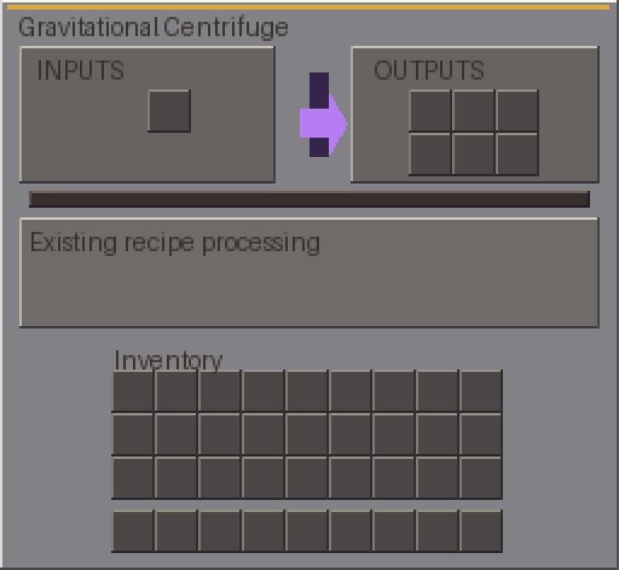

# Single-block machines and clear, use-specific interfaces

Same-version development update for Minecraft Java 1.21.1 / NeoForge. Tweaks remains **1.0.12-dev**; Orbital Bees remains **1.0.0**, with resource-only model repairs. IDs and saves are unchanged.

## Genetic Splicer and Geno Station

The two old assembled models are replaced with one full block each, using native 32-pixel steel/brass face textures and animated front terminals. Inventory models use the same faces and cube, not a different assembly. The addon candidate removes 13 obsolete resources; all original classes, recipes, loot and metadata remain unchanged.

**Important:** these terminals are decorative animations, not working genetic analysis. The current addon still uses placeholder processing. The screens state Backend pending and keep its actual legacy slot filters rather than pretending to accept the draft five-slot workflow.

## Inventory interfaces

Eleven existing non-alveary machine menus now have clearly separated inputs, outputs, purpose panels, empty-slot hints, actual server cycle progress and the original player inventory:

| Machine | Existing slots | Main role |
| --- | --- | --- |
| Stardust Smelter | Comb, fuel, output | Comb smelting |
| Starmetal Smelter | Two alloy inputs, flux, output | Metal processing |
| Silk Weaver | Two fibres, pattern, output | Fibre weaving |
| Centrifuge / Gravitational Centrifuge | Comb, six outputs | Product separation |
| Frame Assembler / Frame Component Assembler | Frame, material, output | Frame assembly |
| Frame Infusion Altar | Frame, two reagents, output | Frame infusion |
| Infusion Altar | Frame, reagent, output | Frame infusion |
| Genetic Splicer | Queen-like bee, drone, frame, legacy output | Genetics backend pending |
| Geno Station | Comb, legacy output | Genetics backend pending |

Slot indices, handlers, filters and server inventories are not changed. The nine hive/controller screens and Ore Refinery's processing menu remain intact.

## Read-only planned interfaces

Empty-hand right-click on Alloy Forge, Combustion Generator, Solar Array, Fusion Reactor, Salvage Station or Crystal Growth Chamber opens its use-specific interface plan. These blocks currently lack processing block entities. Plans show intended input/output roles and monitoring for fuel, FE, daylight, planet modifiers, stability, recovery or crystal growth. They **cannot store or process items**.

Twenty tier hatches/ports also expose read-only plans describing their item, fluid, honey, power, pressure or service role. Side configuration, controller binding and buffers remain pending. Gates, arrival controls and existing crouch interactions are not replaced.

## Checks and remaining work

Native artwork/UVs, four-frame metadata, all facings, source/pack/JAR identity and existing addon slot counts are checked. Resource-only repacking verifies unchanged Java/gameplay payloads. Installation backs up the prior jars outside mods; no worlds are reset. In-game appearance, input handling and shader interaction still need player review.

Pending: actual genetics, new serum/bee-data handling and server menus; FE/fluid buffers and the unfinished machine backends; functional hatch routing; earlier alveary lifespan/tank/tolerance and 27-frame progression.

[Design sources and editable Blockbench projects](https://github.com/ZeroG-Network-PTY-LTD/ZeroG-Tweaks/tree/Design/docs/single-block-machines-v1) · [Locked artwork standard](https://github.com/ZeroG-Network-PTY-LTD/ZeroG-Tweaks/blob/Design/docs/art-direction-lock.md) · [Tweaks JAR](jars/zerog-tweaks-1.21.1-1.0.12-dev.jar) · [Orbital Bees JAR](jars/zerog-binnie-expansion-1.21.1-1.0.0.jar) · [Checksums](jars/SHA256SUMS.txt).
