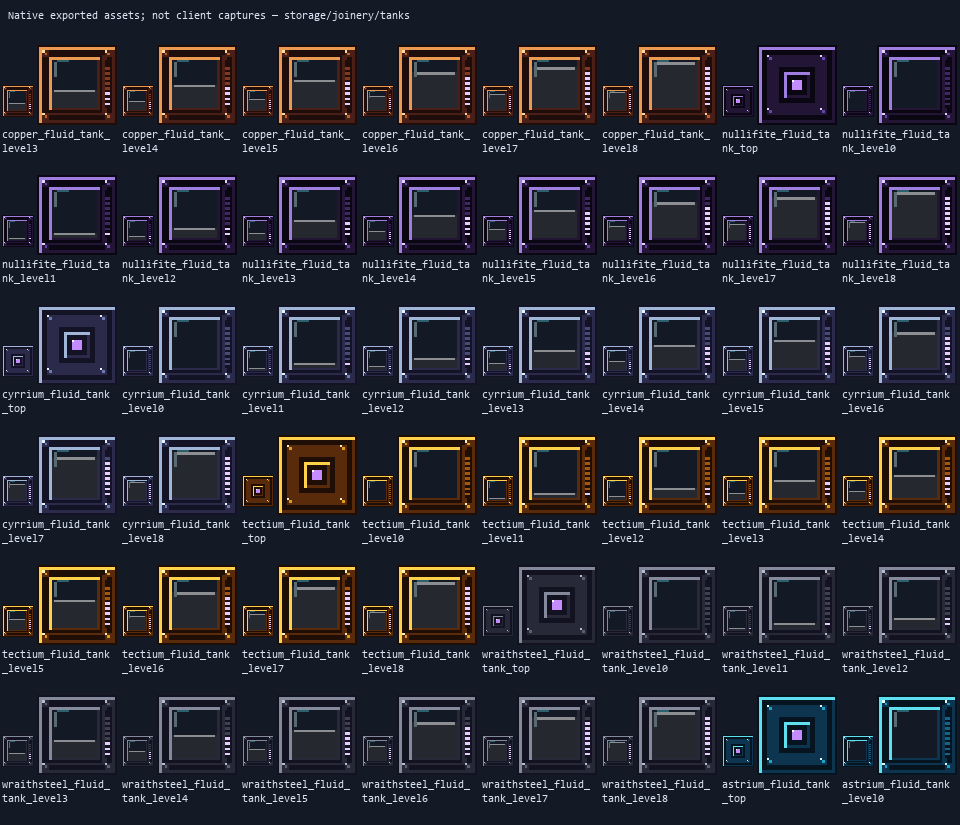
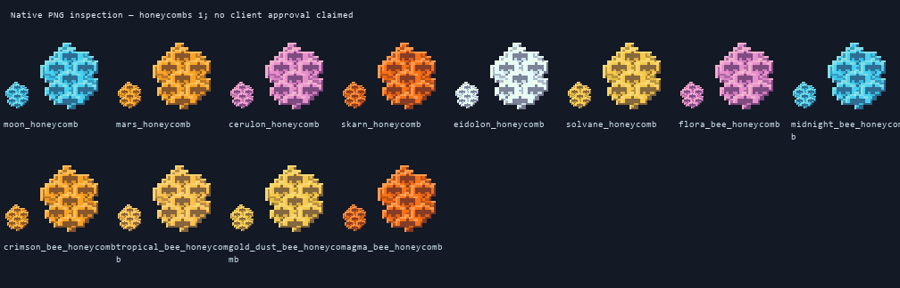
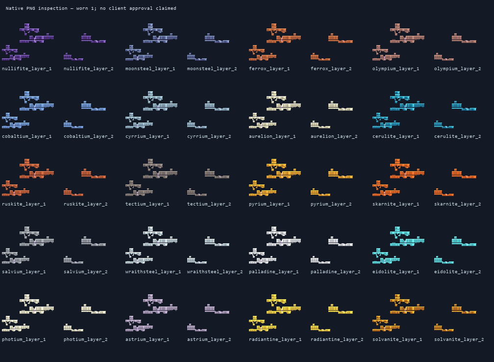

# Planetary joinery, storage and machinery workflow

Minecraft Java **1.21.1 / NeoForge**, candidate **1.0.12-dev**. This extension keeps
the version unchanged. Its installation receipt identifies the exact JAR by SHA256.

The [7 October supplied hub workshop](supplied-hub-workshop-2026-10-07.md) adds
13 stocked machine stations and alveary service supplies in a new copy of the
player's existing hub. It does not reset planetary terrain or change survival costs;
those will be reviewed hardest-to-easiest against the storyline after inspection.

## Original ZeroG machinery, not a bundled Mekanism fork

The six locally installed Mekanism/example JARs were inventoried read-only: core
Mekanism, Generators, Tools, Covers, Mekanistic Routers and MoreMachine. Their GUI
and tank/upgrade resource layouts were reviewed for useful principles: separate
input/output controls, clearly readable capacity gauges, distinct energy/fluid/item
ports, upgrade state belonging to each machine, and tier identity that survives
inventory scaling. **No example code, textures or models are copied into this mod.**
Their JARs are not installed into ZeroG, and they introduce no new dependency.
Existing GeckoLib rendering remains required; Productive Bees remains optional.
The reference inspection tool records filenames and hashes, not redistributed art.

The approved A/C rules remain authoritative: six-tone hue-shifted material ramps,
centered silhouettes, native pixel density, wood grain and staves, restrained energy
inlays, and matching placed/inventory artwork. The new machine screens have pale
labels over original dark panels. Native sheets below are exported source pixels,
**not** client screenshots or proof of shader/lighting approval.

## This delivery

### Correct existing equipment and bee-machine contexts first

The user's latest screenshot identifies twelve disconnected comb icons. They are
now cohesive vanilla-footprint honeycombs with original species palettes, wax rims
and recessed cells; source generators and active pack overrides are updated together.

All **80 main armour pieces** now use Minecraft's standard humanoid armour renderer
and Netherite proportions, not the previous bulky custom Moonsteel/Olympium shells.
All **40 worn layer textures** now use native 128×64 faceted plate artwork while
preserving Netherite's normalized UV/alpha coverage. The approved cool/warm C
direction supplies beveled metallic highlights, shaded planes and recessed
cyan/violet accents, not flat repeating bands. Material stats, repair ingredients, trims, equipment IDs
and implemented bonuses remain unchanged. Old shell sources are retained as inactive
studies, not worn in game. Third-party mod equipment is not secretly overwritten.

The fitting study uses the exported textures, not concept artwork. Vanilla armour
does not emit block light; bright inlays here are painted highlights. Face openings
and visible hands remain unchanged. Player approval in the client is still pending.

The Alveary audit found a validator that accepted only the addon namespace, rejecting
otherwise useful ZeroG service blocks, plus a product grid starting in old frame slots.
The repair keeps the authored flight chamber/controller/roof strict while allowing
explicit, real ZeroG power/item/fluid modules; transfers must retain their native
buffer contents. Product paging starts at actual outputs; old frame items have a
separate extraction-only recovery page. An unavailable drone-breeding function is
labelled as such, not presented as a working bee input. See the delivery receipt for
the final regression results and the exact supported part whitelist.

Supported ZeroG shell substitutions are `energy_port`, all six `*_energy_cell`
blocks, `item_port`, `fluid_port` and all six `*_fluid_tank` blocks, with their
explicit role tags. The combustion generator is an **external** power source, not
a shell substitute. The 5×5×5 shell still requires the tier's roof, controller and
18-block clear central flight space. Generic ports face outside; tanks/cells retain
their own sided modes. Transfers stop for unloaded, broken or ambiguously shared
structures; two controllers cannot claim the same buffered port. Existing native
addon parts remain supported. The output and legacy-frame recovery pages are
separate; unavailable breeding controls are labelled, not silently functional.

The Ore Refinery audit found unrelated catalyst consumption, a 201-call boundary,
missing shift-click and unsynchronized client progress. Corrections keep its actual
existing recipes and purpose; no fake energy gauge or new processing chain is added.
Other machine-type recipes and broad progression remain tracked below. Existing
screens and port correctness take priority over new machine types.

The client blueprint preview no longer intercepts right-clicks on real block entities.
The combustion profile describes its actual single fuel input instead of an invented
residue output. A direct installed-addon regression disproved the earlier centrifuge
dispatch suspicion: meteor comb produced its exact registered products in 200 ticks.
The Starmetal Smelter, Silk Weaver and Frame Infusion Altar now reject their unused
placeholder input slots in both menus and automation. Existing stacks stay extractable.
This is a slot-contract correction, not a claim that every legacy recipe/catalyst
semantic has been reimplemented; the Silk Weaver's older pattern handling still
needs a dedicated processing audit.

### Four original wood families

Shardwood, Charwood, Hoarwood and Gildwood each gain a panel door, lattice trapdoor,
single-block chest and barrel. Existing door/trapdoor IDs and artwork stay intact.
Panel doors are real two-block wooden doors; lattice openings use transparency.
Chests are horizontal-facing, model-rendered containers, not vanilla ChestBER copies;
barrels support all six facings and an open-front state. Chest lids are currently
static artwork, not an animated lid claim. The chest cannot open under a solid block.

Each chest/barrel starts with **27 slots**. Close it and right-click with one
**Storage Expansion Module** to unlock **54 slots** on that container only. A second
module is rejected. Contents, expansion and loot-table state persist; breaking the
container drops its contents and returns its module. Hoppers and item tubes use
standard item capabilities. These are single containers, not automatically joining
double chests. Craft each from its own wood; recipes are included.

Newly generated planetary settlements select their existing wooden doors from the
same themed wood as their building planks: Mars/Skarn Charwood, Moon/Eidolon Hoarwood,
Solvane Gildwood, and Cerulon Shardwood. Galaxy slots use their ecology profile.
Existing generated buildings are **not** silently rebuilt or saves regenerated.

### Six independently upgradeable fluid tanks

| Tier | Shell | Capacity |
| --- | --- | ---: |
| 1 | Copper | 5,000 mB |
| 2 | Nullifite | 20,000 mB |
| 3 | Cyrrium | 100,000 mB |
| 4 | Tectium | 500,000 mB |
| 5 | Wraithsteel | 2,000,000 mB |
| 6 | Astrium | 5,000,000 mB |

Right-click with a bucket to insert/collect fluid. Empty-hand right-click opens
the tank terminal: fluid name, amount/capacity, fullness gauge, inventory and six
face controls. **Both / In / Out / Off** independently select each world's direction
(Down, Up, North, South, West, East), not a confusing hidden orientation shorthand.
Pipes use the same conserved `IFluidHandler` contents as buckets. Tanks accept real
registered liquids, including planetary/honey variants; they do not create fictional
chemical/gas registries. The model gauge indicates fullness without pretending a
neutral texture depicts a specific stored fluid.

Right-click a tank with an **empty higher-tier tank shell** to upgrade it in place.
It preserves fluid, facing and per-face settings and returns the empty old shell.
Downgrades and filled replacement shells are rejected. Recipes produce fresh empty
shells and never consume filled lower-tier tanks. Breaking/placing a tank carries its
contents; shift-right-click with the Flux Wrench safely picks it up. No contents are
duplicated into both a dropped bucket and a saved tank item.

### Independent generator and transport upgrades

The combustion generator gains a real fuel/progress/energy terminal. Right-click
it with **Generator Flux Modules**, up to three per generator. Each adds 25% to its
fuel's FE/tick output and 100,000 FE buffer capacity, from 100,000 to 400,000 FE.
Fuel/output/module state persists; the module count and energy readouts are visible.
Breaking returns installed modules and remaining fuel. This is a defined ZeroG
upgrade, not an undocumented clone of Mekanism's speed/energy formula.

The existing six-tier energy conduits, fluid pipes, item tubes and energy cells
already support family-matched in-place tier upgrades; their conserved storage,
filters and independent face settings remain in use. **Storage & Transport** is a
separate creative category for containers, tanks, lines, cells, ports, filters,
the Flux Wrench and both module types. Joinery remains in Building Blocks.

### Crops in sunless dimensions

All custom age-based crops now survive on supported farmland without sunlight.
Below vanilla growth-light level 9 they advance about **16 times more slowly** than
an equivalently hydrated lit crop. Lit behavior still delegates to vanilla growth
and NeoForge crop hooks. Gourd/melon stems also grow and set fruit slowly in darkness.
Invalid soil still rejects planting: this is not permission to farm on air or stone.

The farmland-maintenance tag now includes the custom crops and attached stems that
were missing. This fixes dry farmland reverting underneath otherwise valid crops.
Vanilla crops and farmland hydration are not globally changed. Neighbor/block updates,
growth, harvesting and dry-soil retention require isolated regression checks.

## Tracked follow-up workflow — do not mark previews as completion

Every future commit must update this list and its evidence, plus the machine-readable
[`storage-and-machinery-todo.json`](storage-and-machinery-todo.json). Keep prior player
guides, diagrams and source generators. Code goes on `1.21.x`, artwork on `Design`,
documentation/images/JARs/checksums on `Docs`. Never merge those unrelated histories.

- [x] Read-only inventory of all six local example JARs; original implementation boundary.
- [x] Four wood-family panel doors, lattice trapdoors, chests and barrels with recipes/loot.
- [x] Independent 27→54-slot storage module and standard item automation.
- [x] Six fluid tanks with buckets, persisted contents, face controls and safe upgrades.
- [x] Combustion terminal and independent bounded generator modules.
- [x] Separate Storage & Transport category and retained existing six-tier lines/cells.
- [x] Dark crop growth/survival, farmland-maintenance repair and themed settlement doors.
- [x] Twelve honeycomb silhouettes and all 40 worn atlases re-authored with editable sources.
- [x] All 80 main armour items registered with the standard vanilla renderer.
- [x] Alveary service-module whitelist, conserved bridges and actual output/recovery paging.
- [x] Refinery filters, catalyst handling, synchronized progress and reload fixes.
- [ ] Player/client approval: all placed facings, cutout holes, menus, inventory sizing,
  bucket pickup, upgrades, pipe connections and vanilla/shader lighting.
- [x] Stored-fluid renderer uses synchronized fluid identity, amount, sprite, tint and light;
  sub-gauge changes send exact contents. GPU/client transparency approval remains pending.
- [x] Chest lids interpolate open/closed around the hinge; server-safe bounded interpolation
  is tested. Optional double-chest joining remains unimplemented.
- [ ] Transport moving-content client renderer and in-game routing readability review.
- [x] Family-specific transport screens hide unrelated grids; energy/fluid items are
  available only through labelled take-only recovery. New insertion and shift-click
  bypasses are rejected; item/Null Link buffers keep their operating inventory.
- [x] Directly test the ordinary centrifuge's actual comb outputs; reject unused smelter,
  weaver and infusion inputs in both menus and automation without deleting old contents.
- [ ] Finish the legacy Silk Weaver pattern/catalyst processing audit.
- [ ] Recipe-driven Ore Refinery, Alloy Forge, Crystal Growth Chamber and Salvage Station
  completion audit; register/validate any still-missing recipe types, output reservation,
  catalysts, FE, sided ports, menus, persistence and independent upgrade support.
- [ ] Solar Array and Fusion Reactor independent upgrade contracts and safe balance;
  no decorative block may be described as a working generator.
- [ ] Additional machine speed/efficiency/throughput modules after clear per-machine
  recipes and bounded cost formulas. Never register a module that silently does nothing.
- [ ] Advanced Alveary biology: authoritative lifespan, climate/gravity tolerance,
  rotor/coil simulation, drone breeding and flower territory where real APIs support it.
- [ ] External claim/team adapters and approved hidden Star Map Fragment world placement.
- [x] Frost Yak sheared-coat animation and snowpack/frozen-regolith grazing regrowth;
  repeated direct shearing yields no duplicate wool and sheared state survives reload.
- [ ] Meteor Maw Cinder Mite entity, artwork and authoritative add/phase values.
- [ ] Remaining boss phases, source-tracker milestones and recipe/mob completion audit.
- [ ] Planetary client travel, cooperative ready-check, Moonsteel both-hand review and
  sky/weather visual approval; isolated server passes do not complete these.

## Verification and installation

The [delivery receipt](storage-machinery-delivery-2026-10-05.json) records tests,
clean production build, source/JAR asset checks,
new-JAR SHA256 and old-JAR backup. Install the matching ZeroG JAR only with the client
closed; preserve unrelated mods and all saves. **No world reset is part of this
extension.** Keep version 1.0.12-dev, install first, then publish separate branches.
New broad artwork not covered by the approved direction needs a small approval batch.

The [subsequent art/visual fix receipt](storage-machinery-art-fix-2026-10-05.json)
records the new candidate separately, preserving the previous receipt and JAR.
This extension passed **50 workflow + 4 genetics + 2 optional-addon-absent checks**;
its original red checkpoint caught unused-input insertion and incidental non-item
storage before the repairs. Client rendering remains a separate review step.
That earlier delivery did not include the pending-machine processing pipeline.
It is superseded by the [6 October machinery and hub update](machinery-and-hub-update-2026-10-06.md): forge/crystal/salvage processing and configurable solar/fusion now ship. Client approval and additional contracts remain pending in the live TODO ledger.

This delivery passed **44 workflow + 4 genetics + 2 optional-addon-absent tests**.
The clean production JAR contains no GameTest classes/fixtures. Both native-source
audits report zero errors: 3,828 existing rollout resource bindings and 264 new
storage/joinery bindings match packaged bytes, including active override layers.
The JAR SHA256 is
`39282958b10846d70218077ff34a58f18bed3d1841221b4aebaf30aa278cfb5a`.
The installed predecessor was moved to `ZeroG/zerog-mod-backups/20261005-012233-UTC/`;
all other installed mods and saves remain unchanged. All 15 published JAR checksums
were regenerated and checked. Server checks do not certify the client GUI or lighting.

See also the preserved [Sol workflow](sol-build-workflow-2026-10-05.md),
[machine/transport guide](sol-machines-and-transport-runtime.md), and
[editable original source](https://github.com/ZeroG-Network-PTY-LTD/ZeroG-Tweaks/tree/Design/docs/storage-joinery-v1).
