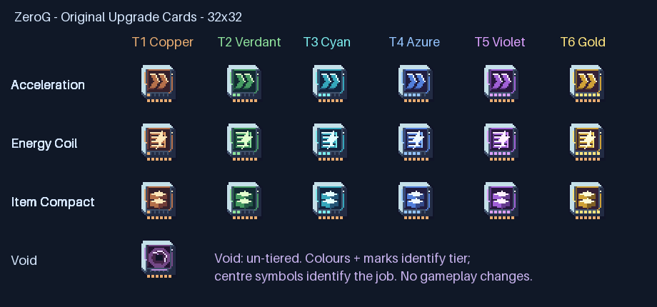

# Dedicated upgrade-card icons

Original local pixel sprites, **32x32 with transparency**, using ZeroG's C magitech clustered shading and hue-shifted highlights. Inventory and held/dropped item models bind the same artwork; no gameplay or positioning changes.

Tier1 Copper, Tier2 Verdant green, Tier3 Cyan, Tier4 Azure blue, Tier5 Violet, Tier6 Gold. Six segmented bottom positions also show rank, so colour is not the only cue. Acceleration uses speed arrows; Energy Coil uses a coil/lightning symbol; Item Compact uses stacked items. Void has its own vortex, but remains un-tiered—no extra gameplay tiers are invented.

All19 icons replace the shared filter-card placeholder. The generator, source PNGs, hashes and preview live on [Design](https://github.com/ZeroG-Network-PTY-LTD/ZeroG-Tweaks/tree/Design/docs/upgrade-card-icons). Runtime PNGs and item models live on1.21.x. Regenerate these last after earlier art/model generators. Pixel highlights do not imply emitted world light or enchantment glint.

This supersedes earlier dedicated-card-art TODOs; actual client appearance remains awaiting review. Machine contracts, effects, research, survival costs and the other artwork TODOs are unchanged. Installation/build/asset evidence is in [the combined delivery receipt](hub-tier-gates-and-card-icons-delivery-2026-10-07.json). This delivery also replaces the hub's northern legacy gates with [six tiered admin gates](hub-tier-gates-2026-10-07.md); the icon changes themselves do not modify saves.
