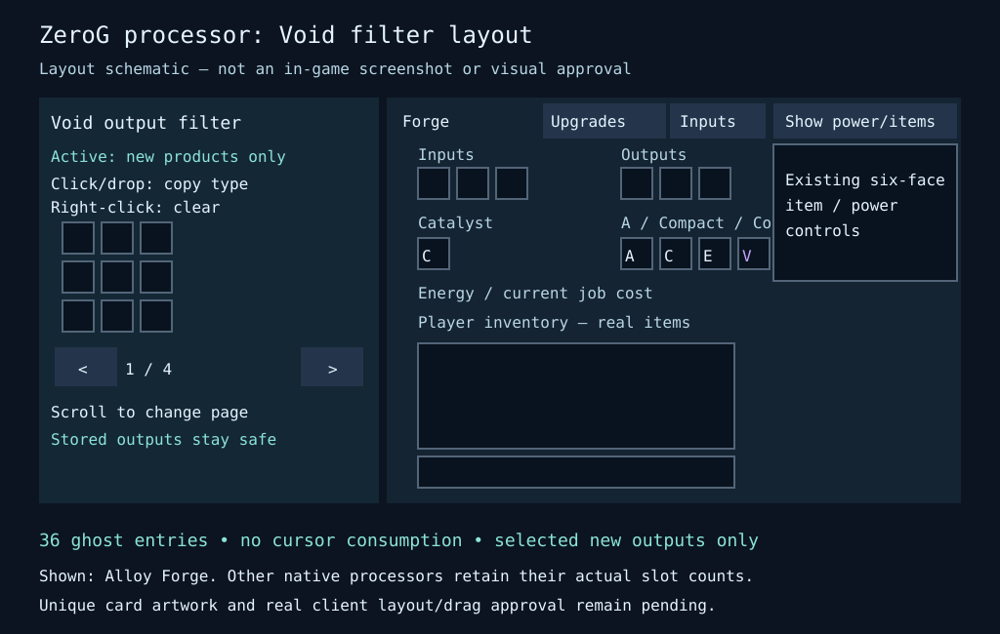

# Original ZeroG Void Card — 7 October 2026

Minecraft Java1.21.1 / NeoForge, same version **1.0.12-dev**.

The card works in the four native processors: Alloy Forge, Ore Refinery, Crystal
Growth Chamber and Salvage Station. It is an original ZeroG output-control card,
not a copied factory or a new dependency on a reference mod.

## Using the card

1. Put one **Void Upgrade Card** in the fourth upgrade socket. The original
   Acceleration, Compact and Energy Coil save positions remain unchanged.
2. Open **Upgrades** at the top of the machine screen. The separate left panel
   does not cover the machine slots, player inventory or side controls.
3. Carry an example item and click/drop it onto a ghost entry. Only its item type
   is copied; the example remains on your cursor. Right-click an entry to clear it.
4. Use the arrows or mouse wheel to switch among four pages of nine entries.

At small GUI sizes the Upgrades button is disabled with a reduce-GUI-scale hint,
rather than allowing the panel to overlap slots. Long panel text is clipped to
its available width; entry tooltips describe the full filtering rule.

## Disposal and storage rules

- A selected **new recipe product** is discarded only while the card is installed.
- Empty filters discard nothing. Nonmatching blocked products still pause the
  whole recipe, without consuming its ingredients or power.
- Existing stored outputs are never purged, even when their item type is selected.
- Inputs, catalysts, fluids, player inventory and cursor items are never voided.
  Ordinary recipe consumption still applies; reusable catalysts stay reusable.
- Filters match item type, not individual item components, enchantments or tags.
- The36-entry profile is saved in the machine. Removing the card preserves the
  selections but disables disposal. The profile does not travel inside the card.
- Breaking returns real stored items and the installed card, never ghost samples.

Changes to cards/filter configuration conservatively reset an in-progress paid
job without refunding spent FE or consuming ingredients. Stable jobs reload with
their saved progress. Costs and Acceleration/Coil limits remain the existing
bounded ZeroG rules, not a reference mod's10x/eight-module formulas.

## Validation and boundaries

Server commands require the current live machine, a nearby player, open Upgrades
view and installed Void card. Selection uses the server's actual cursor item;
clients cannot submit arbitrary registry IDs or nested item data. Invalid commands
and page bounds are rejected. The new socket is appended, and old saved inventory
sizes are normalized without moving previous slots or losing Compact reserves.

Focused isolated tests cover selected production, removal, saved pages, old saves,
empty/nonmatching filters, blocked secondary products, invalid/remote/stale menu
commands, exact ingredient/power use, reusable catalysts and real break drops.
The delivery receipt supplies final combined regression/build/asset/install evidence.
Client screen rendering and physical drag behavior still need owner inspection;
server tests and this schematic do not certify them. No client or saves are changed
by the isolated tests, and no hub/dimension regeneration is part of this batch.

## Still pending

- Dedicated Compact/Void icon artwork: examples requested, existing approved
  filter-card art reused temporarily. No invented replacement textures.
- Other machine compatibility, final survival costs and client visual approval.
- Original Resonance Dampener, Buffer Capacitor, Phase Anchor, Concord Parallel
  Matrix and Atmospheric Recovery concepts are a roadmap, not implemented upgrades.
  See [Design's concept contract](https://github.com/ZeroG-Network-PTY-LTD/ZeroG-Tweaks/blob/Design/docs/zero-g-upgrade-concepts.md).
- The remaining transport, alveary research/biology, story and ecology tasks remain
  in the [full TODO ledger](storage-and-machinery-todo.json).

Previous documentation, galleries and JAR archives are preserved.
