# Mob diagrams

Mermaid sources render on GitHub. PNG copies sit next to each `.mmd` file.

## Mob world map

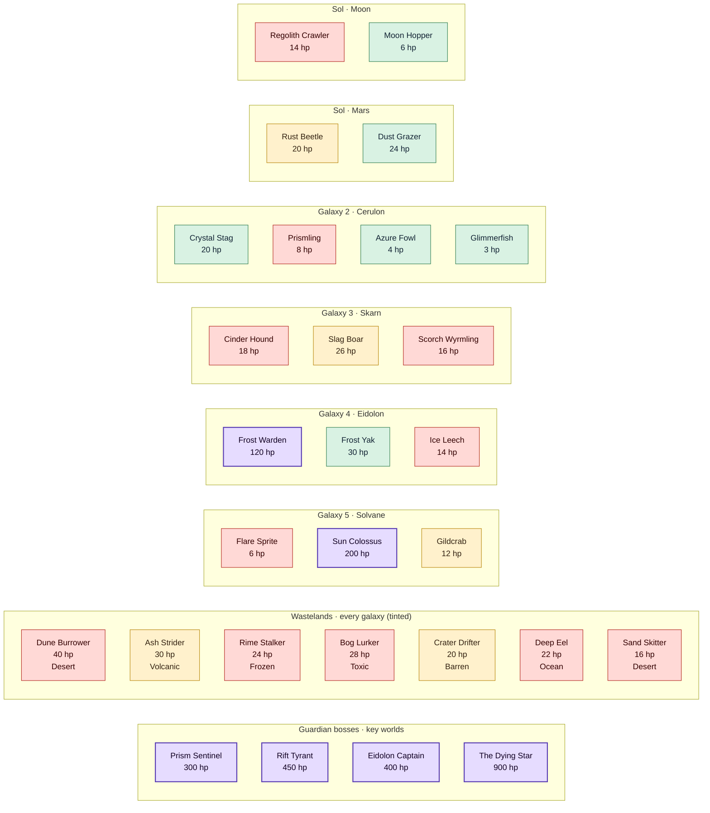

## Mob drops food chain

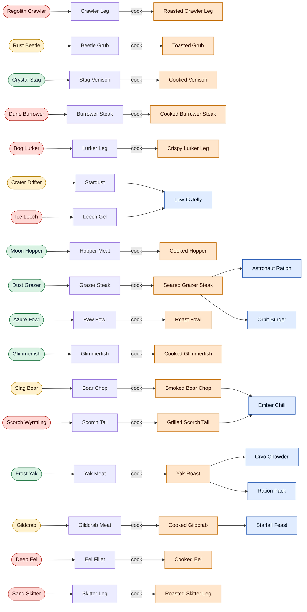

## Boss progression

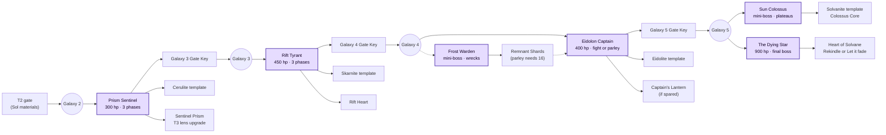

## Behavior states per mob

### Regolith Crawler

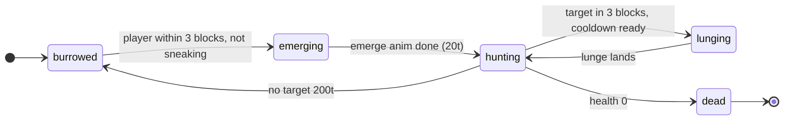

### Rust Beetle

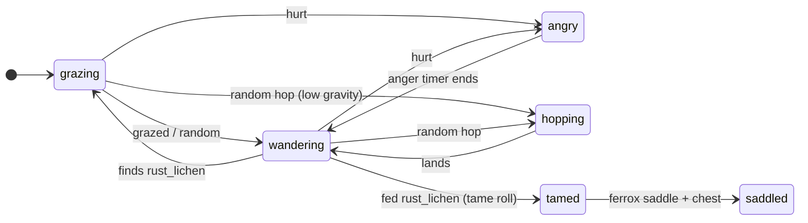

### Crystal Stag

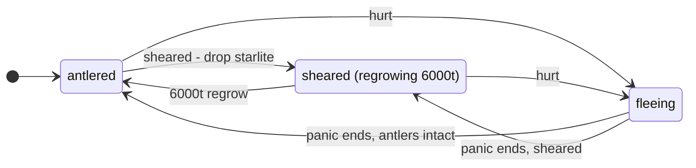

### Prismling

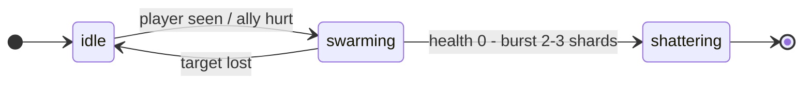

### Cinder Hound

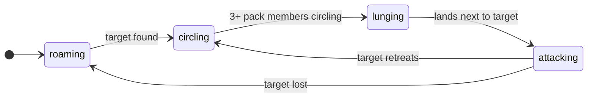

### Frost Warden

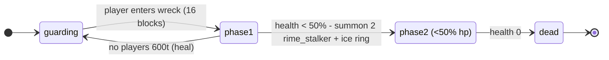

### Flare Sprite

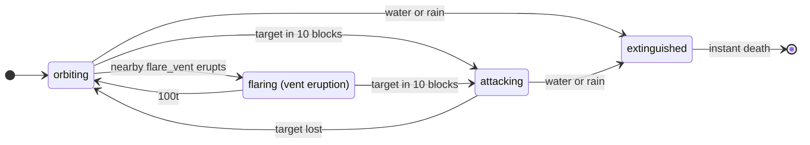

### Sun Colossus

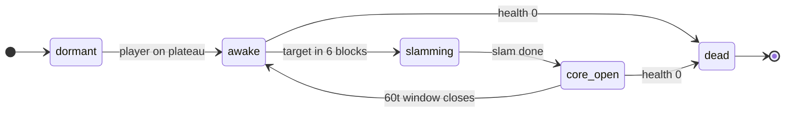

### Dune Burrower

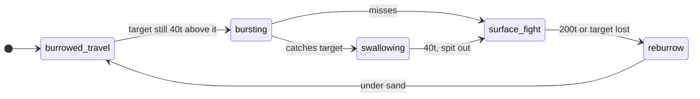

### Ash Strider

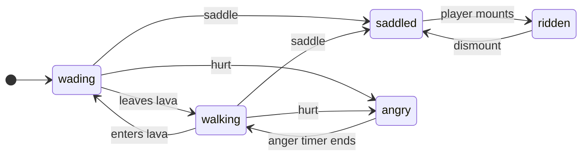

### Rime Stalker

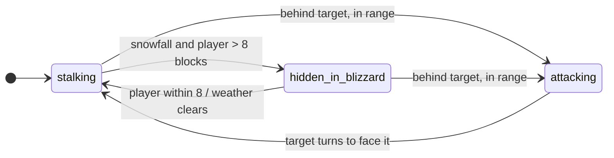

### Bog Lurker

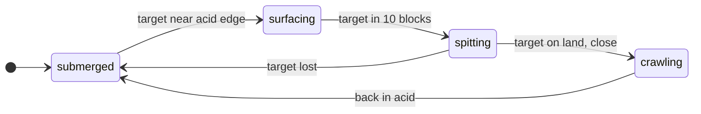

### Crater Drifter

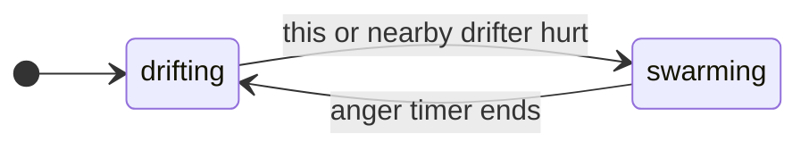

### Prism Sentinel

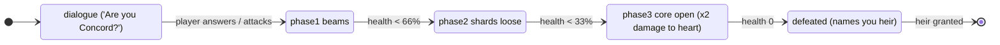

### Rift Tyrant

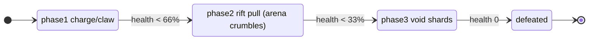

### Eidolon Captain

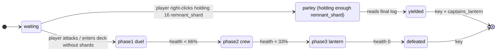

### The Dying Star

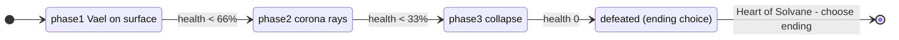

### Moon Hopper

```mermaid
stateDiagram-v2
  direction LR
  state "hopping" as s0
  state "grazing" as s1
  state "fleeing" as s2
  [*] --> s0
  s0 --> s1 : finds lunar_lichen
  s1 --> s0 : random
  s0 --> s2 : hurt / player close
  s1 --> s2 : hurt
  s2 --> s0 : safe
```

### Dust Grazer

```mermaid
stateDiagram-v2
  direction LR
  state "grazing" as s0
  state "wandering" as s1
  state "stampeding" as s2
  [*] --> s0
  s0 --> s1 : random
  s1 --> s0 : finds grass-like block
  s0 --> s2 : any herd member within 12 hurt
  s1 --> s2 : herd member hurt
  s2 --> s1 : panic ends (100t)
```

### Azure Fowl

```mermaid
stateDiagram-v2
  direction LR
  state "walking" as s0
  state "gliding" as s1
  state "laying" as s2
  [*] --> s0
  s0 --> s1 : falling (not on ground)
  s1 --> s0 : lands
  s0 --> s2 : egg timer 6000-12000t
  s2 --> s0 : blue_egg dropped
```

### Glimmerfish

```mermaid
stateDiagram-v2
  direction LR
  state "schooling" as s0
  state "fleeing" as s1
  state "flopping (out of water)" as s2
  [*] --> s0
  s0 --> s1 : hurt / player close
  s1 --> s0 : safe
  s0 --> s2 : out of water
  s1 --> s2 : out of water
  s2 --> s0 : back in water
```

### Slag Boar

```mermaid
stateDiagram-v2
  direction LR
  state "rooting" as s0
  state "wandering" as s1
  state "charging" as s2
  [*] --> s0
  s0 --> s1 : random
  s1 --> s0 : finds slag
  s0 --> s2 : hurt / player near baby
  s1 --> s2 : hurt / player near baby
  s2 --> s1 : anger timer ends
```

### Scorch Wyrmling

```mermaid
stateDiagram-v2
  direction LR
  state "perched" as s0
  state "gliding" as s1
  state "spitting" as s2
  state "biting" as s3
  [*] --> s0
  s0 --> s1 : jumps off ledge
  s1 --> s0 : lands
  s0 --> s2 : target in 12 blocks
  s1 --> s2 : target in 12 blocks
  s2 --> s3 : target in melee range
  s3 --> s2 : target backs off
  s2 --> s0 : target lost
```

### Frost Yak

```mermaid
stateDiagram-v2
  direction LR
  state "woolly" as s0
  state "sheared (regrow by grazing)" as s1
  state "sheltering" as s2
  [*] --> s0
  s0 --> s1 : sheared - yak_wool
  s1 --> s0 : eats snowpack / frozen_regolith
  s0 --> s2 : snowfall + calf nearby
  s1 --> s2 : snowfall + calf nearby
  s2 --> s0 : weather clears
```

### Ice Leech

```mermaid
stateDiagram-v2
  direction LR
  state "hidden" as s0
  state "crawling" as s1
  state "latched" as s2
  [*] --> s0
  s0 --> s1 : player steps within 2 blocks
  s1 --> s2 : touches target - ride
  s2 --> s1 : player sprints 20t / leech hit
  s1 --> s0 : no target 200t
```

### Gildcrab

```mermaid
stateDiagram-v2
  direction LR
  state "basking" as s0
  state "scuttling" as s1
  state "pinching" as s2
  [*] --> s0
  s0 --> s1 : random / disturbed
  s1 --> s0 : on sunspot_rock
  s0 --> s2 : hurt
  s1 --> s2 : hurt
  s2 --> s1 : anger timer ends
```

### Deep Eel

```mermaid
stateDiagram-v2
  direction LR
  state "lurking" as s0
  state "following_light" as s1
  state "biting" as s2
  [*] --> s0
  s0 --> s1 : light source > 10 or player with light
  s1 --> s2 : target in water, in range
  s2 --> s0 : target leaves water
  s1 --> s0 : light gone
```

### Sand Skitter

```mermaid
stateDiagram-v2
  direction LR
  state "buried" as s0
  state "bursting" as s1
  state "attacking" as s2
  [*] --> s0
  s0 --> s1 : player within 4 or group member bursts
  s1 --> s2 : out of sand
  s2 --> s0 : target lost 200t (re-bury)
```
