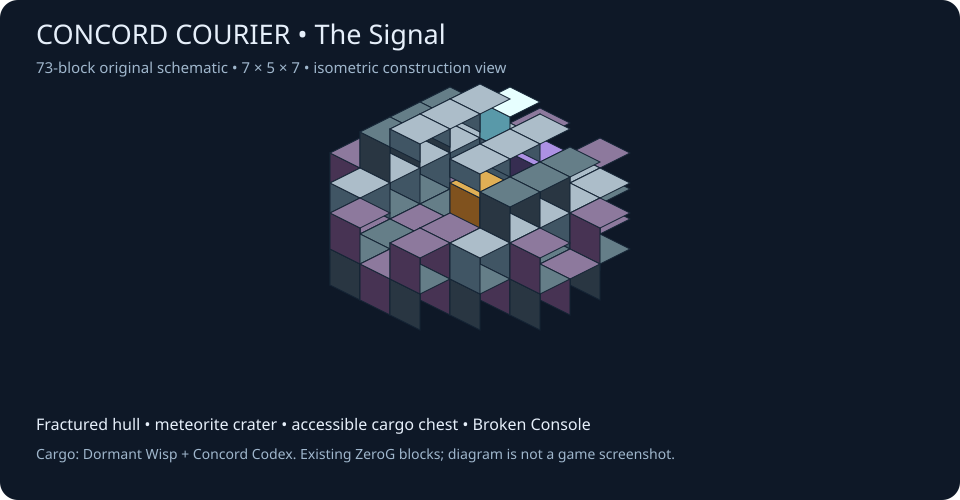

# Concord Courier crash pod

Original editable voxel source: [cells.json](cells.json). Regenerate its
7×5×7, 73-block vanilla structure template with
`../../generators/concord_courier.py --runtime <1.21.x checkout>`.
`courier_preview.py` renders the schematic below, not an in-game screenshot.

Palette: meteorite fragments, corroded hull, hull plating, hull slabs, Selenite
lamp, Broken Console and vanilla chest. The open front and broken roof keep the
chest reachable; no entities, explosives, fluids or active gate are included.
Chest position is (3,1,3); console is (3,1,1). The Java delivery path adds one
Dormant Wisp and one Concord Codex. Manual `/place template
zerog_tweaks:concord_courier` places geometry only, with an empty chest.

The console is the damaged pod control unit, not a working Gate Controller.
Players craft their own controller around Echo's Wisp. Delivery replaces only
validated natural topsoil/stone and air/grass/snow on a flat, open 7×7 surface,
never existing block entities, player blocks, water or protected arrival pads.
Detected unsupported claim mods pause automatic delivery; do not bypass them.
